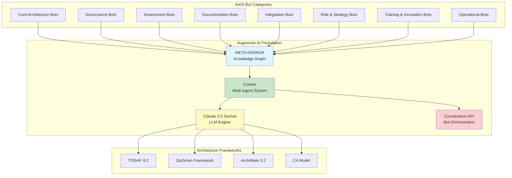
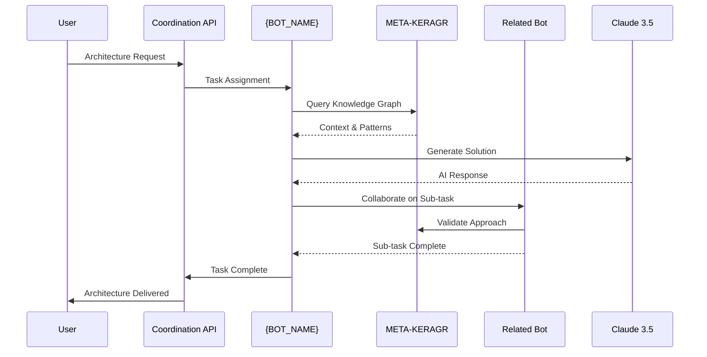

# {BOT_NAME}

**Augmentic AI {BOT_CATEGORY} Bot**
**Component**: AXIS Architecture Governance Automation
**AppVM**: bsw-arch
**Phase**: Autonomous Architecture Intelligence

## 🧠 Augmentic AI Overview

The **{BOT_NAME}** is an autonomous Augmentic AI agent within the AXIS (Architecture Excellence and Integration Standards) ecosystem. Augmentic AI represents the next evolution of artificial intelligence - self-improving, collaborative AI systems that augment human capabilities through continuous learning and autonomous decision-making.

### What is Augmentic AI?

**Augmentic AI** combines:
- **Autonomous Operation**: Self-directed task execution without constant human intervention
- **Continuous Learning**: Integration with META-KERAGR knowledge graphs for perpetual improvement
- **Collaborative Intelligence**: Multi-agent coordination through CrewAI frameworks
- **Contextual Awareness**: RAG (Retrieval-Augmented Generation) for domain-specific expertise
- **Adaptive Behaviour**: Real-time adjustment based on system feedback and metrics

## 🏗️ AXIS Bot Ecosystem Architecture



## 🤖 Bot Category Functions

### 50.XX - Core Architecture Bots
**Purpose**: Foundation architecture design and coordination
- **axis-core-bot**: Central architecture coordination and orchestration
- **axis-architecture-bot**: Enterprise architecture pattern generation
- **axis-design-bot**: Architecture design automation and validation

### 51.XX - Governance Bots
**Purpose**: Architecture governance and compliance management
- **axis-governance-bot**: Architecture governance framework enforcement
- **axis-compliance-bot**: Standards compliance verification
- **axis-standards-bot**: Architecture standards management
- **axis-policy-bot**: Policy creation and enforcement

### 52.XX - Assessment & Review Bots
**Purpose**: Architecture quality assurance and validation
- **axis-assessment-bot**: Architecture maturity assessment
- **axis-review-bot**: Architecture review automation
- **axis-audit-bot**: Security and compliance auditing
- **axis-validation-bot**: Architecture decision validation

### 53.XX - Documentation Bots
**Purpose**: Architecture documentation generation
- **axis-docs-bot**: TOGAF/ArchiMate documentation
- **axis-patterns-bot**: Architecture pattern cataloguing
- **axis-blueprint-bot**: Solution blueprint generation

### 54.XX - Integration Bots
**Purpose**: Cross-domain architecture integration
- **axis-integration-bot**: Service integration coordination
- **axis-coordination-bot**: Multi-domain architecture coordination

### 55.XX - Risk & Strategy Bots
**Purpose**: Risk management and strategic planning
- **axis-risk-bot**: Architecture risk assessment
- **axis-strategy-bot**: Strategic architecture planning
- **axis-planning-bot**: Architecture roadmap generation

### 56.XX - Training & Innovation Bots
**Purpose**: Knowledge transfer and innovation
- **axis-training-bot**: Architecture training automation
- **axis-innovation-bot**: Innovation pattern identification

### 5X.XX - Operational Bots
**Purpose**: DevOps and operational automation
- Monitoring, deployment, security, testing, and infrastructure management

## 🔄 Autonomous Bot Collaboration

### Inter-Bot Communication Protocol



### Collaboration Patterns

1. **Sequential Coordination**: Bots execute tasks in workflow sequence
2. **Parallel Processing**: Multiple bots work simultaneously on different aspects
3. **Hierarchical Delegation**: Parent bots delegate to specialized child bots
4. **Peer Collaboration**: Bots of equal hierarchy collaborate on complex tasks
5. **Feedback Loops**: Continuous improvement through bot-to-bot learning

## 🎯 {BOT_SPECIFIC_FUNCTION}

### Primary Responsibilities

{BOT_SPECIFIC_RESPONSIBILITIES}

### Integration Points

- **KERAGR Integration**: Knowledge-enhanced {bot_function}
- **Coordination API**: Cross-bot orchestration for {bot_function}
- **TOGAF Compliance**: {bot_function} aligned with TOGAF ADM
- **ArchiMate Models**: Visual representation of {bot_function}

## 🚀 Augmentic AI Capabilities

### Self-Improvement Mechanisms

1. **Knowledge Ingestion**: Continuous learning from architecture decisions
2. **Pattern Recognition**: Identifying recurring architecture patterns
3. **Performance Optimisation**: Self-tuning based on success metrics
4. **Error Recovery**: Autonomous correction of failed operations
5. **Context Adaptation**: Adjusting behaviour based on domain context

### Autonomous Decision-Making

```python
# Pseudo-code for autonomous decision flow
def autonomous_decision_process(task):
    # 1. Contextualise
    context = query_keragr(task.domain, task.type)

    # 2. Analyse
    patterns = identify_patterns(context, task.requirements)

    # 3. Collaborate
    if task.complexity > threshold:
        collaborators = find_expert_bots(task.domain)
        solution = multi_agent_solve(task, collaborators)
    else:
        solution = generate_solution(task, patterns)

    # 4. Validate
    validation = validate_solution(solution, standards)

    # 5. Learn
    store_knowledge(task, solution, validation)

    # 6. Execute
    return execute_with_monitoring(solution)
```

## 📊 Quality Standards

### TOGAF Compliance
- ✅ TOGAF 9.2 ADM phase alignment
- ✅ Architecture governance adherence
- ✅ Stakeholder management integration
- ✅ Architecture repository standards

### UK English Documentation
- ✅ British spelling (optimise, colour, analyse)
- ✅ UK date formats (DD/MM/YYYY)
- ✅ British terminology standards
- ✅ Professional UK business writing

### Technical Excellence
- ✅ SHA-256 git security
- ✅ Chainguard Wolfi containers
- ✅ HashiCorp Vault secrets management
- ✅ Comprehensive test coverage

## 🔐 Security & Privacy

### Augmentic AI Security

- **Sandbox Execution**: AI operations run in isolated environments
- **Permission-Based Access**: Bot capabilities controlled by RBAC
- **Audit Logging**: Complete trace of all autonomous decisions
- **Human Oversight**: Critical decisions require human approval
- **Data Privacy**: GDPR-compliant data handling

### DevSecOps Integration

- **Container Security**: Trivy/Grype scanning
- **Secrets Rotation**: Automated credential management
- **Access Control**: Fine-grained bot permissions
- **Compliance Monitoring**: Continuous compliance validation

## 📖 Usage Examples

### Basic Operation

```bash
# Execute {bot_function}
./scripts/{bot_script}.sh --domain AXIS --task {example_task}
```

### API Integration

```python
from axis_bots import {BotClass}

# Initialize bot
bot = {BotClass}(
    keragr_url="http://localhost:3108",
    coordination_url="http://localhost:3111"
)

# Execute autonomous task
result = bot.execute_autonomous({
    "task": "{example_task}",
    "domain": "AXIS",
    "context": {context_data}
})

print(result.architecture_output)
```

### Multi-Bot Collaboration

```python
from axis_bots.coordination import BotOrchestrator

# Initialize orchestrator
orchestrator = BotOrchestrator()

# Define collaborative workflow
workflow = orchestrator.create_workflow([
    "{BOT_NAME}",
    "axis-validation-bot",
    "axis-docs-bot"
])

# Execute with autonomous coordination
result = workflow.execute({
    "objective": "{complex_objective}",
    "autonomy_level": "high"
})
```

## 🔗 Related Bots

**Upstream Dependencies**:
- {UPSTREAM_BOT_1}: Provides {dependency_description}
- {UPSTREAM_BOT_2}: Supplies {dependency_description}

**Downstream Consumers**:
- {DOWNSTREAM_BOT_1}: Consumes {output_description}
- {DOWNSTREAM_BOT_2}: Utilizes {output_description}

**Peer Collaborators**:
- {PEER_BOT_1}: Collaborates on {collaboration_description}
- {PEER_BOT_2}: Partners for {collaboration_description}

## 📈 Monitoring & Metrics

### Performance Metrics
- **Task Completion Rate**: % of autonomous tasks completed successfully
- **Response Time**: Average time from task assignment to completion
- **Accuracy Score**: Validation success rate
- **Collaboration Efficiency**: Multi-bot coordination effectiveness

### Knowledge Growth
- **Pattern Recognition**: New patterns identified per month
- **Knowledge Base Size**: KERAGR entries contributed
- **Learning Rate**: Improvement in task performance over time

## 🆘 Support & Documentation

- **Issues**: [Codeberg Issues](https://codeberg.org/AXIS-Bots/{bot_repo}/issues)
- **Wiki**: [Bot Wiki](https://codeberg.org/AXIS-Bots/{bot_repo}/wiki)
- **AXIS Documentation**: [AXIS Domain Overview](https://codeberg.org/AXIS-Bots/wiki)
- **Augmentic AI Guide**: [Understanding Augmentic AI](https://codeberg.org/AXIS-Bots/wiki/Augmentic-AI)

## 📄 License

MIT License - See [LICENSE](LICENSE) file

---

🤖 **{BOT_NAME}** - Autonomous Architecture Intelligence through Augmentic AI

*Part of the AXIS Bot Ecosystem - 46 Collaborative AI Agents for Enterprise Architecture*

**Status**: {BOT_STATUS}
**Version**: {BOT_VERSION}
**Last Updated**: {UPDATE_DATE}
