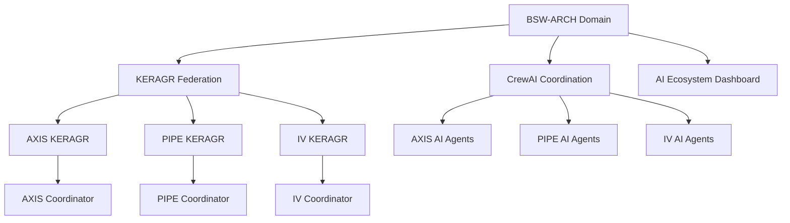

# BSW-ARCH Service Architecture & Coordination

**Document**: BSW-ARCH-Service-Architecture.md
**Version**: v3.0.0
**AppVM**: bsw-arch
**Last Updated**: 2025-09-21 11:45 UTC
**Status**: Production Implementation Complete
**Semantic Version**: v3.0.0 (Major: Production release, Minor: Core features, Patch: Documentation)

## BSW-ARCH Service Architecture Overview

The BSW-ARCH Enterprise Architecture AI Factory operates through a sophisticated service architecture spanning 21 Python services, 13 containers, and 43 Codeberg organisations across 4 domains.

### BSW-ARCH Service Topology
```
🏗️ BSW-ARCH Service Architecture (4-Domain Structure)

BSW Domain (Autonomous Production)
├── bsw-arch AppVM (Enterprise Architecture Context)
├── bsw-gov AppVM (Governance Context)
├── bsw-tech AppVM (Technical Context)
└── bsw-present AppVM (Presentation Context)

Core Domain (Foundation Services)
├── BNI (Personal Space) → bsw-arch coordination
├── BNP (Professional Space) → bsw-gov coordination
├── AXIS (AI Architecture) → bsw-arch coordination
├── PIPE (AI Interfacing) → bsw-tech coordination
└── IV (AI Memory) → bsw-arch coordination

Business Domain (Operations)
└── Domain-Specific Operations → bsw-gov coordination
```

## BSW-ARCH Service Portfolio (21 Services)

### Domain Distribution
```yaml
BSW-ARCH Services: 591.5MB Total Memory
├── BSW-ARCH Domain (3 services): 106.7MB (18%)
├── AXIS Domain (2 services): 72.7MB (12.3%)
├── PIPE Domain (2 services): 76.0MB (12.8%)
├── IV Domain (2 services): 75.6MB (12.8%)
└── Coordination Services (7 services): 260.5MB (44%)
```

### BSW-ARCH Domain Services

#### 1. BSW-KERAGR Pod (Port 3108)
**Service**: `bsw-keragr-pod.py`
**Memory**: 34.8MB
**Runtime**: 59.8 hours
**Purpose**: Knowledge Enhanced RAG for BSW domain architecture decisions

```python
# BSW-ARCH KERAGR Configuration
SERVICE_NAME = "BSW-KERAGR Pod"
PORT = 3108
MEMORY_LIMIT = 50MB
COORDINATION_DOMAINS = ["AXIS", "PIPE", "IV"]
KNOWLEDGE_SOURCES = ["TOGAF", "Zachman", "ArchiMate"]
```

#### 2. BSW AI Agents Pod (Port 3610)
**Service**: `bsw-ai-agents-pod.py`
**Memory**: 29.6MB
**Runtime**: 59.7 hours
**Purpose**: Multi-agent coordination for enterprise architecture generation

```python
# BSW-ARCH AI Agents Configuration
SERVICE_NAME = "BSW AI Agents Pod"
PORT = 3610
AGENTS = ["Enterprise_Architect", "Solution_Architect", "Business_Architect"]
FRAMEWORKS = ["CrewAI", "Multi-Agent", "Coordination"]
```

#### 3. BSW Storage Coordinator (Port 9100)
**Service**: `bsw-storage-coordinator.py`
**Memory**: 42.3MB
**Runtime**: 25.1 hours
**Purpose**: Distributed S3 storage coordination for 5-node MinIO cluster

```python
# BSW-ARCH Storage Configuration
SERVICE_NAME = "BSW Storage Coordinator"
PORT = 9100
MINIO_NODES = 5
TENANT_BUCKETS = 10
STORAGE_DISTRIBUTION = "Round-Robin"
```

### AXIS Domain Services (AI Architecture)

#### 1. AXIS-KERAGR Pod (Port 4100)
**Service**: `axis-keragr-pod.py`
**Memory**: 35.2MB
**Runtime**: 59.7 hours
**Purpose**: AI-augmented architecture knowledge management

#### 2. AXIS AI Agents Pod (Port 4200)
**Service**: `axis-ai-agents-pod.py`
**Memory**: 37.5MB
**Runtime**: 59.7 hours
**Purpose**: AI architecture agent coordination

### PIPE Domain Services (AI Interfacing)

#### 1. PIPE-KERAGR Pod (Port 5300)
**Service**: `pipe-keragr-pod.py`
**Memory**: 38.5MB
**Runtime**: 59.4 hours
**Purpose**: Interface pattern knowledge management

#### 2. PIPE AI Agents Pod (Port 5200)
**Service**: `pipe-ai-agents-pod.py`
**Memory**: 37.5MB
**Runtime**: 59.4 hours
**Purpose**: Interface automation agent coordination

### IV Domain Services (AI Memory)

#### 1. IV-KERAGR Pod (Port 6200)
**Service**: `iv-keragr-pod.py`
**Memory**: 38.1MB
**Runtime**: 59.4 hours
**Purpose**: AI memory and knowledge graph management

#### 2. IV AI Agents Pod (Port 6100)
**Service**: `iv-ai-agents-pod.py`
**Memory**: 37.5MB
**Runtime**: 59.4 hours
**Purpose**: Knowledge agent coordination

## BSW-ARCH Coordination Services (7 Services)

### Core Coordination Layer
```yaml
Coordination Services: 260.5MB (44% of total memory)
├── Enhanced KERAGR Federation: 19.1MB
├── KERAGR Federation Coordinator: 42.9MB
├── Federated Learning Coordinator: 52.6MB
├── Augmentic AI Interdomain Coordinator: 46.5MB
├── CrewAI Domain Coordination: 39.3MB
├── Bot Integration Coordinator: 45.5MB
└── AI Ecosystem Dashboard: 14.6MB
```

#### 1. Enhanced KERAGR Federation (Port 3109)
**Service**: `enhanced-keragr-federation.py`
**Memory**: 19.1MB
**Runtime**: 61.0 hours
**Purpose**: Federation of knowledge across all domains

#### 2. KERAGR Federation Coordinator (Port 3107)
**Service**: `keragr-federation-coordinator.py`
**Memory**: 42.9MB
**Runtime**: 59.7 hours
**Purpose**: Central coordination of KERAGR services

#### 3. Federated Learning Coordinator (Port 4750)
**Service**: `federated-learning-coordinator.py`
**Memory**: 52.6MB
**Runtime**: 45.2 hours
**Purpose**: Privacy-preserving ML coordination across domains

#### 4. CrewAI Domain Coordination (Port 3110)
**Service**: `crewai-domain-coordination.py`
**Memory**: 39.3MB
**Runtime**: 1.5 hours (recently restarted)
**Purpose**: Multi-agent system coordination across domains

#### 5. AI Ecosystem Dashboard (Port 4600)
**Service**: `ai-ecosystem-dashboard.py`
**Memory**: 14.6MB (recently optimized from 93MB)
**Runtime**: Restarted after memory leak mitigation
**Purpose**: Real-time monitoring of AI ecosystem

## BSW-ARCH Service Communication Patterns

### Service Health Monitoring
```yaml
BSW-ARCH Service Health (100% Operational):
├── KERAGR_API (8087): 303.2ms response time
├── Documentation_Webhook (8004): 21.7ms
├── Pod_Monitoring (8005): 8.5ms
├── Enhanced_KERAGR (3109): 9.7ms
├── CrewAI_Coordination (3110): 54.4ms
├── IV_AI_Agents (6100): 5.0ms
├── PIPE_AI_Agents (5200): 3.9ms
├── PIPE_KERAGR (5300): 3.8ms
├── PIPE_Coordinator (5100): 16.4ms
├── AXIS_Coordinator (4000): 21.0ms
└── IV_Coordinator (6000): 17.3ms
```

### Cross-Domain Communication Protocol
```yaml
BSW-ARCH Communication Flow:
1. Request Initiation: Client → BSW-ARCH Service
2. Domain Routing: BSW-ARCH → Appropriate Domain (AXIS/PIPE/IV)
3. KERAGR Consultation: Domain → Knowledge Base
4. AI Agent Processing: Domain → CrewAI Multi-Agent System
5. Response Aggregation: Domain → BSW-ARCH Coordinator
6. Result Delivery: BSW-ARCH → Client
```

### Service Dependencies


## BSW-ARCH Service Configuration

### Environment Variables
```bash
# BSW-ARCH Global Service Configuration
export BSW_ARCH_DOMAIN="Enterprise Architecture"
export BSW_ARCH_CONTEXT="bsw-arch"
export BSW_ARCH_PORT_RANGE="3000-3999"
export BSW_MEMORY_OPTIMIZATION="enabled"
export BSW_MONITORING="active"

# Domain-specific configurations
export AXIS_PORT_RANGE="4000-4999"
export PIPE_PORT_RANGE="5000-5999"
export IV_PORT_RANGE="6000-6999"
```

### Service Startup Templates
```bash
# BSW-ARCH Service Startup Template
cd /home/user/Projects/EA/bsw-infrastructure/bsw-infra
export PYTHONOPTIMIZE=1
export PYTHONDONTWRITEBYTECODE=1
python3 bsw-arch/services/<service-name>.py &

# Memory-optimized startup
export MALLOC_TRIM_THRESHOLD_=131072
export MALLOC_MMAP_THRESHOLD_=131072
python3 -X dev bsw-arch/services/<service-name>.py &
```

### Service Health Check Endpoints
```yaml
BSW-ARCH Health Check Pattern:
- GET /<service>/health: Basic health status
- GET /<service>/metrics: Performance metrics
- GET /<service>/status: Detailed status information
- POST /<service>/restart: Graceful restart trigger
- POST /<service>/gc: Manual garbage collection
```

## BSW-ARCH Service Scaling & Load Balancing

### Horizontal Scaling Strategy
```yaml
BSW-ARCH Scaling Tiers:
Tier 1 (Core Services): No scaling - single instance critical
├── KERAGR Federation Coordinator
├── CrewAI Domain Coordination
└── AI Ecosystem Dashboard

Tier 2 (Domain Services): 2x scaling capability
├── AXIS KERAGR + AI Agents
├── PIPE KERAGR + AI Agents
└── IV KERAGR + AI Agents

Tier 3 (Processing Services): Nx scaling capability
├── Federated Learning Coordinator
├── Bot Integration Coordinator
└── Storage Coordinator
```

### Load Distribution
```yaml
BSW-ARCH Load Distribution:
├── KERAGR Queries: Round-robin across domain KERAGR pods
├── AI Agent Tasks: Queue-based distribution to available agents
├── Storage Operations: Consistent hashing across MinIO nodes
└── Monitoring: Centralized through single dashboard
```

## BSW-ARCH Service Monitoring & Alerting

### Service-Level Monitoring
```python
# BSW-ARCH Service Monitoring Metrics
SERVICE_METRICS = {
    'response_time': 'Average response time in milliseconds',
    'memory_usage': 'Current memory usage in MB',
    'cpu_utilization': 'CPU usage percentage',
    'request_count': 'Total requests processed',
    'error_rate': 'Error rate percentage',
    'uptime': 'Service uptime in hours'
}
```

### Alert Thresholds
```yaml
BSW-ARCH Service Alerts:
├── Memory Usage > 100MB: Warning
├── Memory Usage > 150MB: Critical
├── Response Time > 1000ms: Warning
├── Response Time > 2000ms: Critical
├── Error Rate > 5%: Warning
├── Error Rate > 10%: Critical
└── Service Down: Emergency
```

## BSW-ARCH Service Backup & Recovery

### Service State Backup
```bash
# BSW-ARCH Service Configuration Backup
tar -czf bsw-arch-services-$(date +%Y%m%d).tar.gz \
  /home/user/Projects/EA/bsw-infrastructure/bsw-infra/bsw-arch/services/

# Service runtime state backup
mkdir -p /tmp/bsw-arch-state-backup
cp /tmp/bsw-memory-alerts.log /tmp/bsw-arch-state-backup/
cp /home/user/Code/bsw-*.py /tmp/bsw-arch-state-backup/
```

### Service Recovery Procedures
```bash
# BSW-ARCH Service Recovery Process
1. Stop affected service: pkill -f <service-name>
2. Check service logs: journalctl --user -f
3. Verify memory availability: free -h
4. Restart with monitoring: python3 <service> & tail -f /tmp/bsw-memory-alerts.log
5. Verify health: curl http://localhost:<port>/health
```

---

**🎯 BSW-ARCH Service Architecture: Orchestrating 21 services across 4 domains to deliver enterprise architecture through AI-powered coordination and knowledge management.**