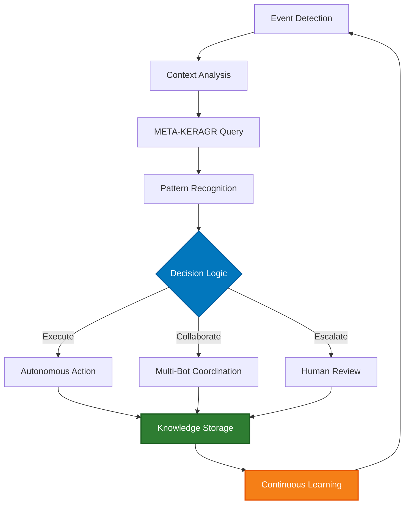
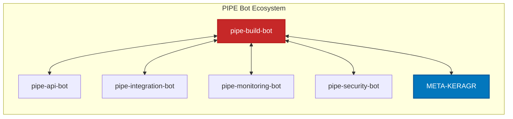

# BUILD BOT BOT

[](https://codeberg.org/PIPE-Bots/pipe-build-bot)
[](https://python.org)
[](LICENSE)
[](https://codeberg.org/PIPE-Bots/pipe-build-bot/actions)
[](https://codeberg.org/PIPE-Bots/pipe-build-bot/wiki)

<div align="center">

```
 ____  _                                      _      ____      _ _           _   _
|  _ \(_)___  ___ ___  _ __  _ __   ___  ___| |_   / ___|___ | | | ___  ___| |_(_)_   _____
| | | | / __|/ __/ _ \| '_ \| '_ \ / _ \/ __| __| | |   / _ \| | |/ _ \/ __| __| \ \ / / _ \
| |_| | \__ \ (_| (_) | | | | | | |  __/ (__| |_  | |__| (_) | | |  __/ (__| |_| |\ V /  __/
|____/|_|___/\___\___/|_| |_|_| |_|\___|\___|\__|  \____\___/|_|_|\___|\___|\__|_| \_/ \___|

                      PIPE-BOTS - SECURE · RELIABLE · INDEPENDENT
```

# pipe-build-bot

[](https://codeberg.org/PIPE-Bots/pipe-build-bot)
[](LICENSE)
[](docs/SECURITY.md)
[](https://en.wikipedia.org/wiki/British_English)

</div>

## 🧠 Augmentic AI Overview

The **pipe-build-bot** is an autonomous Augmentic AI agent that manages Build Bot operations across the PIPE platform. Built on the PIPE (Platform Infrastructure and Protocol Engineering) domain principles, this bot operates autonomously while collaborating with other PIPE bots through the META-KERAGR knowledge graph and CrewAI multi-agent orchestration.

### What is Augmentic AI?

Augmentic AI represents a paradigm shift from traditional automation to **self-improving, collaborative AI systems** that:

- **Learn Continuously**: Every operation enriches the META-KERAGR knowledge graph, improving future decisions
- **Collaborate Autonomously**: Multi-bot coordination through CrewAI for complex platform operations
- **Adapt Intelligently**: Pattern recognition and decision logic evolve based on operational experience
- **Operate Independently**: Autonomous execution with human oversight only for critical escalations

## 🎯 Core Capabilities

- **Build Bot Management**: Automated Build Bot lifecycle management
- **Intelligent Automation**: Self-optimising workflows and processes
- **Multi-Bot Integration**: Seamless collaboration with other PIPE bots
- **Knowledge Enrichment**: Continuous learning through META-KERAGR integration
- **Compliance & Security**: TOGAF 9.2 compliant with comprehensive audit logging

## 🔄 Autonomous Operation Workflow



### Operation Modes

1. **Autonomous Mode**: Fully automated operation based on learned patterns and policies
2. **Collaborative Mode**: Coordinated action with other PIPE bots via CrewAI
3. **Supervised Mode**: Human-in-the-loop for critical or unprecedented scenarios
4. **Learning Mode**: Observation and pattern extraction for knowledge enrichment

## 🤖 Multi-Bot Integration

The pipe-build-bot operates as part of the PIPE bot ecosystem, collaborating with:



### Integration Points

- **META-KERAGR** (port 3108): Knowledge graph for cross-bot learning and context
- **Coordination API** (port 3111): Real-time bot-to-bot communication
- **Event Bus**: Asynchronous event-driven coordination
- **Shared State**: Distributed state management via Redis

## 📊 Platform Infrastructure Context

The PIPE domain manages:

- **Infrastructure as Code**: OpenTofu/Terraform, Ansible, Kubernetes configurations
- **CI/CD Pipelines**: Woodpecker CI, GitHub Actions, GitOps workflows
- **Protocol Management**: HTTP/HTTPS, gRPC, WebSocket, MQTT, AMQP
- **Platform Services**: API gateways, service mesh, load balancing, caching
- **Operational Excellence**: SRE practices, monitoring, observability, incident response

## 🔐 Security & Compliance

- **TOGAF 9.2**: Full architecture framework compliance
- **UK English**: British spelling and terminology throughout
- **Encryption**: TLS 1.3 for all communications
- **Access Control**: Role-based access control (RBAC)
- **Audit Logging**: Complete operation trace and compliance tracking
- **GDPR Compliance**: Privacy-by-design principles
- **DevSecOps**: Integrated security scanning and vulnerability management

## 📈 Performance Metrics

| Metric | Target | Description |
|--------|--------|-------------|
| **Response Time** | < 100ms | Average API response time |
| **Availability** | > 99.9% | System uptime percentage |
| **Accuracy** | > 95% | Decision accuracy rate |
| **Collaboration** | > 90% | Multi-bot integration success |
| **Learning Rate** | Daily | Knowledge graph update frequency |

## 🚀 Getting Started

### Prerequisites

- Python 3.11+
- Docker and Docker Compose
- Access to META-KERAGR knowledge graph
- PIPE domain credentials

### Installation

```bash
# Clone repository
git clone ssh://git@codeberg.org/PIPE-Bots/pipe-build-bot.git
cd pipe-build-bot

# Install dependencies
pip install -r requirements.txt

# Configure environment
cp configs/pipe-build-bot.example.yml configs/pipe-build-bot.yml
# Edit configs/pipe-build-bot.yml with your settings

# Start the bot
docker-compose up -d
```

### Configuration

Key configuration parameters in `configs/pipe-build-bot.yml`:

```yaml
bot:
  name: pipe-build-bot
  mode: autonomous  # autonomous, collaborative, supervised, learning

meta_keragr:
  host: localhost
  port: 3108

coordination:
  api_host: localhost
  api_port: 3111

crewai:
  enabled: true
  max_agents: 5
```

## 📚 Documentation

Comprehensive documentation is available in the [Repository Wiki](https://codeberg.org/PIPE-Bots/pipe-build-bot/wiki):

- **[Getting Started](https://codeberg.org/PIPE-Bots/pipe-build-bot/wiki/Getting-Started)** - Installation and first steps
- **[Architecture](https://codeberg.org/PIPE-Bots/pipe-build-bot/wiki/Architecture)** - System architecture and design
- **[API Reference](https://codeberg.org/PIPE-Bots/pipe-build-bot/wiki/API-Reference)** - Complete API documentation
- **[Integration Guide](https://codeberg.org/PIPE-Bots/pipe-build-bot/wiki/Integration-Guide)** - Multi-bot integration patterns
- **[Troubleshooting](https://codeberg.org/PIPE-Bots/pipe-build-bot/wiki/Troubleshooting)** - Common issues and solutions

## 🤝 Contributing

We welcome contributions! Please see our [Contributing Guide](CONTRIBUTING.md) for details.

## 📄 Licence

MIT Licence - See [LICENCE](LICENCE) file for details.

## 🆘 Support

- **Issues**: [Report Issues](https://codeberg.org/PIPE-Bots/pipe-build-bot/issues)
- **Discussions**: [Community Forum](https://codeberg.org/PIPE-Bots/pipe-build-bot/discussions)
- **PIPE Ecosystem**: [PIPE-Bots Overview](https://codeberg.org/PIPE-Bots)

---

🤖 **pipe-build-bot** - Autonomous Platform Intelligence through Augmentic AI

*Part of the Disconnect Collective - SECURE · RELIABLE · INDEPENDENT*
