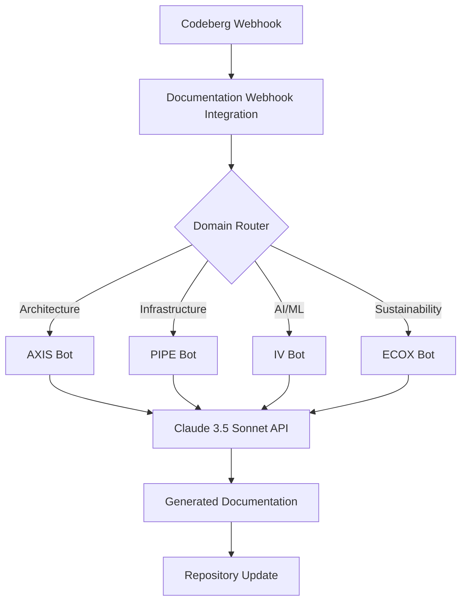

# BSW AI Documentation Bots

[](https://bsw-arch.local)
[](https://python.org)
[](LICENSE)

Automated AI-powered documentation generation for BSW domains using Claude AI.

## Overview

The BSW AI Documentation Bot system automatically generates and maintains comprehensive documentation across all BSW domains (AXIS, PIPE, IV, ECOX) using Claude 3.5 Sonnet.

### Features

- **Domain-Specific Documentation**: Tailored documentation for each domain's standards
- **Webhook Integration**: Automated triggers from Codeberg commits
- **Standards Compliance**: TOGAF, ArchiMate, MLOps, ESG compliance
- **UK English**: All documentation in UK English spelling
- **Multi-Format Output**: README.md, API docs, wiki pages, runbooks

## Architecture



## Domain Bots

### AXIS - Architecture Governance Bot
- **Standards**: TOGAF, ArchiMate, Zachman, COBIT
- **Outputs**: Architecture Decision Records (ADRs), ArchiMate diagrams, governance docs
- **Port**: 4000-4299

### PIPE - Infrastructure & DevOps Bot
- **Standards**: DevOps, GitOps, SRE, Platform Engineering
- **Outputs**: Runbooks, CI/CD pipeline docs, IaC documentation
- **Port**: 5000-5299

### IV - AI/ML Documentation Bot
- **Standards**: MLOps, LLMOps, RAG, META-KERAGR
- **Outputs**: Model cards, RAG system docs, MLOps pipeline docs
- **Port**: 6000-6299

### ECOX - Sustainability Bot
- **Standards**: ESG, Green IT, GRI, TCFD
- **Outputs**: Sustainability reports, carbon reduction plans, Green IT assessments
- **Port**: 7000-7299

## Installation

### Prerequisites

```bash
# Python 3.11+
python3 --version

# Anthropic API key
export ANTHROPIC_API_KEY="sk-ant-..."
```

### Setup

```bash
# Install dependencies
pip install anthropic flask requests

# Make scripts executable
chmod +x *.py
chmod +x start-documentation-bots.sh
```

## Usage

### Start Documentation Bot Service

```bash
./start-documentation-bots.sh
```

Service will be available at `http://localhost:8004`

### Test Individual Bots

```bash
# Test AXIS bot
python axis-documentation-bot.py

# Test PIPE bot
python pipe-documentation-bot.py

# Test IV bot
python iv-documentation-bot.py

# Test ECOX bot
python ecox-documentation-bot.py
```

### Test via HTTP

```bash
# Test AXIS domain
curl -X POST http://localhost:8004/webhook/documentation/test \
  -H "Content-Type: application/json" \
  -d '{"domain": "AXIS"}'

# Check bot status
curl http://localhost:8004/documentation/bots/status

# Health check
curl http://localhost:8004/health
```

## Webhook Configuration

Configure Codeberg webhook to send POST requests to:
```
http://localhost:8004/webhook/documentation
```

### Webhook Payload

```json
{
  "repository": {
    "name": "axis-governance",
    "full_name": "bsw-arch/axis-governance"
  },
  "commits": [{
    "id": "abc123",
    "message": "Add new governance policy",
    "added": ["policies/new-policy.md"],
    "modified": ["README.md"],
    "removed": []
  }]
}
```

## Documentation Standards

### AXIS Domain Standards
- UK English spelling (colour, organisation, initialise)
- TOGAF ADM phase identification
- ArchiMate viewpoints and layers
- Architecture Decision Records (ADRs)
- Mermaid diagrams for architecture visualisation

### PIPE Domain Standards
- Infrastructure as Code (OpenTofu/Ansible)
- CI/CD pipeline documentation
- Operational runbooks with troubleshooting
- SRE best practices
- Deployment architecture diagrams

### IV Domain Standards
- Model cards following ethical AI standards
- RAG system architecture documentation
- MLOps pipeline documentation
- Evaluation metrics and monitoring
- Knowledge graph integration

### ECOX Domain Standards
- ESG reporting (GRI, TCFD, SASB)
- Carbon footprint calculation
- Green IT metrics and assessments
- Circular economy documentation
- Sustainability targets and roadmaps

## Output Examples

### AXIS - Architecture Decision Record
```markdown
# ADR-001: Adopt Microservices Architecture

## Status
Accepted

## TOGAF Phase
C - Information Systems Architecture

## ArchiMate Viewpoint
Application Layer

## Decision
Migrate payment processing from monolithic to microservices...
```

### PIPE - Operational Runbook
```markdown
# Vault HA Cluster Runbook

## Service Overview
High-availability secrets management cluster

## Health Check
`curl http://vault.local:8200/v1/sys/health`

## Troubleshooting
### Issue: Vault Sealed
**Symptoms**: HTTP 503, sealed status
**Resolution**: Unseal using key shares...
```

### IV - Model Card
```markdown
# KERAGR-Embedding-v1 Model Card

## Model Type
Sentence-BERT Embedding Model

## Metrics
- Accuracy: 94.2%
- Latency: 45ms p95
- Vector Dimensions: 768

## Ethical Considerations
- Bias assessment completed
- Privacy-preserving training
- Safety tier: Monitored
```

### ECOX - Sustainability Report
```markdown
# BSW ESG Sustainability Report 2025

## Environmental Performance
- Carbon Emissions: 450 tonnes CO2e (-15% YoY)
- Renewable Energy: 65% (target: 100%)
- PUE: 1.45 (improved from 1.65)

## Green IT Metrics
- Server Utilisation: 78%
- E-waste Recycling: 85%
```

## Integration with Existing Infrastructure

### Webhook Router Integration
The documentation bots integrate with the existing webhook router at `localhost:8003`:

```python
# In webhook-router.py
def route_documentation_trigger(payload):
    requests.post('http://localhost:8004/webhook/documentation', json=payload)
```

### KERAGR Integration
Documentation bots can query KERAGR (localhost:3108) for context:

```python
# Query KERAGR for relevant architecture knowledge
keragr_context = requests.post('http://localhost:3108/rag/query',
    json={"query": "What are our architecture principles?"})
```

### Coordination API Integration
Update documentation status via Coordination API (localhost:3111):

```python
requests.post('http://localhost:3111/coordination/documentation/status',
    json={"domain": "AXIS", "status": "updated", "commit": "abc123"})
```

## Monitoring

### Metrics Tracked
- Documentation generation latency
- Success/failure rate per domain
- Token usage per bot
- Quality validation scores

### Grafana Dashboard
Import dashboard from: `monitoring/documentation-bots-dashboard.json`

Metrics available at: `http://localhost:9090/metrics`

## Troubleshooting

### Bot Not Generating Documentation
```bash
# Check Anthropic API key
echo $ANTHROPIC_API_KEY

# Check bot logs
tail -f /var/log/documentation-bots.log

# Test individual bot
python axis-documentation-bot.py
```

### Webhook Not Triggering
```bash
# Check webhook integration service
curl http://localhost:8004/health

# Test webhook manually
curl -X POST http://localhost:8004/webhook/documentation/test \
  -H "Content-Type: application/json" \
  -d '{"domain": "AXIS"}'
```

### Documentation Quality Issues
```bash
# Run validation
python -c "
from axis_documentation_bot import AXISDocumentationBot
bot = AXISDocumentationBot()
result = bot.validate_togaf_compliance(open('doc.md').read())
print(result)
"
```

## Development

### Adding New Domain Bot

1. Create new bot class extending `DomainDocumentationBot`
2. Define domain standards
3. Implement domain-specific methods
4. Add to `DOMAIN_BOTS` in webhook integration
5. Update repository pattern matching

### Running Tests

```bash
# Test all bots
python -m pytest tests/

# Test specific bot
python -m pytest tests/test_axis_bot.py

# Coverage report
python -m pytest --cov=. tests/
```

## Versioning

This project uses [Semantic Versioning](https://semver.org/):
- **v1.0.0** - Initial release with 4 domain bots
- **v1.1.0** - Added TOGAF validation (planned)
- **v1.2.0** - Wiki sync integration (planned)

## License

MIT License - See [LICENSE](LICENSE) file

## Support

- **Issues**: [Codeberg Issues](https://codeberg.org/bsw-arch/ai-documentation-bots/issues)
- **Documentation**: [BSW Wiki](https://codeberg.org/bsw-arch/wiki)
- **Contact**: bsw-arch-team@localhost

---

🤖 BSW AI Documentation Bots - Automated Documentation for Enterprise Architecture
