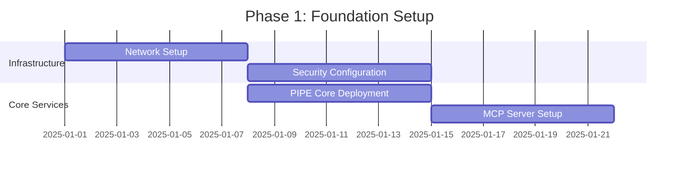

# 2-Tier CAG+RAG Solution Architecture with Cascaded Domain Integration

## Executive Summary

This document presents a comprehensive solution architecture for a 2-tier Context-Aware Generation (CAG) and Retrieval-Augmented Generation (RAG) system integrated with OpenCode/OpenSpec frameworks across multiple domain networks (BNi, BNP, PIPE, IV, AXIS, ECO, DC, BU). The architecture implements a cascaded approach with sophisticated knowledge graph integration and multi-domain orchestration.

---

## Table of Contents

1. [Architecture Overview](#architecture-overview)
2. [Domain Architecture](#domain-architecture)
3. [Network Infrastructure](#network-infrastructure)
4. [CAG+RAG System Design](#cag-rag-system-design)
5. [Pipeline Architecture](#pipeline-architecture)
6. [Bot Orchestration](#bot-orchestration)
7. [Security Architecture](#security-architecture)
8. [Implementation Roadmap](#implementation-roadmap)

---

## 1. Architecture Overview

### 1.1 High-Level Architecture

```
┌─────────────────────────────────────────────────────────────────────────────┐
│                          ENTERPRISE SOLUTION ARCHITECTURE                     │
├─────────────────────────────────────────────────────────────────────────────┤
│                                                                               │
│   ┌──────────────────────┐    ┌──────────────────────┐                     │
│   │   TIER 1: CAG LAYER  │───▶│   TIER 2: RAG LAYER  │                     │
│   │  (Context Generation)│    │ (Knowledge Retrieval)│                     │
│   └──────────┬───────────┘    └──────────┬───────────┘                     │
│              │                            │                                  │
│              ▼                            ▼                                  │
│   ┌─────────────────────────────────────────────────┐                       │
│   │            OPENCODE + OPENSPEC FRAMEWORK         │                       │
│   │  ┌──────────────┐  ┌───────────┐  ┌──────────┐│                       │
│   │  │ Spec Manager │  │Graph RAG  │  │MCP Server││                       │
│   │  └──────────────┘  └───────────┘  └──────────┘│                       │
│   └─────────────────────────────────────────────────┘                       │
│                                                                               │
│   ┌─────────────────────────────────────────────────────────────────┐       │
│   │                    CASCADED DOMAIN NETWORKS                      │       │
│   ├───────────┬───────────┬───────────┬───────────┬────────────────┤       │
│   │   PIPE    │    BNI    │    BNP    │   AXIS    │      IV        │       │
│   │ (Core API)│(Business) │(Platform) │   (AI)    │    (LLM)      │       │
│   ├───────────┼───────────┼───────────┼───────────┼────────────────┤       │
│   │   ECO     │    DC     │    BU     │   Labs    │   Security    │       │
│   │(Ecosystem)│  (Media)  │(Business) │(Research) │  (SecOps)     │       │
│   └───────────┴───────────┴───────────┴───────────┴────────────────┘       │
│                                                                               │
└─────────────────────────────────────────────────────────────────────────────┘
```

### 1.2 Key Components

| Component | Purpose | Technology Stack |
|-----------|---------|-----------------|
| **CAG Layer** | Context-aware generation and orchestration | Python, FastAPI, LangChain |
| **RAG Layer** | Knowledge retrieval and augmentation | Neo4j, Vector DB, Embeddings |
| **OpenSpec** | Specification-driven development | YAML/JSON specs, Validators |
| **OpenCode** | Code generation and management | AST parsing, Templates |
| **Domain Networks** | Service-specific implementations | Microservices, Kubernetes |

---

## 2. Domain Architecture

### 2.1 Domain Hierarchy

```yaml
Enterprise_Architecture:
  Core_Infrastructure:
    - PIPE: # Pipeline Infrastructure Processing Engine
        services: 21
        primary_function: "Core API and integration management"
        network_zone: "10.100.1.0/24"

  Business_Domains:
    - BNI: # Business Network Infrastructure
        services: 18
        primary_function: "Business service orchestration"
        network_zone: "10.100.3.0/24"

    - BNP: # Business Network Platform
        services: 18
        primary_function: "Platform services and APIs"
        network_zone: "10.100.4.0/24"

    - BU: # Business Unit
        services: 25
        primary_function: "Analytics, compliance, operations"
        network_zone: "10.100.5.0/24"

  AI_Domains:
    - AXIS: # AI Architecture
        services: 18
        primary_function: "AI model management and deployment"
        network_zone: "10.100.6.0/24"

    - IV: # IntelliVerse (LLM RAG)
        services: 18
        primary_function: "LLM orchestration and RAG"
        network_zone: "10.100.7.0/24"

  Specialised_Domains:
    - ECO: # EcoX Blockchain
        services: 18
        primary_function: "Blockchain and smart contracts"
        network_zone: "10.100.8.0/24"

    - DC: # Digital Content
        services: 18
        primary_function: "Media asset management"
        network_zone: "10.100.9.0/24"
```

### 2.2 Domain Interconnection Matrix

```
        ┌──────┬──────┬──────┬──────┬──────┬──────┬──────┬──────┐
        │ PIPE │ BNI  │ BNP  │ AXIS │  IV  │ ECO  │  DC  │  BU  │
┌───────┼──────┼──────┼──────┼──────┼──────┼──────┼──────┼──────┤
│ PIPE  │  ●   │  ◉   │  ◉   │  ◉   │  ◉   │  ○   │  ○   │  ◉   │
│ BNI   │  ◉   │  ●   │  ◉   │  ○   │  ○   │  ○   │  ○   │  ◉   │
│ BNP   │  ◉   │  ◉   │  ●   │  ○   │  ○   │  ○   │  ○   │  ◉   │
│ AXIS  │  ◉   │  ○   │  ○   │  ●   │  ◉   │  ○   │  ○   │  ○   │
│ IV    │  ◉   │  ○   │  ○   │  ◉   │  ●   │  ○   │  ◉   │  ○   │
│ ECO   │  ○   │  ○   │  ○   │  ○   │  ○   │  ●   │  ○   │  ○   │
│ DC    │  ○   │  ○   │  ○   │  ○   │  ◉   │  ○   │  ●   │  ○   │
│ BU    │  ◉   │  ◉   │  ◉   │  ○   │  ○   │  ○   │  ○   │  ●   │
└───────┴──────┴──────┴──────┴──────┴──────┴──────┴──────┴──────┘

Legend: ● = Self | ◉ = High Integration | ○ = Low Integration
```

---

## 3. Network Infrastructure

### 3.1 Network Zone Architecture

```
┌────────────────────────────────────────────────────────────────┐
│                     PIPE NETWORK ZONES                         │
├────────────────────────────────────────────────────────────────┤
│                                                                 │
│  ┌─────────────────────────────────────────────────────────┐ │
│  │ CORE NETWORK (10.100.1.0/24)                            │ │
│  │ • Gateway, DNS, DHCP, Load Balancer                     │ │
│  │ • API Services, Integration, UX                         │ │
│  │ • Authentication: Certificate + 2FA                     │ │
│  └─────────────────────────────────────────────────────────┘ │
│                                                                 │
│  ┌─────────────────────────────────────────────────────────┐ │
│  │ SECURITY NETWORK (10.100.12.0/24)                       │ │
│  │ • Firewall, IDS/IPS, Authentication                     │ │
│  │ • WAF, SIEM, IAM Services                              │ │
│  │ • Authentication: Hardware Token                        │ │
│  └─────────────────────────────────────────────────────────┘ │
│                                                                 │
│  ┌─────────────────────────────────────────────────────────┐ │
│  │ DATA NETWORK (10.100.2.0/24)                            │ │
│  │ • Data Gateway, Cache, Processing                       │ │
│  │ • Analytics, Storage, Data Processing                   │ │
│  │ • Authentication: Certificate + Key                     │ │
│  └─────────────────────────────────────────────────────────┘ │
│                                                                 │
│  ┌─────────────────────────────────────────────────────────┐ │
│  │ MONITORING NETWORK (10.100.10.0/24)                     │ │
│  │ • Monitor Gateway, Metrics, Alerts                      │ │
│  │ • Logging, Alerting, Health Checks                      │ │
│  │ • Authentication: Certificate                            │ │
│  └─────────────────────────────────────────────────────────┘ │
│                                                                 │
└────────────────────────────────────────────────────────────────┘
```

### 3.2 Subnet Allocation Strategy

| Subnet Type | IP Range | Purpose |
|-------------|----------|---------|
| Infrastructure | .1-.10 | Gateway, DNS, DHCP, Load Balancer |
| Primary Services | .11-.100 | API Endpoints, Core Processing, Primary DBs |
| Bot Services | .101-.150 | Automation Bots, Service Bots, Integration Bots |
| Support Services | .151-.200 | Backup, Monitoring Agents, Log Collectors |
| Dynamic Allocation | .201-.254 | Auto-scaling, Temporary Services, Testing |

---

## 4. CAG+RAG System Design

### 4.1 2-Tier CAG+RAG Architecture

```
┌─────────────────────────────────────────────────────────────────────┐
│                     TIER 1: CONTEXT-AWARE GENERATION (CAG)          │
├─────────────────────────────────────────────────────────────────────┤
│                                                                      │
│  ┌──────────────────┐    ┌──────────────────┐                     │
│  │ Context Manager  │───▶│ Prompt Engineer  │                     │
│  │ • User Context   │    │ • Template Engine │                     │
│  │ • Domain Context │    │ • Variable Inject │                     │
│  │ • History Track  │    │ • Context Merge   │                     │
│  └──────────────────┘    └──────────────────┘                     │
│           │                        │                                │
│           ▼                        ▼                                │
│  ┌─────────────────────────────────────────┐                       │
│  │     Context-Aware Query Processor       │                       │
│  │  • Query Analysis & Classification      │                       │
│  │  • Domain Routing & Load Balancing      │                       │
│  │  • Multi-Domain Query Decomposition     │                       │
│  └─────────────────────────────────────────┘                       │
│                                                                      │
└──────────────────────────────────┬──────────────────────────────────┘
                                   │
                                   ▼
┌─────────────────────────────────────────────────────────────────────┐
│              TIER 2: RETRIEVAL-AUGMENTED GENERATION (RAG)           │
├─────────────────────────────────────────────────────────────────────┤
│                                                                      │
│  ┌────────────────────────────────────────────────────────┐       │
│  │              HYBRID RETRIEVAL ENGINE                     │       │
│  ├────────────────────────────────────────────────────────┤       │
│  │                                                          │       │
│  │  ┌──────────────┐  ┌──────────────┐  ┌──────────────┐ │       │
│  │  │ Vector Store │  │ Graph Store  │  │ Document DB  │ │       │
│  │  │ • Embeddings │  │ • Neo4j      │  │ • MongoDB    │ │       │
│  │  │ • FAISS      │  │ • Relations  │  │ • Full Text  │ │       │
│  │  │ • Similarity │  │ • Traversal  │  │ • Metadata   │ │       │
│  │  └──────────────┘  └──────────────┘  └──────────────┘ │       │
│  │                                                          │       │
│  │  ┌──────────────────────────────────────────────────┐  │       │
│  │  │            KNOWLEDGE FUSION ENGINE                │  │       │
│  │  │  • Result Ranking & Merging                      │  │       │
│  │  │  • Cross-Domain Knowledge Linking                │  │       │
│  │  │  • Confidence Scoring & Validation               │  │       │
│  │  └──────────────────────────────────────────────────┘  │       │
│  └────────────────────────────────────────────────────────┘       │
│                                                                      │
│  ┌────────────────────────────────────────────────────────┐       │
│  │              AUGMENTATION PROCESSOR                      │       │
│  │  • Content Enrichment with Retrieved Knowledge          │       │
│  │  • Response Generation with Context Integration         │       │
│  │  • Multi-Modal Output Support (Text, Code, Specs)      │       │
│  └────────────────────────────────────────────────────────┘       │
│                                                                      │
└─────────────────────────────────────────────────────────────────────┘
```

### 4.2 Cascaded Processing Flow

```python
# Cascaded CAG+RAG Processing Pipeline
class CascadedCAGRAGPipeline:
    def __init__(self):
        self.domains = {
            'PIPE': PIPEDomain(),
            'BNI': BNIDomain(),
            'BNP': BNPDomain(),
            'AXIS': AXISDomain(),
            'IV': IVDomain(),
            'ECO': ECODomain(),
            'DC': DCDomain(),
            'BU': BUDomain()
        }

    async def process_query(self, query: Query) -> Response:
        # TIER 1: CAG Processing
        context = await self.build_context(query)
        classified_query = await self.classify_query(query, context)
        target_domains = await self.route_to_domains(classified_query)

        # TIER 2: RAG Processing (Cascaded)
        cascade_results = []
        for domain in target_domains:
            # Primary domain processing
            primary_result = await self.domains[domain].retrieve(
                query=classified_query,
                context=context
            )

            # Cascade to dependent domains
            dependent_domains = self.get_dependent_domains(domain)
            for dep_domain in dependent_domains:
                dep_result = await self.domains[dep_domain].retrieve(
                    query=classified_query,
                    context=context,
                    parent_result=primary_result
                )
                cascade_results.append(dep_result)

        # Fusion and augmentation
        fused_knowledge = await self.fuse_results(cascade_results)
        augmented_response = await self.generate_response(
            query=classified_query,
            knowledge=fused_knowledge,
            context=context
        )

        return augmented_response
```

---

## 5. Pipeline Architecture

### 5.1 Domain Pipeline Matrix

```
┌─────────────────────────────────────────────────────────────────────┐
│                      PIPELINE ORCHESTRATION                         │
├─────────────────────────────────────────────────────────────────────┤
│                                                                      │
│  Domain │ Pipeline Type           │ PIPE Bots      │ Infra Bots    │
│  ───────┼────────────────────────┼────────────────┼───────────────│
│  PIPE   │ Core API Pipeline      │ PAPI           │ PB, PINT      │
│         │ Smart Contract         │ PART           │ PB            │
│         │ Scaling Solutions      │ PINT           │ PDEP          │
│  ───────┼────────────────────────┼────────────────┼───────────────│
│  IV     │ LLM API Pipeline       │ PAPI           │ PB, IB        │
│         │ LLM Build Pipeline     │ PART           │ PB, IB        │
│         │ RAG Integration        │ PINT           │ PINT, IINT    │
│  ───────┼────────────────────────┼────────────────┼───────────────│
│  AXIS   │ API Management         │ PAPI           │ PB, AB        │
│         │ AI Build Pipeline      │ PART           │ PB, AB        │
│         │ Model Integration      │ PINT           │ PINT, AINT    │
│  ───────┼────────────────────────┼────────────────┼───────────────│
│  BNI    │ API Management         │ PAPI           │ PB, NB        │
│         │ Build Process          │ PART           │ PB, NB        │
│         │ Integration            │ PINT           │ PINT, BINT    │
│                                                                      │
└─────────────────────────────────────────────────────────────────────┘
```

### 5.2 Pipeline Execution Flow

```yaml
Pipeline_Execution:
  Input_Layer:
    - API_Requests: "External and internal API calls"
    - Data_Sources: "Databases, streams, external APIs"
    - User_Interface: "UI-triggered workflows"

  Processing_Layer:
    stages:
      - Stage_1_Validation:
          components:
            - Input validation
            - Authentication check
            - Rate limiting

      - Stage_2_Routing:
          components:
            - Domain classification
            - Pipeline selection
            - Load balancing

      - Stage_3_Execution:
          components:
            - Bot orchestration
            - Service invocation
            - Data processing

      - Stage_4_Aggregation:
          components:
            - Result collection
            - Data fusion
            - Response formatting

  Output_Layer:
    - API_Responses: "Formatted JSON/XML responses"
    - Event_Streams: "Real-time event notifications"
    - Storage_Updates: "Database and cache updates"
```

---

## 6. Bot Orchestration

### 6.1 Bot Hierarchy and Responsibilities

```
┌──────────────────────────────────────────────────────────────┐
│                    BOT ORCHESTRATION LAYER                   │
├──────────────────────────────────────────────────────────────┤
│                                                               │
│  ┌─────────────────────────────────────────────────────────┐│
│  │                  MASTER ORCHESTRATOR                     ││
│  │  • Global coordination                                   ││
│  │  • Resource allocation                                   ││
│  │  • Failure recovery                                      ││
│  └────────────────────┬─────────────────────────────────────┘│
│                       │                                       │
│  ┌────────────────────┼────────────────────┐                │
│  │                    │                     │                │
│  ▼                    ▼                     ▼                │
│  ┌──────────┐  ┌──────────┐  ┌──────────┐                 │
│  │PIPE BOTS │  │INFRA BOTS│  │SPEC BOTS │                 │
│  ├──────────┤  ├──────────┤  ├──────────┤                 │
│  │• PAPI    │  │• PB      │  │• Validator│                 │
│  │• PART    │  │• BB      │  │• Generator│                 │
│  │• PINT    │  │• NB      │  │• Analyser │                 │
│  │• PCMP    │  │• IB      │  │• Mapper   │                 │
│  └──────────┘  └──────────┘  └──────────┘                 │
│                                                               │
└──────────────────────────────────────────────────────────────┘
```

### 6.2 Bot Communication Protocol

```python
# Bot Communication Interface
class BotCommunicationProtocol:
    def __init__(self):
        self.message_bus = MessageBus()
        self.event_store = EventStore()

    async def send_command(self,
                          bot_id: str,
                          command: Command) -> Response:
        """Send command to specific bot"""
        message = Message(
            target=bot_id,
            command=command,
            timestamp=datetime.now(),
            correlation_id=generate_correlation_id()
        )

        # Publish to message bus
        await self.message_bus.publish(message)

        # Wait for response with timeout
        response = await self.wait_for_response(
            correlation_id=message.correlation_id,
            timeout=30  # seconds
        )

        return response

    async def broadcast_event(self, event: Event):
        """Broadcast event to all subscribed bots"""
        await self.event_store.store(event)
        await self.message_bus.broadcast(event)
```

---

## 7. Security Architecture

### 7.1 Multi-Layer Security Model

```
┌────────────────────────────────────────────────────────────────┐
│                    SECURITY ARCHITECTURE                       │
├────────────────────────────────────────────────────────────────┤
│                                                                 │
│  Layer 1: Network Security                                     │
│  ┌──────────────────────────────────────────────────────────┐│
│  │ • Firewall Rules     • IDS/IPS     • DDoS Protection     ││
│  │ • Network Segmentation            • Traffic Monitoring    ││
│  └──────────────────────────────────────────────────────────┘│
│                                                                 │
│  Layer 2: Application Security                                 │
│  ┌──────────────────────────────────────────────────────────┐│
│  │ • WAF               • API Gateway Security               ││
│  │ • Input Validation  • Output Encoding                    ││
│  └──────────────────────────────────────────────────────────┘│
│                                                                 │
│  Layer 3: Data Security                                        │
│  ┌──────────────────────────────────────────────────────────┐│
│  │ • Encryption at Rest    • Encryption in Transit          ││
│  │ • Data Masking         • Access Control Lists            ││
│  └──────────────────────────────────────────────────────────┘│
│                                                                 │
│  Layer 4: Identity & Access Management                         │
│  ┌──────────────────────────────────────────────────────────┐│
│  │ • Multi-Factor Authentication    • Role-Based Access     ││
│  │ • Certificate Management         • Token Management       ││
│  └──────────────────────────────────────────────────────────┘│
│                                                                 │
└────────────────────────────────────────────────────────────────┘
```

### 7.2 Authentication Matrix

| Zone | Authentication Method | Access Level | Monitoring |
|------|----------------------|--------------|------------|
| Core Network | Certificate + 2FA | Full | Full Packet Capture |
| Security Network | Hardware Token | Restricted | Security Logs |
| Data Network | Certificate + Key | Read/Write | Data Access Logs |
| Monitoring Network | Certificate | Read-only | Metric Collection |

---

## 8. Implementation Roadmap

### 8.1 Phase 1: Foundation (Weeks 1-4)



**Deliverables:**
- Network zones configured (Core, Security, Data, Monitoring)
- Basic security policies implemented
- PIPE core services deployed
- MCP server operational

### 8.2 Phase 2: CAG Implementation (Weeks 5-8)

```yaml
Phase_2_Tasks:
  Week_5:
    - Context Manager implementation
    - Prompt engineering framework
    - Query classification system

  Week_6:
    - Domain routing logic
    - Load balancing configuration
    - Multi-domain query decomposition

  Week_7:
    - CAG testing and optimisation
    - Performance benchmarking
    - Error handling implementation

  Week_8:
    - Integration testing
    - Documentation
    - Deployment to staging
```

### 8.3 Phase 3: RAG Enhancement (Weeks 9-12)

**Components to Implement:**
1. **Vector Store Setup**
   - Embedding generation pipeline
   - FAISS index configuration
   - Similarity search optimisation

2. **Graph Database**
   - Neo4j deployment
   - Knowledge graph schema design
   - Relationship mapping

3. **Document Database**
   - MongoDB configuration
   - Full-text search indexing
   - Metadata management

4. **Knowledge Fusion Engine**
   - Result ranking algorithms
   - Cross-domain linking
   - Confidence scoring

### 8.4 Phase 4: Domain Integration (Weeks 13-16)

```python
# Domain Integration Schedule
integration_schedule = {
    "Week_13": ["IV (IntelliVerse)", "AXIS (AI)"],
    "Week_14": ["BNI", "BNP"],
    "Week_15": ["ECO", "DC"],
    "Week_16": ["BU", "Labs", "Final Integration"]
}
```

### 8.5 Phase 5: Production Deployment (Weeks 17-20)

**Final Steps:**
- Performance testing at scale
- Security audit and penetration testing
- Disaster recovery planning
- Production deployment
- Monitoring and alerting setup
- Documentation and training

---

## 9. Monitoring and Operations

### 9.1 Key Performance Indicators (KPIs)

| Metric | Target | Measurement Method |
|--------|--------|-------------------|
| Query Response Time | < 2 seconds | API monitoring |
| System Availability | 99.9% | Uptime monitoring |
| Context Accuracy | > 95% | Quality sampling |
| RAG Relevance Score | > 0.85 | Automated scoring |
| Bot Success Rate | > 98% | Task completion tracking |

### 9.2 Operational Dashboard

```
┌────────────────────────────────────────────────────────────────┐
│                    OPERATIONAL DASHBOARD                       │
├────────────────────────────────────────────────────────────────┤
│                                                                 │
│  System Health     │  Performance      │  Security            │
│  ─────────────    │  ────────────     │  ─────────          │
│  ● PIPE: Online   │  Latency: 1.2s    │  Threats: 0         │
│  ● IV: Online     │  TPS: 1,234       │  Blocked: 12        │
│  ● AXIS: Online   │  CPU: 45%         │  Auth Failures: 3   │
│  ● BNI: Online    │  Memory: 62%      │  Active Sessions: 234│
│                    │                   │                      │
│  Bot Status        │  Pipeline Health  │  Data Flow          │
│  ──────────       │  ───────────────  │  ──────────        │
│  Active: 46/50    │  Running: 12      │  Input: 5.2 GB/h    │
│  Idle: 4          │  Queued: 3        │  Output: 4.8 GB/h   │
│  Failed: 0        │  Failed: 0        │  Cache Hit: 78%     │
│                                                                 │
└────────────────────────────────────────────────────────────────┘
```

---

## 10. Disaster Recovery and Business Continuity

### 10.1 Recovery Strategy

```yaml
Disaster_Recovery:
  RTO: "4 hours"  # Recovery Time Objective
  RPO: "1 hour"   # Recovery Point Objective

  Backup_Strategy:
    - Frequency: "Every 15 minutes"
    - Retention: "30 days"
    - Locations:
        - Primary: "On-premise storage"
        - Secondary: "Cloud storage (encrypted)"
        - Tertiary: "Offsite tape backup"

  Failover_Mechanism:
    - Automatic: "For critical services"
    - Manual: "For non-critical services"
    - Testing: "Monthly DR drills"
```

### 10.2 Incident Response Plan

1. **Detection** → Automated monitoring alerts
2. **Assessment** → Severity classification (P1-P4)
3. **Containment** → Isolate affected systems
4. **Eradication** → Remove root cause
5. **Recovery** → Restore normal operations
6. **Post-Incident** → Review and improve

---

## 11. Conclusion and Next Steps

### 11.1 Summary

This solution architecture provides:
- **Scalable 2-tier CAG+RAG system** with context-aware generation and knowledge retrieval
- **Cascaded domain integration** across 8 specialised domains
- **Robust security architecture** with multi-layer protection
- **Comprehensive bot orchestration** for automated workflows
- **OpenCode/OpenSpec integration** for specification-driven development

### 11.2 Immediate Next Steps

1. **Technical Review** - Architecture validation with stakeholders
2. **Resource Planning** - Team allocation and skill assessment
3. **Environment Setup** - Development and staging environments
4. **Proof of Concept** - Implement core CAG+RAG for PIPE domain
5. **Security Audit** - Initial security assessment and recommendations

### 11.3 Success Metrics

- **Technical Success**: Meeting all KPIs defined in Section 9.1
- **Business Success**: Improved development velocity by 40%
- **Operational Success**: Reduced manual interventions by 60%
- **Quality Success**: Increased code quality metrics by 35%

---

## Appendix A: Technology Stack Details

| Component | Technology | Version | Purpose |
|-----------|------------|---------|---------|
| CAG Engine | Python/FastAPI | 3.11/0.104 | Context processing |
| RAG Engine | LangChain | 0.1.x | Knowledge retrieval |
| Vector DB | FAISS | 1.7.4 | Similarity search |
| Graph DB | Neo4j | 5.x | Relationship mapping |
| Document DB | MongoDB | 7.0 | Document storage |
| Message Bus | RabbitMQ | 3.12 | Async communication |
| Container | Kubernetes | 1.28 | Orchestration |
| Monitoring | Prometheus/Grafana | Latest | Metrics & visualisation |

## Appendix B: API Specifications

```openapi
openapi: 3.0.0
info:
  title: CAG+RAG API
  version: 1.0.0
paths:
  /api/v1/query:
    post:
      summary: Process CAG+RAG query
      requestBody:
        content:
          application/json:
            schema:
              type: object
              properties:
                query:
                  type: string
                context:
                  type: object
                domains:
                  type: array
                  items:
                    type: string
      responses:
        200:
          description: Successful response
          content:
            application/json:
              schema:
                type: object
                properties:
                  response:
                    type: string
                  metadata:
                    type: object
                  confidence:
                    type: number
```

---

*Document Version: 1.0*
*Last Updated: November 2024*
*Classification: Internal Use*
