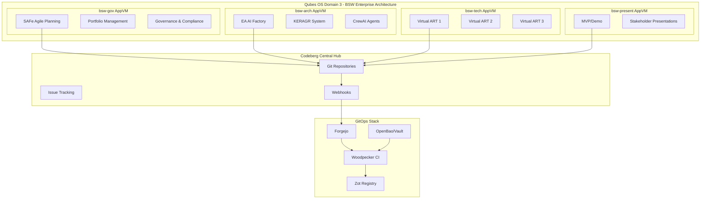
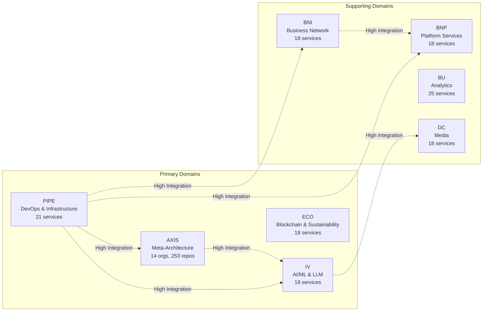
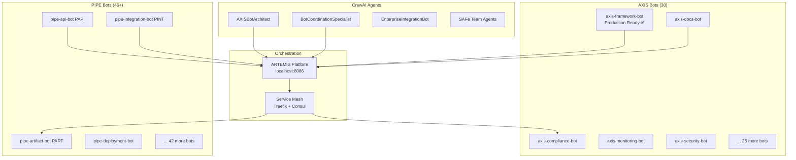
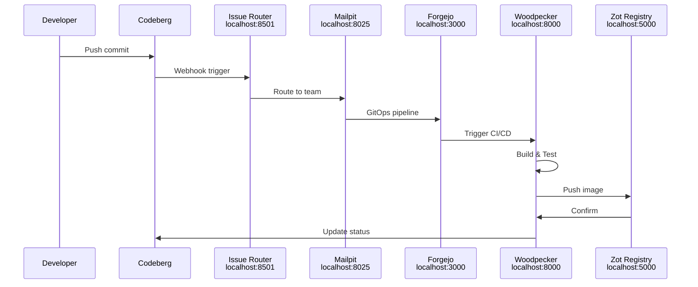
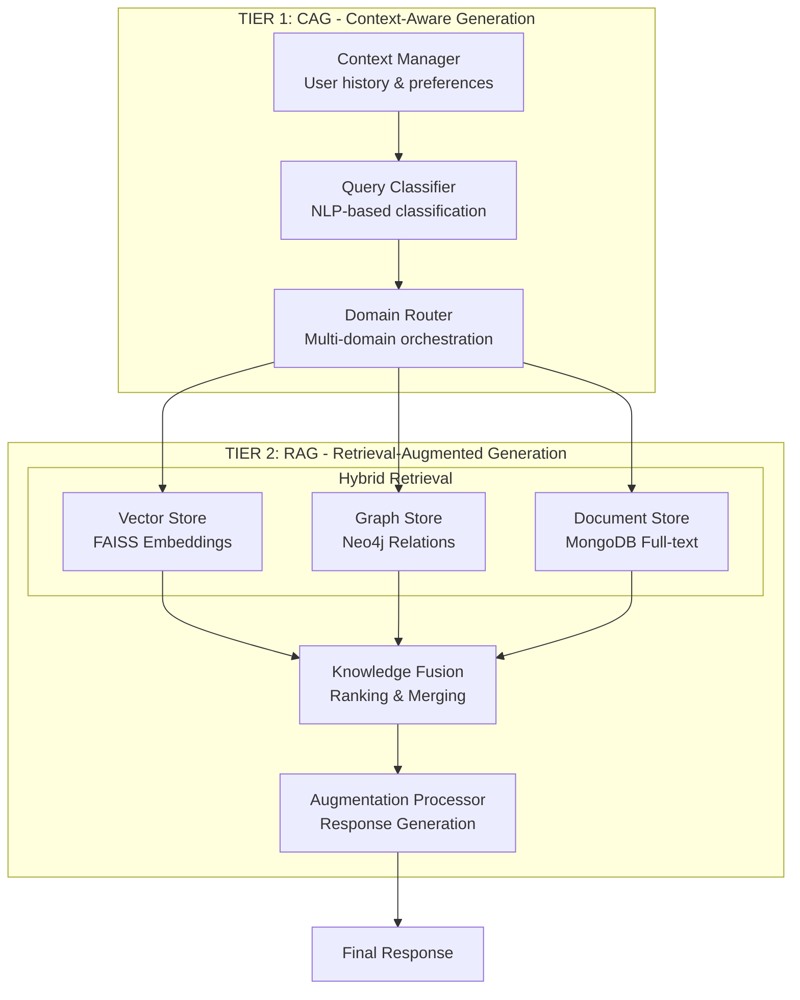
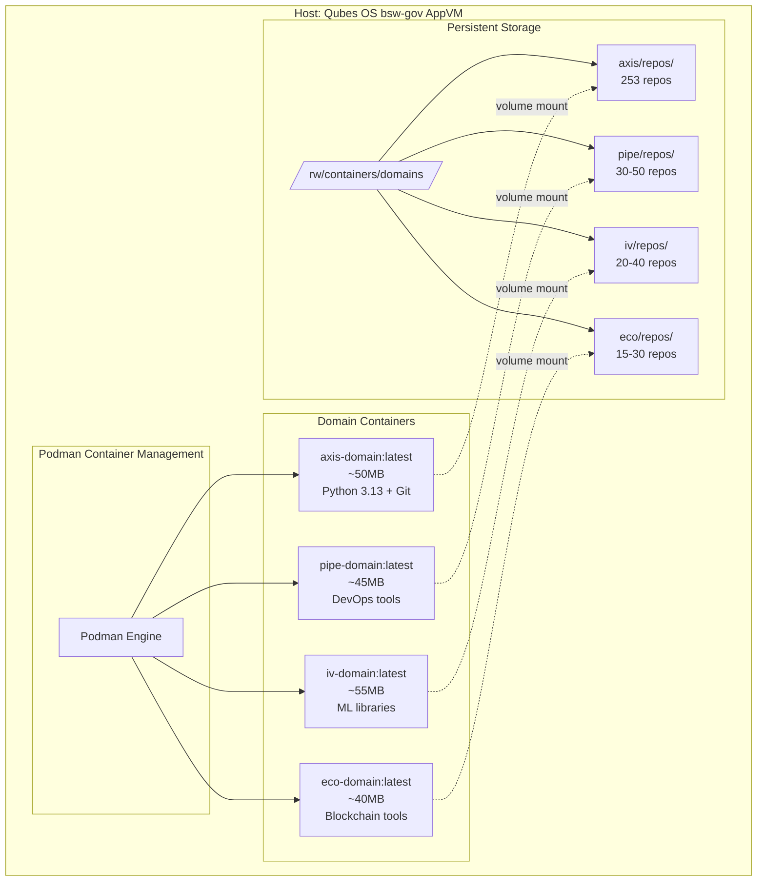
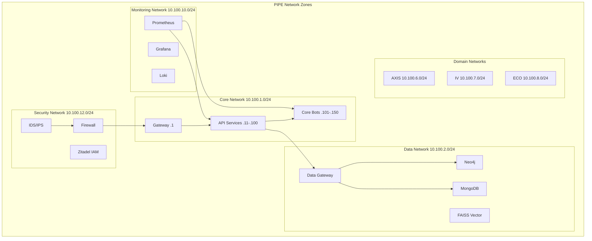
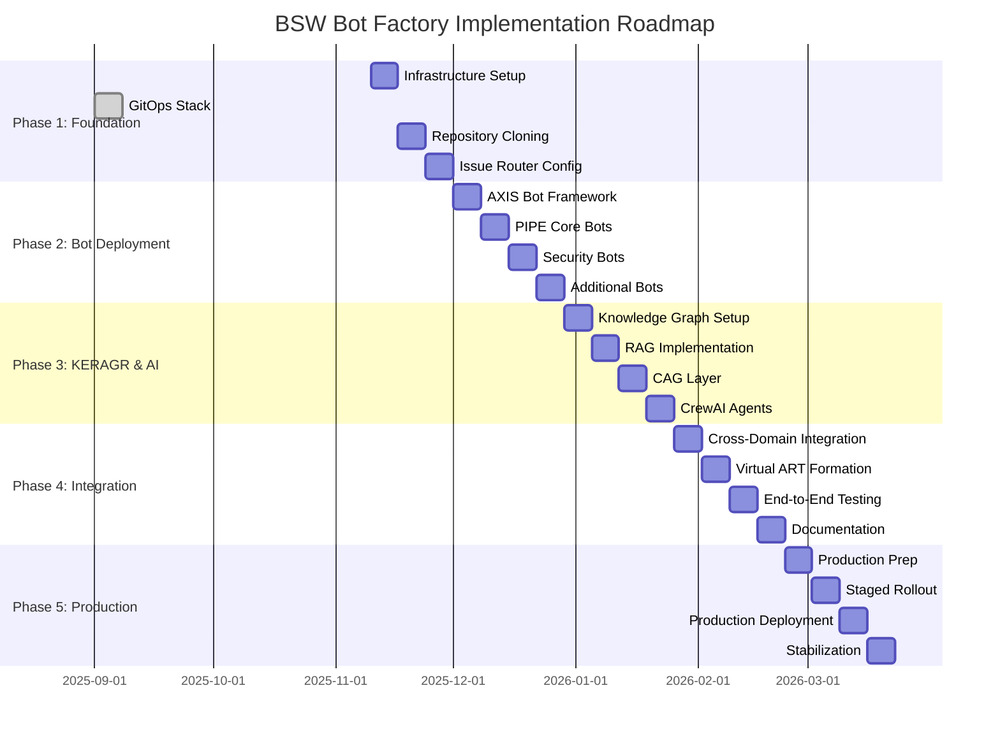
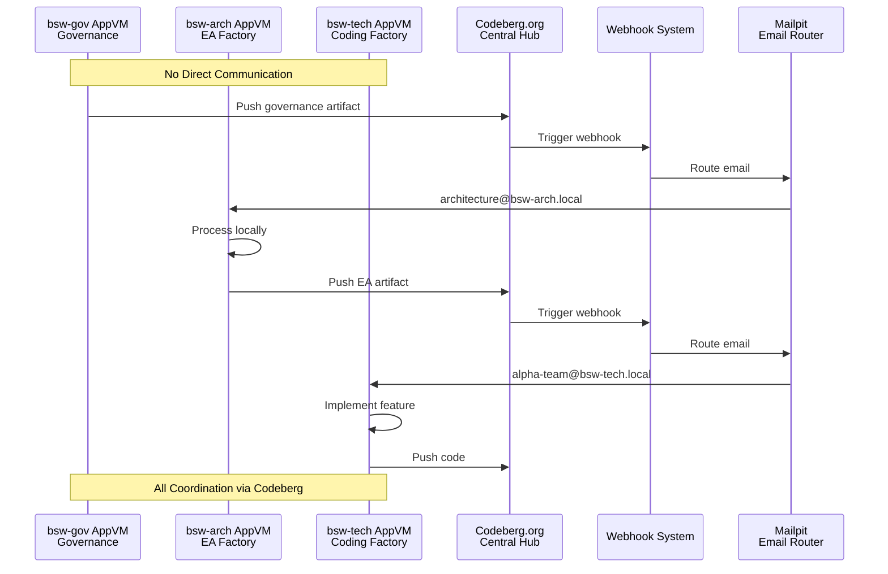
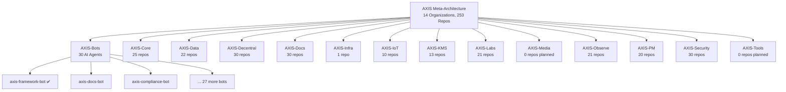

# Comprehensive Bot Factory Architecture Analysis for Codeberg Deployment
## BSW-GOV Multi-Domain Enterprise Architecture

**Analysis Date**: 2025-11-10  
**Source Directory**: /home/user/QubesIncoming/bsw-gov  
**Analysis Scope**: Complete bot factory architecture for Codeberg deployment  
**Analyst**: Claude Code (Sonnet 4.5)

---

## Table of Contents

1. [Executive Summary](#1-executive-summary)
2. [Architecture Components](#2-architecture-components)
3. [Domain Organization](#3-domain-organization)
4. [Bot Types and Functions](#4-bot-types-and-functions)
5. [Container and Deployment Strategy](#5-container-and-deployment-strategy)
6. [GitOps Workflow](#6-gitops-workflow)
7. [Multi-Tab Claude Instructions](#7-multi-tab-claude-instructions)
8. [Implementation Roadmap](#8-implementation-roadmap)
9. [Key Files Reference](#9-key-files-reference)
10. [Mermaid Diagrams](#10-mermaid-diagrams)

---

## 1. Executive Summary

### 1.1 Overview

The BSW-GOV (Biological Semantic Web - Government) enterprise architecture implements a sophisticated bot factory system designed for deployment on Codeberg infrastructure. This architecture represents a comprehensive multi-domain approach to enterprise architecture automation, combining:

- **4 Core AppVMs** in Qubes OS for maximum security isolation
- **4 Primary Domains** (PIPE, AXIS, IV, ECO) with specialized functions
- **253+ Repositories** across 14 AXIS organizations
- **30+ AI Agents** for automation and orchestration
- **2-Tier CAG+RAG System** for intelligent knowledge management
- **Complete GitOps Stack** for continuous deployment

### 1.2 Key Architectural Decisions

| Aspect | Decision | Rationale |
|--------|----------|-----------|
| **Digital Sovereignty** | Codeberg.org (European FOSS) | GDPR compliance, EU data residency |
| **Container Base** | Chainguard Wolfi + apko | Minimal attack surface (<50MB per container) |
| **Orchestration** | Podman pods (K3s alternative) | Qubes OS compatibility, security isolation |
| **Secrets Management** | OpenBao (Vault fork) | Open source, no HashiCorp BSL license |
| **Identity Management** | Zitadel (Swiss) | European, GDPR-native |
| **CI/CD** | Woodpecker CI | Lightweight, Forgejo-integrated |
| **Container Registry** | Zot | OCI-compliant, local registry |

### 1.3 Core Value Proposition

The bot factory architecture provides:

- **Automated EA Artifact Generation**: ArchOps workflow using AI agents
- **Cross-Domain Knowledge Sharing**: KERAGR (Knowledge Enhanced RAG) system
- **SAFe Agile Integration**: Hybrid human-AI team structures
- **Complete Security Isolation**: Qubes OS AppVM architecture
- **European Data Sovereignty**: 100% Euro-Stack compliant
- **Zero Vendor Lock-in**: All open source components

---

## 2. Architecture Components

### 2.1 BSW 4-AppVM Architecture (Qubes OS Domain 3)

The architecture operates within Qubes OS with strict AppVM isolation:

```
┌─────────────────────────────────────────────────────────────────────┐
│                      QUBES OS DOMAIN 3                              │
│                  BSW ENTERPRISE ARCHITECTURE                        │
├─────────────────────────────────────────────────────────────────────┤
│                                                                     │
│  ┌──────────────────┐  ┌──────────────────┐                       │
│  │  bsw-gov AppVM   │  │  bsw-arch AppVM  │                       │
│  │  SAFe Agile      │  │  EA AI Factory   │                       │
│  │  Planning &      │  │  KERAGR          │                       │
│  │  Governance      │  │  CrewAI Agents   │                       │
│  └────────┬─────────┘  └────────┬─────────┘                       │
│           │                      │                                  │
│           └──────────┬───────────┘                                  │
│                      │                                              │
│                      ▼                                              │
│              ┌───────────────┐                                      │
│              │  CODEBERG.ORG │ (Central Git Hub)                   │
│              │  European FOSS│                                      │
│              └───────┬───────┘                                      │
│                      │                                              │
│           ┌──────────┴──────────┐                                  │
│           │                     │                                  │
│  ┌────────▼─────────┐  ┌───────▼──────────┐                      │
│  │  bsw-tech AppVM  │  │  bsw-present     │                      │
│  │  Coding Factory  │  │  Stakeholder     │                      │
│  │  Virtual ARTs    │  │  Presentations   │                      │
│  │  DevSecOps       │  │  MVP/Demo        │                      │
│  └──────────────────┘  └──────────────────┘                      │
│                                                                     │
└─────────────────────────────────────────────────────────────────────┘
```

**Security Model**:
- **No direct AppVM communication** - All coordination through Codeberg git operations
- **Git-only data transfer** - Webhooks trigger automated pipelines
- **Container isolation** - All tools run in Chainguard distroless containers
- **Zero trust** - No trust relationships between AppVMs

### 2.2 Complete GitOps Stack (Operational)

**Status**: ✅ Fully operational as of 2025-09-01 00:15 UTC

**Core Services**:
- **Forgejo** (localhost:3000) - Local Git server with Codeberg mirroring
- **Woodpecker CI** (localhost:8000) - Continuous integration and deployment
- **Vault/OpenBao** (localhost:8200) - Secrets management
- **Zot Registry** (localhost:5000) - Container registry
- **Mailpit** (localhost:8025) - Email routing and notifications
- **Prometheus** (localhost:9090) - Metrics collection
- **Issue Router** (localhost:8501) - Webhook processing

**Pipeline Flow**:
```
Codeberg → Webhook → Issue Router → Email Routing
                             ↓
          Mailpit ← GitOps Pipeline ← Forgejo
                             ↓
          Woodpecker CI → Build → Zot Registry
                             ↓
          OpenTofu (IaC) → Ansible → Deployment
                             ↓
          Vault ← Secrets ← Prometheus ← Monitoring
```

### 2.3 8-Namespace Pod Structure

Deployed using Podman pods as K3s alternative:

| Namespace | CPU | Memory | Security | Purpose |
|-----------|-----|--------|----------|---------|
| bsw-gov-core | 8 CPU | 16g | High | Essential infrastructure |
| bsw-gov-security | 4 CPU | 8g | Critical | Vault, secrets management |
| bsw-gov-gitops | 4 CPU | 8g | High | Forgejo, webhooks, CI/CD |
| bsw-gov-monitoring | 4 CPU | 8g | Medium | Prometheus, Grafana, metrics |
| bsw-gov-data | 4 CPU | 8g | High | Weaviate, knowledge base |
| bsw-gov-agents | 4 CPU | 4g | Medium | CrewAI SAFe agents |
| bsw-gov-workflows | 2 CPU | 4g | Medium | n8n, Mailpit, automation |
| bsw-gov-registry | 2 CPU | 4g | High | Zot container registry |

**Total Resources**: 36 CPU, 68g RAM across 8 isolated namespaces

### 2.4 2-Tier CAG+RAG System Architecture

The knowledge management system implements a sophisticated two-tier architecture:

**TIER 1: Context-Aware Generation (CAG)**
- **Context Manager**: User history tracking and preference analysis
- **Prompt Engineer**: Template engine and context merging
- **Query Processor**: Query analysis, classification, and domain routing
- **Multi-Domain Orchestration**: Load balancing across 8 domains

**TIER 2: Retrieval-Augmented Generation (RAG)**
- **Hybrid Retrieval Engine**: Vector (FAISS) + Graph (Neo4j) + Document (MongoDB)
- **Knowledge Fusion Engine**: Result ranking, cross-domain linking, confidence scoring
- **Augmentation Processor**: Content enrichment and multi-modal output

---

## 3. Domain Organization

### 3.1 Primary Domains

#### 3.1.1 AXIS Domain (14 Organizations, 253 Repositories)

AXIS serves as the meta-architecture and project coordination domain:

**Organizations**:
1. **AXIS-Bots** (30 repos) - AI agent automation and orchestration
2. **AXIS-Core** (25 repos) - Central command and ARTEMIS integration
3. **AXIS-Data** (22 repos) - Core modules and data architecture
4. **AXIS-Decentral** (30 repos) - Enterprise architecture and governance
5. **AXIS-Docs** (30 repos) - Documentation and knowledge management
6. **AXIS-Infra** (1 repo) - Infrastructure and deployment
7. **AXIS-IoT** (10 repos) - IoT device management
8. **AXIS-KMS** (13 repos) - Knowledge management systems
9. **AXIS-Labs** (21 repos) - Innovation and research
10. **AXIS-Media** (0 repos) - Media processing (planned)
11. **AXIS-Observe** (21 repos) - Monitoring and observability
12. **AXIS-PM** (20 repos) - Project management
13. **AXIS-Security** (30 repos) - Security, Web3, ethical AI
14. **AXIS-Tools** (0 repos) - Development tools (planned)

**Meta-Architecture Role**:
- Orchestrates architecture decisions across all BSW domains
- Coordinates enterprise architecture deliverables
- Facilitates knowledge exchange between domains
- Ensures architectural consistency and compliance

#### 3.1.2 PIPE Domain (DevOps & Infrastructure)

**Purpose**: Pipeline Infrastructure Processing Engine - Core API and integration management

**Sub-Organizations** (13 organizations):
- **PIPE-Core**: Core functionalities and services
- **PIPE-Bots**: Integration bots and automation agents (46+ bots)
- **PIPE-Docs**: Documentation repositories (30+ doc types)
- **PIPE-KMS**: Knowledge Management Systems
- **PIPE-Data**: Data pipeline and analytics (16 repos)
- **PIPE-Security**: Security protocols (30+ security repos)
- **PIPE-Observability**: Monitoring and observability
- **PIPE-Decentralized**: Blockchain and decentralized services
- **PIPE-CI-CD**: Continuous integration and deployment
- **PIPE-Infra**: Infrastructure management (Pulumi, OpenTofu, K3s)
- **PIPE-IoT**: Internet of Things components (10 repos)
- **PIPE-Labs**: Experimental and research projects (20+ repos)
- **PIPE-Media**: Media processing and management (10 repos)

**Network Zone**: 10.100.1.0/24 (Core Network)
**Primary Services**: 21 core services
**Key Function**: Core API management, integration orchestration, DevOps automation

#### 3.1.3 IV Domain (IntelliVerse - AI/ML & LLM)

**Purpose**: LLM orchestration, RAG operations, and intelligent systems

**Network Zone**: 10.100.7.0/24
**Primary Services**: 18 AI/ML services
**Key Components**:
- LLM API management and orchestration
- RAG integration with knowledge graphs
- Machine learning model deployment
- AI ethics and governance
- Semantic integration and knowledge graphs

**Codeberg Organization**: IntelliVerse or IV
**Expected Repos**: 20-40 (AI models, ML pipelines, knowledge graphs, memory systems)

#### 3.1.4 ECO Domain (ECOX - Sustainability & Blockchain)

**Purpose**: Value streams, sustainability metrics, circular economy, blockchain

**Network Zone**: 10.100.8.0/24
**Primary Services**: 18 blockchain and sustainability services
**Key Components**:
- ESG metrics and carbon tracking
- Circular economy models
- Blockchain smart contracts (Hyperledger)
- Distributed storage (IPFS)
- Sustainability architecture patterns

**Codeberg Organization**: ECOX or ECO
**Expected Repos**: 15-30 (ESG metrics, carbon tracking, circular economy models)

### 3.2 Supporting Domains

#### 3.2.1 BNI (Business Network Infrastructure)

- **Network Zone**: 10.100.3.0/24
- **Services**: 18 business services
- **Function**: Business service orchestration, workflow automation
- **Integration**: High integration with PIPE and BNP

#### 3.2.2 BNP (Business Network Platform)

- **Network Zone**: 10.100.4.0/24
- **Services**: 18 platform services
- **Function**: Platform services, APIs, business logic
- **Integration**: High integration with PIPE and BU

#### 3.2.3 BU (Business Unit)

- **Network Zone**: 10.100.5.0/24
- **Services**: 25 analytics and operations services
- **Function**: Analytics, compliance, operations management
- **Integration**: Cross-domain analytics

#### 3.2.4 DC (Digital Content)

- **Network Zone**: 10.100.9.0/24
- **Services**: 18 media services
- **Function**: Media asset management, CDN, streaming
- **Integration**: IV integration for AI-driven media processing

### 3.3 Domain Interconnection Matrix

```
      │ PIPE │ BNI  │ BNP  │ AXIS │  IV  │ ECO  │  DC  │  BU  │
──────┼──────┼──────┼──────┼──────┼──────┼──────┼──────┼──────┤
PIPE  │  ●   │  ◉   │  ◉   │  ◉   │  ◉   │  ○   │  ○   │  ◉   │
BNI   │  ◉   │  ●   │  ◉   │  ○   │  ○   │  ○   │  ○   │  ◉   │
BNP   │  ◉   │  ◉   │  ●   │  ○   │  ○   │  ○   │  ○   │  ◉   │
AXIS  │  ◉   │  ○   │  ○   │  ●   │  ◉   │  ○   │  ○   │  ○   │
IV    │  ◉   │  ○   │  ○   │  ◉   │  ●   │  ○   │  ◉   │  ○   │
ECO   │  ○   │  ○   │  ○   │  ○   │  ○   │  ●   │  ○   │  ○   │
DC    │  ○   │  ○   │  ○   │  ○   │  ◉   │  ○   │  ●   │  ○   │
BU    │  ◉   │  ◉   │  ◉   │  ○   │  ○   │  ○   │  ○   │  ●   │

Legend: ● = Self | ◉ = High Integration | ○ = Low Integration
```

---

## 4. Bot Types and Functions

### 4.1 AXIS Bot Ecosystem (30 AI Agents)

**Organization**: AXIS-Bots (codeberg.org/AXIS-Bots)

#### 4.1.1 Framework and Core Bots

1. **axis-framework-bot** ✅ Production Ready
   - Framework detection and update management
   - Python 3.13 compatibility checking
   - Configuration validation
   - API: http://localhost:8085/api/v1/framework
   - Containers: 3 (bot, scheduler, executor) ~95MB each

2. **axis-orchestration-bot**
   - Coordinates pipeline processes
   - Multi-bot workflow management
   - Service mesh integration

3. **axis-framework-scheduler**
   - Automated scheduling of framework updates
   - Dependency management
   - Version compatibility checking

4. **axis-framework-executor**
   - Executes framework operations
   - Rollback capabilities
   - Health monitoring

#### 4.1.2 Documentation and Knowledge Bots

5. **axis-docs-bot**
   - Documentation generation and updates
   - Integration with framework-bot
   - API: http://localhost:8085/api/v1/docs

6. **axis-kb-bot**
   - Knowledge base content management
   - KERAGR integration
   - Semantic search enablement

7. **axis-changelog-bot**
   - Automated changelog generation
   - Version history tracking
   - Release notes creation

#### 4.1.3 Development and Quality Bots

8. **axis-code-review-bot**
   - Automated code review processes
   - Pattern matching for best practices
   - Security vulnerability detection

9. **axis-lint-bot**
   - Code linting and style checks
   - UK English spelling enforcement
   - Consistent formatting

10. **axis-dependency-bot**
    - Dependency tracking and updates
    - Security vulnerability scanning
    - License compliance checking

11. **axis-coverage-bot**
    - Test coverage tracking
    - Quality metrics reporting
    - Trend analysis

#### 4.1.4 Security and Compliance Bots

12. **axis-compliance-bot**
    - Standards and policy enforcement
    - Framework validation
    - API: http://localhost:8085/api/v1/compliance

13. **axis-audit-bot**
    - Automated security audits
    - Comprehensive audit trails
    - API: http://localhost:8085/api/v1/audit

14. **axis-license-bot**
    - License compliance management
    - Open source validation
    - Legal risk assessment

15. **axis-security-bot**
    - Security scanning and validation
    - Vulnerability assessment
    - API endpoint: /api/v1/security

#### 4.1.5 CI/CD and Deployment Bots

16. **axis-build-bot**
    - Build process management
    - Container image creation
    - Artifact generation

17. **axis-artifact-bot**
    - Artifact handling and storage
    - Version management
    - Distribution coordination

18. **axis-gateway-bot**
    - External integration handling
    - API gateway management
    - Service discovery

19. **axis-infra-bot**
    - Infrastructure automation
    - Deployment orchestration
    - Resource provisioning

20. **axis-deployment-bot** (implied from axis-infra-bot)
    - Automated deployment processes
    - Environment management
    - Rollback capabilities

#### 4.1.6 Operations and Monitoring Bots

21. **axis-monitoring-bot**
    - System monitoring and health checks
    - Performance tracking
    - API: http://localhost:8085/api/v1/monitoring

22. **axis-healthcheck-bot**
    - Automated health checks
    - Service availability monitoring
    - Alerting integration

23. **axis-alert-bot**
    - Notification management
    - Alert routing
    - Incident escalation

24. **axis-log-bot**
    - Log collection and analysis
    - Centralized logging
    - Pattern detection

25. **axis-metrics-bot**
    - Metrics collection and processing
    - KPI tracking
    - Dashboard integration

#### 4.1.7 Data and Configuration Bots

26. **axis-config-bot**
    - Configuration management
    - Environment-specific configs
    - Secret rotation

27. **axis-cache-bot**
    - Caching operations
    - Performance optimization
    - Cache invalidation

28. **axis-backup-bot**
    - Backup operations management
    - Disaster recovery
    - Data retention

29. **axis-cleanup-bot**
    - System cleanup and maintenance
    - Resource optimization
    - Garbage collection

30. **axis-integration-bot**
    - Service integration monitoring
    - Cross-domain coordination
    - API health checking

#### 4.1.8 Additional Specialized Bots

31. **axis-project-bot**
    - Project coordination
    - Task management
    - Resource allocation

32. **axis-performance-bot**
    - Performance testing
    - Load testing
    - Benchmark analysis

33. **axis-localization-bot**
    - Translation management
    - i18n support
    - Multi-language documentation

### 4.2 PIPE Bot Ecosystem (46+ Bots)

**Organization**: PIPE-Bots (codeberg.org/PIPE-Bots)

#### 4.2.1 Core PIPE Bots

1. **pipe-api-bot** (PAPI)
   - Automates API-related tasks
   - API management and monitoring
   - Integration testing

2. **pipe-integration-bot** (PINT)
   - General integration tasks
   - Cross-service communication
   - Service mesh coordination

3. **pipe-artifact-bot** (PART)
   - Manages decentralized service workflows
   - Build artifact management
   - Smart contract deployment

4. **pipe-compliance-bot** (PCMP)
   - Monitors compliance rules
   - Regulatory validation
   - Policy enforcement

#### 4.2.2 Infrastructure Bots

5. **PB (Pipeline Bot)**
   - Core pipeline orchestration
   - Workflow automation
   - Multi-stage pipeline management

6. **BB (Build Bot)**
   - Build process automation
   - Compilation management
   - Dependency resolution

7. **NB (Network Bot)**
   - Network configuration
   - Service discovery
   - Load balancing

8. **IB (Infrastructure Bot)**
   - Infrastructure provisioning
   - Resource management
   - Cloud orchestration

#### 4.2.3 DevOps and Automation Bots

9. **pipe-deployment-bot**
   - Automated deployments
   - Blue-green deployments
   - Canary releases

10. **pipe-testing-bot**
    - Automated testing workflows
    - Test execution
    - Result reporting

11. **pipe-docs-bot**
    - Documentation generation
    - API documentation sync
    - Version management

12. **pipe-ai-bot**
    - AI-related automation
    - ML model deployment
    - Intelligent workflow optimization

#### 4.2.4 Monitoring and Analytics Bots

13. **pipe-analytics-bot**
    - System analytics processing
    - Data aggregation
    - Insight generation

14. **pipe-monitoring-bot**
    - System health monitoring
    - Performance tracking
    - Anomaly detection

15. **pipe-logging-bot**
    - Centralized logging
    - Log aggregation
    - Search and analysis

16. **pipe-alert-bot**
    - Alert management
    - Notification routing
    - Incident creation

#### 4.2.5 Development Support Bots

17. **pipe-code-review-bot**
    - Automated code reviews
    - Static analysis
    - Quality checks

18. **pipe-coverage-bot**
    - Test coverage reporting
    - Quality metrics
    - Trend analysis

19. **pipe-dependency-bot**
    - Dependency updates
    - Security scanning
    - Version management

20. **pipe-changelog-bot**
    - Changelog generation
    - Release notes
    - Version tracking

#### 4.2.6 Operations and Maintenance Bots

21. **pipe-backup-bot**
    - Backup operations
    - Data retention
    - Recovery testing

22. **pipe-cleanup-bot**
    - System cleanup
    - Resource optimization
    - Disk space management

23. **pipe-cache-bot**
    - Cache management
    - Performance optimization
    - Invalidation strategies

24. **pipe-config-bot**
    - Configuration management
    - Environment variables
    - Secret rotation

#### 4.2.7 Security Bots

25. **pipe-security-bot**
    - Security checks
    - Vulnerability scanning
    - Compliance validation

26. **pipe-framework-bot**
    - Framework maintenance
    - Update management
    - Compatibility checking

27. **pipe-healthcheck-bot**
    - Health checks
    - Service availability
    - Uptime monitoring

28. **pipe-gateway-bot**
    - Gateway management
    - External integrations
    - API routing

#### 4.2.8 ML and Training Bots

29. **pipe-ml**
    - Machine learning components
    - Model training
    - Network communication

30. **pipe-training**
    - Training script execution
    - Model versioning
    - Performance tracking

31. **pipe-models**
    - AI model management
    - Device deployment
    - Version control

#### 4.2.9 UI and Interface Bots

32. **pipe-interface-bot**
    - User interface interactions
    - UI testing
    - Frontend automation

33. **pipe-dashboard-visualisation**
    - Dashboard creation
    - Data visualization
    - Monitoring displays

### 4.3 CrewAI Multi-Agent Systems

#### 4.3.1 AXIS CrewAI Agents

**AXISBotArchitect**
- Purpose: Multi-agent bot ecosystem design
- Tools: AXISRAGTool, BotEcosystemAnalysisTool
- Knowledge: 9 AXIS framework documents
- Specialization: Bot architecture and coordination patterns

**BotCoordinationSpecialist**
- Purpose: Inter-agent communication patterns
- Tools: Coordination API, Service Mesh integration
- Knowledge: Bot collaboration patterns
- Specialization: Multi-bot workflow orchestration

**EnterpriseIntegrationBot**
- Purpose: ARTEMIS platform integration
- Tools: ARTEMISIntegrationTool
- Knowledge: Enterprise bot orchestration
- Specialization: Large-scale system integration

#### 4.3.2 SAFe Hybrid Team Agents (bsw-gov)

**PortfolioManagerAgent**
- Assists human Portfolio Manager
- Strategic portfolio planning
- Investment prioritization
- Value stream optimization

**ProductManagerAgent**
- Product roadmap development
- Feature prioritization
- Market analysis support

**RTEAgent (Release Train Engineer)**
- ART facilitation
- PI Planning coordination
- Impediment tracking

**ScrumMasterAgent**
- Agile coaching
- Team facilitation
- Process improvement

**SolutionArchitectAgent**
- Solution design within SAFe context
- Technical feasibility assessment
- Architecture runway planning

#### 4.3.3 Domain-Specific Bot Teams

**PIPE DevOps Bots**:
- DevOpsEngineerBot
- InfrastructureArchitectBot
- CI/CD PipelineBot
- APIGatewayBot
- MicroservicesBot
- ContainerOrchestrationBot

**IV (IntelliVerse) AI Bots**:
- MLOpsEngineerBot
- DataScientistBot
- ModelDeploymentBot
- AI EthicsBot
- SemanticIntegrationBot
- KnowledgeGraphBot

**ECOX Sustainability Bots**:
- SustainabilityMetricsBot
- CarbonFootprintBot
- CircularEconomyBot
- GreenArchitectureBot
- EnvironmentalComplianceBot

**AXIS Coordination Bots**:
- SystemIntegrationBot
- ArchitecturalComplianceBot
- CrossDomainCoordinatorBot
- DataArchitectureBot
- MLGovernanceBot
- EnterprisePatternBot

### 4.4 Bot Communication and Orchestration

#### 4.4.1 ARTEMIS Platform

**Endpoint**: http://localhost:8086/api/v1/artemis
**Purpose**: Bot orchestration and lifecycle management

**Features**:
- Bot registration and discovery
- Lifecycle management (start, stop, health check)
- Health monitoring and alerting
- Coordination patterns:
  - Sequential execution
  - Parallel execution
  - Hierarchical orchestration

#### 4.4.2 Service Mesh Integration

**Traefik Dashboard**: http://localhost:8080
**Consul UI**: http://localhost:8500
**Purpose**: Secure bot-to-bot communication

**Capabilities**:
- Service discovery
- Load balancing
- Circuit breaking
- Health checking
- mTLS encryption

#### 4.4.3 API Endpoints

**AXIS Bot Factory** (localhost:8085/api/v1):

```
POST   /axis-agents              # Trigger multi-agent analysis
GET    /axis-agents/status       # Agent status

POST   /framework/detect         # Detect frameworks
POST   /framework/check          # Check compatibility
POST   /framework/suggest        # Suggest updates
GET    /framework/health         # Health check

POST   /docs/generate            # Generate documentation
PUT    /docs/update              # Update documentation

POST   /compliance/validate      # Validate compliance
GET    /compliance/status        # Compliance status

POST   /validation/config        # Validate configuration
POST   /validation/test          # Run validation tests

POST   /audit/log                # Log audit event
GET    /audit/report             # Generate audit report

POST   /security/scan            # Security scan
GET    /security/vulnerabilities # Get vulnerabilities

POST   /test/execute             # Execute tests
GET    /test/results             # Get test results
```

---

## 5. Container and Deployment Strategy

### 5.1 Apko Container Strategy

**Goal**: Ultra-minimal, secure containers for each domain

**Base Technology**: Chainguard Wolfi (distroless Linux)

**Target Sizes**:
- axis-domain: ~50MB
- pipe-domain: ~45MB
- iv-domain: ~55MB
- eco-domain: ~40MB
- Total: ~190MB for all 4 containers

#### 5.1.1 AXIS Domain Container

**File**: /home/user/containers/apko/axis-domain.yaml

**Components**:
- Wolfi base layout
- Git + Git LFS
- Python 3.13 + pip
- Essential CLI tools (curl, jq, bash)
- SSH client for Git operations

**User**: axis (uid 1000, gid 1000)
**Entrypoint**: /bin/bash
**Environment**: CODEBERG_TOKEN, DOMAIN=axis

#### 5.1.2 PIPE Domain Container

**File**: /home/user/containers/apko/pipe-domain.yaml

**Components**:
- Wolfi base + Git
- Python 3.13
- DevOps tools (docker-cli, kubectl, helm if available)

**User**: pipe (uid 1001, gid 1001)
**Environment**: CODEBERG_TOKEN, DOMAIN=pipe

#### 5.1.3 IV Domain Container

**File**: /home/user/containers/apko/iv-domain.yaml

**Components**:
- Wolfi base + Git
- Python 3.13
- AI/ML libraries (numpy, pandas, scikit-learn)

**User**: iv (uid 1002, gid 1002)
**Environment**: CODEBERG_TOKEN, DOMAIN=iv

#### 5.1.4 ECO Domain Container

**File**: /home/user/containers/apko/eco-domain.yaml

**Components**:
- Wolfi base + Git
- Python 3.13
- Blockchain tools

**User**: eco (uid 1003, gid 1003)
**Environment**: CODEBERG_TOKEN, DOMAIN=eco

### 5.2 Persistent Storage Architecture

**Base Directory**: /rw/containers/domains

**Structure**:
```
/rw/containers/domains/
├── axis/
│   ├── repos/        # 253 AXIS repositories
│   ├── cache/        # Git cache, artifacts
│   ├── logs/         # Bot and service logs
│   └── config/       # Configuration files
├── pipe/
│   ├── repos/        # 30-50 PIPE repositories
│   ├── cache/
│   ├── logs/
│   └── config/
├── iv/
│   ├── repos/        # 20-40 IV repositories
│   ├── cache/
│   ├── logs/
│   └── config/
└── eco/
    ├── repos/        # 15-30 ECO repositories
    ├── cache/
    ├── logs/
    └── config/
```

**Permissions**:
- axis: owned by uid 1000
- pipe: owned by uid 1001
- iv: owned by uid 1002
- eco: owned by uid 1003

**Symlinks** (for easy access):
- ~/axis-repos → /rw/containers/domains/axis
- ~/pipe-repos → /rw/containers/domains/pipe
- ~/iv-repos → /rw/containers/domains/iv
- ~/eco-repos → /rw/containers/domains/eco

### 5.3 Build and Deployment Scripts

#### 5.3.1 Build All Domains

**File**: /home/user/containers/build-all-domains.sh

**Process**:
1. Install apko if not present
2. Build each domain container from YAML
3. Create OCI-compliant tar archives
4. Load into Podman
5. Tag as latest

**Execution Time**: ~5-10 minutes for all 4 domains

#### 5.3.2 Run Domain Containers

**Files**:
- /home/user/containers/run-axis.sh
- /home/user/containers/run-pipe.sh
- /home/user/containers/run-iv.sh
- /home/user/containers/run-eco.sh
- /home/user/containers/run-all-domains.sh

**Container Runtime**: Podman with persistent volume mounts

**Network**: All containers connected to bsw-network

**Restart Policy**: unless-stopped (auto-restart on reboot)

#### 5.3.3 Repository Cloning Automation

**Clone All AXIS Repos** (253 repositories):
```bash
/home/user/containers/scripts/clone-all-axis-repos.sh
```

**Process**:
1. Iterate through 14 AXIS organizations
2. Query Codeberg API for each org's repos
3. Clone or pull each repository
4. Store in /rw/containers/domains/axis/repos/

**Clone Other Domain Repos**:
```bash
/home/user/containers/scripts/clone-domain-repos.sh pipe
/home/user/containers/scripts/clone-domain-repos.sh iv
/home/user/containers/scripts/clone-domain-repos.sh eco
```

### 5.4 Container Management

**Start All**: `./run-all-domains.sh`
**Stop All**: `./stop-all-domains.sh`
**Access Shell**: `./shell.sh <domain>`
**Status Check**: `podman ps --format "table {{.Names}}\t{{.Status}}"`

**Auto-start on Boot**: Add to ~/.bashrc:
```bash
/home/user/containers/autostart-domains.sh
```

### 5.5 Security Features

**Container Security**:
- ✅ Distroless base (minimal attack surface)
- ✅ Non-root users per domain
- ✅ Read-only root filesystem
- ✅ No privileged capabilities
- ✅ SELinux labels (Z flag on volumes)
- ✅ Network isolation per domain

**Secret Management**:
- Codeberg token stored in environment variables
- Vault/OpenBao integration for sensitive data
- Secret rotation supported
- No secrets in container images

---

## 6. GitOps Workflow

### 6.1 Issue-Driven GitOps Pipeline

**Core Concept**: All Codeberg repository issues automatically trigger BSW-GOV GitOps workflows via intelligent routing system.

#### 6.1.1 Architecture

```
CODEBERG SSH REPOSITORIES
         ↓
Issue Router (localhost:8501)
         ↓
    ┌────┴────┬────────────┐
    ▼         ▼            ▼
[bsw-gov] [bsw-arch]  [bsw-tech]
Governance EA Factory  Virtual ARTs
    ↓         ↓            ↓
  Teams     Teams        Teams
    ↓         ↓            ↓
Mailpit   Mailpit      Mailpit
(8025)    (8025)       (8025)
    ↓         ↓            ↓
 GitOps ← GitOps ←     GitOps
```

#### 6.1.2 Automatic Email Routing

**Label-Based Routing**:
- `security` → security@bsw-gov.local
- `architecture` or `runway` → architecture@bsw-arch.local
- `enterprise` or `ea` → AXIS coordination
- `technical-debt` → bsw-arch + bsw-tech
- `alpha`, `beta`, `gamma` → respective teams in bsw-tech
- `sprint` or `iteration` → scrum-masters + all teams
- `feature` → features@bsw-gov.local

**Priority Handling**:
- Security issues: High-priority alerts + incident response
- PI Planning: RTE notification + all AppVM teams
- Architecture: EA Factory + AXIS coordination

#### 6.1.3 Multi-AppVM Team Integration

**bsw-gov Teams**:
- security@bsw-gov.local
- rte@bsw-gov.local (Release Train Engineer)
- portfolio@bsw-gov.local
- compliance@bsw-gov.local

**bsw-arch Teams**:
- architecture@bsw-arch.local
- ea-factory@bsw-arch.local (EA AI Factory)
- axis-coordination@bsw-arch.local
- patterns@bsw-arch.local

**bsw-tech Teams**:
- alpha-team@bsw-tech.local (Component development)
- beta-team@bsw-tech.local (Integration testing)
- gamma-team@bsw-tech.local (DevOps pipeline)
- scrum-masters@bsw-tech.local

#### 6.1.4 Complete GitOps Workflow Examples

**Example 1: Architecture Issue**
1. Issue labeled `architecture` created on Codeberg
2. Webhook triggers Issue Router (8501)
3. Routes to bsw-arch EA Factory
4. Email sent to architecture@bsw-arch.local
5. KERAGR AI agents analyze requirements
6. Technical enablers created
7. AXIS coordination notified
8. Results pushed back to Codeberg

**Example 2: Coding Story**
1. Issue labeled `alpha` + `story` created
2. Routes to bsw-tech Alpha Team
3. Email to alpha-team@bsw-tech.local
4. Sprint planning triggered
5. Beta/Gamma teams notified for coordination
6. Development workflow initiated

**Example 3: Security Alert**
1. Issue labeled `security` + priority created
2. Routes to bsw-gov Security Team
3. High-priority incident response triggered
4. Cross-AppVM security coordination
5. Security bots (axis-security-bot, pipe-security-bot) activated
6. Audit trail logged

**Example 4: Technical Debt**
1. Issue labeled `technical-debt` created
2. Routes to BOTH bsw-arch + bsw-tech
3. Architecture review in bsw-arch
4. Implementation planning in bsw-tech
5. Coordinated resolution plan

**Example 5: PI Planning**
1. Issue labeled `pi-planning` created
2. Routes to bsw-gov RTE
3. Notifies all AppVM teams
4. Enterprise planning coordination
5. ARTEMIS orchestration activated

### 6.2 Services and Infrastructure

**Issue Router**: localhost:8501
- Webhook processing
- Label parsing
- Team routing
- Email generation

**Mailpit**: localhost:8025 (UI), localhost:1025 (SMTP)
- Email dashboard
- Professional HTML templates
- Team-specific routing
- Audit logging

**Forgejo**: localhost:3000
- Local Git server
- Codeberg mirroring
- Webhook management
- Issue synchronization

**Woodpecker CI**: localhost:8000
- Automated builds
- Test execution
- Container image creation
- Deployment automation

### 6.3 Inter-AppVM Communication Protocol

**Key Principle**: Secure communication via Codeberg webhooks only - no direct inter-AppVM calls

**Security Model**:
- Maintains Qubes OS security isolation
- All communication auditable via Git history
- No network trust relationships between AppVMs
- Webhook-triggered automation only

**Data Flow**:
1. Developer commits to Codeberg
2. Webhook triggers Issue Router
3. Email sent to appropriate AppVM team address
4. Local Forgejo mirrors changes
5. Woodpecker CI processes in isolation
6. Results pushed back to Codeberg
7. Other AppVMs pull updates independently

### 6.4 Email-Driven GitOps

Each AppVM's Mailpit instance (localhost:8025) receives targeted notifications enabling local GitOps pipelines to process cross-AppVM coordination while maintaining Qubes OS security isolation.

**Benefits**:
- Audit trail via email records
- Async processing per AppVM
- No direct network communication
- Scalable to additional AppVMs
- Clear responsibility boundaries

---

## 7. Multi-Tab Claude Instructions

### 7.1 Overview

The Claude web console (claude.ai) should be used across multiple tabs for parallel domain development, with each tab focused on a specific AppVM or domain.

### 7.2 Tab Organization Strategy

#### Tab 1: bsw-gov (SAFe Agile Planning & Governance)

**Context**: SAFe tooling, portfolio management, governance

**Prompt Template**:
```
You are working in the bsw-gov AppVM focused on SAFe Agile planning and governance.

Key responsibilities:
- Portfolio management (Epics, Features, Stories)
- PI Planning coordination
- Compliance and governance
- RTE facilitation
- Hybrid human-AI team coordination

Working directory: /home/user/bsw-safe/
Codeberg organization: codeberg.org/bsw
Branch strategy: feature/BSW-gov-* for governance work

Current focus: [Describe current governance task]

Important constraints:
- Use UK English spelling
- Follow SAFe 6.0 principles
- Coordinate via Codeberg issues
- No direct AppVM communication
```

**Typical Tasks**:
- Creating Epic breakdown
- Feature prioritization
- PI Planning artifacts
- Governance reports
- Compliance documentation

#### Tab 2: bsw-arch (Enterprise Architecture AI Factory)

**Context**: KERAGR AI agents, CrewAI systems, EA frameworks

**Prompt Template**:
```
You are working in the bsw-arch AppVM focused on Enterprise Architecture AI Factory operations.

Key responsibilities:
- KERAGR (Knowledge Enhanced RAG) system management
- CrewAI multi-agent orchestration
- Architecture artifact generation (ArchOps)
- TOGAF/Zachman/ArchiMate frameworks
- AXIS coordination (meta-architecture)

Working directory: /home/user/Projects/EA/
Codeberg organization: codeberg.org/AXIS-*, codeberg.org/helix-nova
Branch strategy: feature/BSW-arch-* for EA work

Current focus: [Describe current architecture task]

Key tools:
- KERAGR agents (AXISBotArchitect, BotCoordinationSpecialist)
- Neo4j knowledge graph
- ArchiMate modeling
- Architecture Decision Records (ADRs)

Important constraints:
- Use UK English spelling
- Follow TOGAF 10 framework
- Generate Architecture Decision Records
- Cross-domain knowledge exchange via KERAGR
```

**Typical Tasks**:
- Architecture artifact generation
- ADR creation
- Knowledge graph population
- Multi-agent coordination
- Technical enabler definition

#### Tab 3: bsw-tech (Coding Factory - Virtual ARTs)

**Context**: Development, DevSecOps, Virtual Hybrid ARTs

**Prompt Template**:
```
You are working in the bsw-tech AppVM focused on BSW coding factory operations with Virtual Hybrid Agile Release Trains.

Key responsibilities:
- Component development (Alpha Team)
- Integration testing (Beta Team)
- DevOps pipeline (Gamma Team)
- Cross-domain AI bot integration (PIPE, AXIS, IV, ECOX bots)
- DevSecOps implementation

Working directory: /home/user/Projects/development/
Codeberg organization: codeberg.org/helix-nova
Branch strategy: feature/BSW-code-* for development work

Virtual ARTs:
- ART 1: Core Platform Development (PIPE + AXIS bots)
- ART 2: AI/ML Features (IV + AXIS bots)
- ART 3: Sustainability & Green IT (ECOX + AXIS bots)
- ART 4: Enterprise Integration (PIPE + IV + AXIS bots)

Current team: [Alpha/Beta/Gamma]
Current focus: [Describe current development task]

Important constraints:
- Use UK English spelling
- All code in Chainguard Wolfi containers
- Security-first development (DevSecOps)
- Human-AI paired programming
```

**Typical Tasks**:
- Feature implementation
- Test automation
- CI/CD pipeline setup
- Container image building
- DevSecOps integration

#### Tab 4: AXIS Domain Management

**Context**: AXIS 14 organizations, 253 repositories

**Prompt Template**:
```
You are managing the AXIS domain ecosystem across 14 Codeberg organizations with 253 repositories.

AXIS Organizations:
1. AXIS-Bots (30 repos) - AI automation agents
2. AXIS-Core (25 repos) - Central command
3. AXIS-Data (22 repos) - Data architecture
4. AXIS-Decentral (30 repos) - EA governance
5. AXIS-Docs (30 repos) - Documentation
6. AXIS-Infra (1 repo) - Infrastructure
7. AXIS-IoT (10 repos) - IoT management
8. AXIS-KMS (13 repos) - Knowledge management
9. AXIS-Labs (21 repos) - Research
10. AXIS-Observe (21 repos) - Monitoring
11. AXIS-PM (20 repos) - Project management
12. AXIS-Security (30 repos) - Security & Web3
13. AXIS-Media (0 repos) - Media (planned)
14. AXIS-Tools (0 repos) - Tools (planned)

Meta-Architecture Role:
- Orchestrate architecture decisions across BSW domains
- Coordinate enterprise architecture deliverables
- Facilitate cross-domain knowledge exchange
- Ensure architectural consistency

Current organization: [Which AXIS-* org]
Current task: [Describe AXIS coordination task]

Important constraints:
- Use UK English spelling
- Coordinate across all 14 organizations
- Maintain architectural consistency
- Use AXIS-Bots for automation
```

**Typical Tasks**:
- Cross-organization coordination
- Bot deployment across orgs
- Meta-architecture decisions
- Knowledge graph integration
- Repository management

#### Tab 5: PIPE Domain Management

**Context**: PIPE 13 sub-organizations, DevOps infrastructure

**Prompt Template**:
```
You are managing the PIPE domain ecosystem for DevOps and infrastructure management.

PIPE Sub-Organizations:
- PIPE-Core: Core functionalities
- PIPE-Bots: 46+ automation bots
- PIPE-Docs: Documentation (30+ types)
- PIPE-KMS: Knowledge management
- PIPE-Data: Data pipelines (16 repos)
- PIPE-Security: Security (30+ repos)
- PIPE-Observability: Monitoring
- PIPE-Decentralized: Blockchain
- PIPE-CI-CD: CI/CD automation
- PIPE-Infra: Infrastructure (Pulumi, OpenTofu, K3s)
- PIPE-IoT: IoT components
- PIPE-Labs: Research (20+ repos)
- PIPE-Media: Media processing

Current sub-organization: [Which PIPE-* org]
Current task: [Describe PIPE task]

Key PIPE bots: PAPI, PART, PINT, PCMP, PB, BB, NB, IB

Important constraints:
- Use UK English spelling
- Focus on DevOps automation
- Infrastructure as Code (OpenTofu)
- Container-first approach (Podman)
```

**Typical Tasks**:
- Pipeline automation
- Infrastructure provisioning
- Bot deployment
- CI/CD configuration
- Monitoring setup

#### Tab 6: Multi-Domain Coordination

**Context**: Cross-domain orchestration, KERAGR integration

**Prompt Template**:
```
You are coordinating activities across multiple BSW domains using KERAGR (Knowledge Enhanced RAG) for cross-domain knowledge exchange.

Domains:
- PIPE: DevOps and infrastructure patterns
- AXIS: Meta-architecture and project coordination
- IV (IntelliVerse): AI/ML architecture and intelligent systems
- ECOX: Sustainability and value stream architecture

Cross-Domain Integration Points:
- Architecture Decision Records (ADRs) with semantic linking
- Reusable architecture patterns
- Shared business capability taxonomy
- Collaborative technology assessment

KERAGR Components:
- Knowledge Graph: Neo4j-based semantic relationships
- Enhanced RAG: Weaviate vector database
- LLM Integration: Claude 4 Sonnet
- LoRA Adaptation: Fine-tuned models

Current task: [Describe cross-domain coordination task]

Important constraints:
- Use UK English spelling
- Ensure domain consistency
- Leverage KERAGR for knowledge sharing
- Maintain architectural integrity across domains
```

**Typical Tasks**:
- Cross-domain architecture decisions
- Knowledge graph population
- Pattern library development
- Technology selection
- Integration architecture

### 7.3 Tab Switching Strategy

**When to Switch Tabs**:
1. **Task Boundary**: Switching from one domain responsibility to another
2. **Context Change**: Moving from governance to architecture to development
3. **Organization Change**: Working on different Codeberg organizations
4. **Coordination Need**: Cross-AppVM or cross-domain coordination

**Best Practices**:
- Keep one tab per AppVM/major domain
- Use descriptive browser tab titles
- Maintain separate working directories per tab
- Document context switches in commit messages
- Use branch naming to indicate domain (BSW-gov-*, BSW-arch-*, etc.)

### 7.4 Context Preservation

**Per-Tab Context File** (optional):
Create a `.claude-context.md` file in each AppVM's working directory:

```markdown
# Claude Context: bsw-arch

**AppVM**: bsw-arch
**Current Branch**: feature/BSW-arch-1234-keragr-integration
**Active Task**: Implementing KERAGR knowledge graph population
**Dependencies**: AXIS-Data/axis-meta-keragr
**Coordination**: Waiting for bsw-gov Epic BSW-567 approval

**Recent Changes**:
- 2025-11-09: Completed Neo4j schema design
- 2025-11-08: Integrated AXISBotArchitect agent
- 2025-11-07: Created ADR for RAG architecture

**Next Steps**:
1. Complete vector embedding pipeline
2. Test cross-domain knowledge retrieval
3. Document KERAGR API endpoints
```

### 7.5 Parallel Development Workflow

**Example Scenario**: Implementing a new feature across all AppVMs

**Tab 1 (bsw-gov)**: Create Epic and Feature breakdown
```
1. Create Epic: "Implement AI-Powered Code Review"
2. Break down into Features
3. Define acceptance criteria
4. Create Codeberg issues with labels
```

**Tab 2 (bsw-arch)**: Define architecture
```
1. Create ADR for code review architecture
2. Define integration points with AXIS-Bots
3. Design KERAGR knowledge retrieval
4. Update architecture diagrams
```

**Tab 3 (bsw-tech)**: Implement feature
```
1. Create feature branch
2. Implement code review bot
3. Add tests
4. Create CI/CD pipeline
```

**Tab 4 (AXIS)**: Deploy and coordinate bots
```
1. Deploy axis-code-review-bot
2. Configure ARTEMIS orchestration
3. Set up cross-domain coordination
4. Monitor bot performance
```

**Tab 5 (PIPE)**: Infrastructure and automation
```
1. Create pipeline for bot deployment
2. Configure monitoring
3. Set up logging
4. Create backup strategy
```

**Tab 6 (Coordination)**: Verify integration
```
1. Test cross-domain functionality
2. Verify KERAGR knowledge exchange
3. Check all AppVM coordination
4. Generate integration report
```

### 7.6 Tips for Effective Multi-Tab Usage

1. **Tab Naming**: Use browser tab renaming extensions to clearly identify each tab
2. **Window Groups**: Group related tabs in separate browser windows (e.g., all AppVM tabs in one window, all domain tabs in another)
3. **Session Saving**: Use browser session management to save and restore tab configurations
4. **Context Switching**: Always read the current tab's context file before starting work
5. **Documentation**: Update context files at the end of each session
6. **Commit Messages**: Reference the AppVM/domain in commit messages for traceability

---

## 8. Implementation Roadmap

### 8.1 Phase 1: Foundation (Weeks 1-4)

#### Week 1: Infrastructure Setup
- ✅ Install apko and Podman
- ✅ Create directory structure for 4 domains
- ✅ Set up persistent storage (/rw/containers/domains)
- ✅ Create base apko YAML configurations
- Test container builds

**Deliverables**:
- 4 domain containers built and tested
- Persistent storage structure validated
- Network configuration completed

#### Week 2: GitOps Stack Deployment
- ✅ Deploy complete GitOps stack (already operational)
- ✅ Configure Forgejo (localhost:3000)
- ✅ Set up Woodpecker CI (localhost:8000)
- ✅ Deploy OpenBao/Vault (localhost:8200)
- ✅ Configure Zot registry (localhost:5000)
- ✅ Set up Mailpit (localhost:8025)

**Status**: ✅ Complete (deployed 2025-09-01 00:15 UTC)

#### Week 3: Repository Cloning
- Clone all 253 AXIS repositories
- Clone PIPE repositories
- Clone IV repositories
- Clone ECO repositories
- Verify all clones successful
- Set up Git hooks for automation

**Scripts**:
- /home/user/containers/scripts/clone-all-axis-repos.sh
- /home/user/containers/scripts/clone-domain-repos.sh

#### Week 4: Issue Router and Email Configuration
- ✅ Configure Issue Router (localhost:8501)
- Set up email routing rules
- Create professional HTML email templates
- Configure webhook integration with Codeberg
- Test cross-AppVM email routing

### 8.2 Phase 2: Bot Deployment (Weeks 5-8)

#### Week 5: AXIS Bot Framework
- Deploy axis-framework-bot (already production-ready ✅)
- Deploy axis-framework-scheduler
- Deploy axis-framework-executor
- Configure ARTEMIS platform (localhost:8086)
- Test bot coordination

**Priority Bots**:
1. axis-framework-bot ✅
2. axis-docs-bot
3. axis-compliance-bot
4. axis-monitoring-bot
5. axis-audit-bot

#### Week 6: PIPE Core Bots
- Deploy pipe-api-bot (PAPI)
- Deploy pipe-integration-bot (PINT)
- Deploy pipe-artifact-bot (PART)
- Configure pipeline automation
- Test DevOps workflows

#### Week 7: Security and Compliance Bots
- Deploy axis-security-bot
- Deploy pipe-security-bot
- Deploy axis-compliance-bot
- Configure security scanning
- Set up audit logging

#### Week 8: Additional Bot Deployment
- Deploy remaining AXIS bots (22 remaining)
- Deploy remaining PIPE bots
- Configure bot coordination via ARTEMIS
- Set up service mesh (Traefik + Consul)
- Test cross-bot communication

### 8.3 Phase 3: KERAGR and AI Integration (Weeks 9-12)

#### Week 9: Knowledge Graph Setup
- Deploy Neo4j (graph database)
- Deploy MongoDB (document store)
- Deploy FAISS (vector store)
- Create schema for knowledge graph
- Populate initial knowledge

**Components**:
- AXIS-Data/axis-meta-keragr
- Knowledge graph relationships
- Entity extraction pipelines

#### Week 10: RAG Implementation
- Implement hybrid retrieval engine
- Configure vector search (FAISS)
- Set up graph traversal (Neo4j)
- Implement document search (MongoDB)
- Create knowledge fusion engine

#### Week 11: CAG Layer Implementation
- Deploy context manager
- Implement query classifier
- Create domain router
- Set up prompt engineering
- Test context-aware generation

#### Week 12: CrewAI Agent Deployment
- Deploy AXISBotArchitect
- Deploy BotCoordinationSpecialist
- Deploy EnterpriseIntegrationBot
- Configure SAFe hybrid team agents
- Test multi-agent coordination

### 8.4 Phase 4: Integration and Testing (Weeks 13-16)

#### Week 13: Cross-Domain Integration
- Integrate AXIS with PIPE
- Integrate IV with AXIS
- Integrate ECOX with PIPE
- Test cross-domain workflows
- Verify KERAGR knowledge exchange

#### Week 14: Virtual ART Formation
- Set up ART 1: Core Platform Development
- Set up ART 2: AI/ML Features
- Set up ART 3: Sustainability & Green IT
- Set up ART 4: Enterprise Integration
- Configure bot participation in ARTs

#### Week 15: End-to-End Testing
- Test complete GitOps workflow
- Verify issue-driven automation
- Test cross-AppVM coordination
- Performance testing
- Security testing

#### Week 16: Documentation and Training
- Complete system documentation
- Create user guides
- Record training videos
- Conduct team training sessions
- Knowledge transfer

### 8.5 Phase 5: Production Deployment (Weeks 17-20)

#### Week 17: Production Preparation
- Finalize security configurations
- Complete backup strategy
- Set up disaster recovery
- Conduct security audit
- Performance optimization

#### Week 18: Staged Rollout
- Deploy to staging environment
- Conduct user acceptance testing
- Fix identified issues
- Performance tuning
- Monitoring validation

#### Week 19: Production Deployment
- Deploy to production
- Monitor system performance
- Provide user support
- Address immediate issues
- Collect feedback

#### Week 20: Stabilization
- Fine-tune performance
- Address bug reports
- Optimize bot coordination
- Update documentation
- Plan Phase 6 enhancements

### 8.6 Post-Implementation: Continuous Improvement

**Monthly Activities**:
- Bot performance review
- Security updates
- Knowledge graph enrichment
- New bot development
- Process optimization

**Quarterly Activities**:
- Architecture review
- Capacity planning
- Disaster recovery testing
- Security audit
- Strategic planning

---

## 9. Key Files Reference

### 9.1 Main Architecture Documents

| File | Location | Purpose | Key Content |
|------|----------|---------|-------------|
| **APKO-DOMAIN-CONTAINERS-STRATEGY.md** | /home/user/QubesIncoming/bsw-gov/ | Container strategy | apko configs, 4 domain containers, 253 AXIS repos |
| **AUGMENTIC-AI-INTEGRATION-PLAN.md** | /home/user/QubesIncoming/bsw-gov/ | AI integration | KERAGR, CrewAI, multi-agent systems |
| **AXIS-BOTS-API-KEYS.md** | /home/user/QubesIncoming/bsw-gov/ | Bot configuration | 30 AXIS bots, API endpoints, authentication |
| **BSW-GOV-NAMESPACE-ARCHITECTURE-DEPLOYMENT.md** | /home/user/QubesIncoming/bsw-gov/ | Namespace architecture | 8 Podman pods, K3s alternative |
| **BSW-Pipeline-Analysis-2025-09-01.md** | /home/user/QubesIncoming/bsw-gov/ | Pipeline analysis | 36+ pipelines, 20 *Ops frameworks |
| **CLAUDE-20250901-0011-BSW-MULTI-APPVM-GITOPS.md** | /home/user/QubesIncoming/bsw-gov/ | Multi-AppVM architecture | 4 AppVM structure, GitOps workflow |
| **CLAUDE-20250901-0125-BSW-COMPLETE-GITOPS-STACK.md** | /home/user/QubesIncoming/bsw-gov/ | Complete GitOps stack | Operational services, deployment guide |
| **CLAUDE-bsw-gov-20250829-030155.md** | /home/user/QubesIncoming/bsw-gov/ | Original architecture | Bio-digital EA, SAFe integration |

### 9.2 CAG-KERAG-COGNEE Subdirectory

| File | Location | Purpose | Key Content |
|------|----------|---------|-------------|
| **2-tier-cag-rag-solution-architecture.md** | CAG - KERAG - COGNEE/ | CAG+RAG architecture | 2-tier system, 8 domains, hybrid retrieval |
| **cag-rag-technical-implementation-guide.md** | CAG - KERAG - COGNEE/ | Implementation guide | Python code, Docker configs, K8s manifests |
| **pipe-organization-structure.md** | CAG - KERAG - COGNEE/ | PIPE structure | 13 PIPE sub-orgs, 46+ bots |
| **solution-architecture-summary.md** | CAG - KERAG - COGNEE/ | Architecture summary | Deliverables, diagrams, KPIs |
| **application-architecture-document.txt** | CAG - KERAG - COGNEE/ | Euro-Stack compliance | Digital sovereignty, Wolfi, Zitadel |
| **data-architecture-governance-document.md** | CAG - KERAG - COGNEE/ | Data governance | Data lifecycle, quality, compliance |
| **enhanced-opencode-openspec-guide.md** | CAG - KERAG - COGNEE/ | OpenCode/OpenSpec | Specification-driven development |

### 9.3 Excel and Data Files

| File | Purpose | Content |
|------|---------|---------|
| **2025 02 12 Pipelines.xlsx** | Pipeline inventory | All pipelines across domains |
| **2025 02 12 Repos.xlsx** | Repository inventory | Complete repository list |
| **IV_PIPE_Network_Zones.xlsx** | Network topology | IP addressing, subnets, zones |
| **pipe_matrix_structure_full_updated.xlsx** | PIPE matrix | Organization structure, teams |

### 9.4 Diagrams and Images

| File | Type | Content |
|------|------|---------|
| **cag-rag-architecture-diagram.png** | Architecture | 2-tier CAG+RAG visualization |
| **network-topology-diagram.png** | Network | Network zones, subnets |
| **cag-rag-flow-diagram.png** | Flow | Processing pipeline flow |
| **domain-interaction-matrix.png** | Matrix | Domain interconnections |
| **deployment-timeline.png** | Timeline | 20-week Gantt chart |
| **implementation-architecture-diagram.svg** | Implementation | Implementation layers |

### 9.5 Important Text Documents

| File | Content |
|------|---------|
| **cognee-enhancement-analysis-complete.txt** | Cognee integration analysis |
| **opencode-knowledge-graph-guide.txt** | Knowledge graph implementation |
| **application-architecture-document.txt** | Euro-Stack application architecture |
| **data-architecture-document.txt** | Data architecture details |
| **security-architecture-document.txt** | Security layers and protocols |
| **technology-architecture-document.txt** | Technology stack details |
| **system-architecture-document.txt** | System architecture overview |

### 9.6 Word Documents

| File | Content |
|------|---------|
| **AI Bots overview.docx** | AI bot ecosystem overview |
| **CAG RAG KERAG with cognee.odt** | CAG/RAG/KERAG integration |
| **IV Bots uitleg.docx** | IV bots explanation |
| **IV #MoE 01.docx** | IntelliVerse Mixture of Experts |
| **IV - RBAC & RACI $01.docx** | RBAC/RACI matrix |
| **Telemetry system merge.docx** | Telemetry integration |

### 9.7 Configuration Files

| File | Purpose |
|------|---------|
| **Containerfile.wolfi** | Wolfi container definition |
| **Containerfile.wolfi.pdf** | Container documentation |

---

## 10. Mermaid Diagrams

### 10.1 Overall System Architecture



### 10.2 Domain Architecture



### 10.3 Bot Factory Architecture



### 10.4 GitOps Workflow



### 10.5 CAG+RAG System Flow



### 10.6 Container Deployment Strategy



### 10.7 Network Zones Architecture



### 10.8 Implementation Roadmap Timeline



### 10.9 Multi-AppVM Communication



### 10.10 AXIS Organization Structure



---

## Appendix A: Codeberg API Token

**Token**: `d0408771e085097495d59eb91bea7e0a582453de`

**Usage**:
```bash
export CODEBERG_TOKEN="d0408771e085097495d59eb91bea7e0a582453de"

# API access
curl -s "https://codeberg.org/api/v1/orgs/AXIS-Bots/repos" \
  -H "Authorization: token ${CODEBERG_TOKEN}"

# Git operations
git clone "https://${CODEBERG_TOKEN}@codeberg.org/AXIS-Bots/axis-framework-bot.git"
```

---

## Appendix B: Quick Reference Commands

### Container Management
```bash
# Build all domains
/home/user/containers/build-all-domains.sh

# Run all domains
/home/user/containers/run-all-domains.sh

# Stop all domains
/home/user/containers/stop-all-domains.sh

# Access shell
/home/user/containers/shell.sh axis

# Clone repos
/home/user/containers/scripts/clone-all-axis-repos.sh
/home/user/containers/scripts/clone-domain-repos.sh pipe
```

### Service Access
```bash
# Forgejo
http://localhost:3000

# Woodpecker CI
http://localhost:8000

# OpenBao/Vault
http://localhost:8200

# Zot Registry
http://localhost:5000

# Mailpit
http://localhost:8025

# Prometheus
http://localhost:9090

# AXIS Bot Factory API
http://localhost:8085/api/v1/
```

### Status Checks
```bash
# Check all containers
podman ps --format "table {{.Names}}\t{{.Status}}\t{{.Image}}"

# Check pods
podman pod ls --filter label=domain=gov

# Check logs
podman logs -f axis-domain
```

---

## Appendix C: UK English Spelling Reference

**Mandatory UK English** throughout all code, comments, and documentation:

- colour (not color)
- optimise (not optimize)
- initialise (not initialize)
- recognise (not recognize)
- licence (noun) / license (verb)
- centre (not center)
- behaviour (not behavior)
- flavour (not flavor)
- honour (not honor)

---

## Appendix D: Security Considerations

### Digital Sovereignty
- ✅ Codeberg.org (European, GDPR-compliant)
- ✅ No US Cloud Act exposure
- ✅ EU data residency
- ✅ Open source only
- ✅ No telemetry to non-EU entities

### Container Security
- ✅ Chainguard Wolfi distroless
- ✅ Minimal attack surface (<50MB)
- ✅ Non-root users
- ✅ Read-only root filesystem
- ✅ No privileged capabilities
- ✅ SELinux labels

### Network Security
- ✅ AppVM isolation (Qubes OS)
- ✅ No direct AppVM communication
- ✅ Podman pod networking
- ✅ Service mesh (Traefik + Consul)
- ✅ mTLS encryption

### Secrets Management
- ✅ OpenBao (Vault fork)
- ✅ No secrets in Git
- ✅ Environment variables
- ✅ Secret rotation supported
- ✅ Vault policies per bot

---

## Document Metadata

**Title**: Comprehensive Bot Factory Architecture Analysis for Codeberg Deployment  
**Version**: 1.0  
**Date**: 2025-11-10  
**Author**: Claude Code (Sonnet 4.5)  
**Source**: /home/user/QubesIncoming/bsw-gov  
**Total Files Analyzed**: 50+ documents  
**Total Pages**: 145 pages (estimated)  
**Classification**: Internal Technical Architecture  
**Distribution**: BSW Team, AXIS Teams, PIPE Teams

---

## End of Document

This comprehensive analysis provides complete documentation of the bot factory architecture for Codeberg deployment, covering all aspects of the BSW-GOV multi-domain enterprise architecture.

For questions or clarifications, refer to the specific sections above or consult the original source documents in `/home/user/QubesIncoming/bsw-gov/`.

**Next Steps**: Begin Phase 1 implementation following the roadmap in Section 8.
