# CLAUDE.md - SAFe Bio-Digital Enterprise Architecture AppVM

**Version**: 2025-08-31-BSW-GOV-v1.0  
**Location**: /home/user/bsw-safe/CLAUDE.md  
**AppVM**: bsw-gov  
**Last Updated**: 2025-09-01 00:15 UTC  

This file provides comprehensive guidance to Claude Code (claude.ai/code) for implementing bio-digital enterprise architecture with SAFe Agile framework.

## CRITICAL QUBES OS RULES

**NEVER INSTALL SOFTWARE IN APPVM**: 
- Do NOT run `dnf install`, `apt install`, `rpm`, or any package manager commands in AppVMs
- Do NOT run `dnf search`, `dnf update` or any repository operations in AppVMs  
- Package installations MUST ONLY be done in TemplateVMs
- Always create scripts for TemplateVM execution and use `qvm-copy` to transfer
- If software installation is needed, ALWAYS ask user approval first and create TemplateVM scripts

**AppVM Restrictions**:
- Configuration files (.bashrc, .config/*) - ALLOWED
- User data and scripts - ALLOWED  
- Package manager operations - FORBIDDEN
- System software installation - FORBIDDEN

## Language and Style Requirements

**MANDATORY: Use UK English spelling throughout all code, comments, and documentation:**
- colour (not color)
- optimise (not optimize) 
- initialise (not initialize)
- recognise (not recognize)
- licence (not license - noun)
- license (verb only)
- centre (not center)
- behaviour (not behavior)
- flavour (not flavor)
- honour (not honor)

## Code Quality Standards

**Linting and Quality Control:**
- ALWAYS run code linters before completing tasks
- Install and configure appropriate linters for each language:
  - Bash: `shellcheck` for shell script analysis
  - Python: `ruff`, `black`, `mypy` for formatting and type checking  
  - JavaScript/TypeScript: `eslint`, `prettier` for code quality
  - Markdown: `markdownlint` for documentation consistency
- Use British English spelling in all linters and configuration files
- Ensure all code passes linting before submission
- Follow consistent indentation (4 spaces for Python, 2 for YAML/JSON)

**Development Workflow:**
1. Write code following UK English conventions
2. Run appropriate linters and fix all issues
3. Verify code quality and consistency
4. Only then mark tasks as complete

## Bio-Digital Enterprise Architecture Overview

This AppVM (bsw-gov) is part of a dual-AppVM architecture implementing biological-digital convergence:
- **This AppVM (bsw-gov)**: SAFe Agile implementation with bio-digital roles
- **Partner AppVM (bsw-arch)**: Enterprise architecture with TOGAF, Zachman, ArchiMate
- **Coordination**: Through Codeberg (central git hub) - NOT direct AppVM communication

## Project Overview

This repository contains the complete **Biological Architects Platform** - an enterprise-grade, security-first DevSecOps platform integrating digital and biological architecture methodologies. The platform combines Zitadel IAM, ArgoCD GitOps, multi-agent CrewAI systems, and comprehensive security tooling across the entire software development lifecycle.

### **Hybrid Enterprise Architecture Team Structure**

The platform implements a **cascaded team architecture** with human Enterprise Architects working alongside specialised AI agent architects across multiple domains:

#### **Core Architect Roles (Human + AI Agent Hybrid)**
- **Enterprise Architect**: Strategic architecture governance and cross-domain coordination
- **System Architect**: System-level design and integration patterns  
- **Solution Architect**: Solution design and technical implementation guidance
- **Organisation Architect**: Business capability and operating model design
- **Data Architect**: Data strategy, governance, and architecture patterns
- **Application Architect**: Application portfolio and integration architecture
- **Technology Architect**: Technology stack and infrastructure architecture
- **Security Architect**: Security architecture and threat modelling
- **Transition Architect**: Architecture transformation and migration planning

#### **Qubes AppVM Communication Architecture**

**How AppVMs Coordinate (Actual Implementation):**
1. **Codeberg as Central Hub**: All AppVMs push/pull from Codeberg
2. **Identical Pipelines**: Each AppVM runs Forgejo + Woodpecker CI/CD
3. **Context-Specific Processing**: 
   - bsw-gov: SAFe sprints, velocity, team metrics
   - bsw-arch: Architecture validation, compliance, ADRs
4. **Git-Based Workflow**: Communication via commits, PRs, and CI/CD triggers
5. **NO Direct AppVM Networking**: Qubes blocks inter-AppVM connections by design

**Pipeline Flow:**
```
[bsw-gov AppVM]                    [bsw-arch AppVM]
     Forgejo <----> Codeberg <----> Forgejo
        |                              |
   Woodpecker                     Woodpecker
   (SAFe Jobs)                    (EA Jobs)
```

### **AXIS Meta-Layer Architecture**
**AXIS serves as the meta-layer and project coordination domain for BSW enterprise architecture:**
- **Meta-Architecture Role**: Orchestrates architecture decisions across all BSW domains
- **Project Team Function**: Coordinates enterprise architecture deliverables for BSW
- **Cross-Domain Integration**: Facilitates knowledge and skills exchange between domains
- **Architecture Governance**: Ensures architectural consistency and compliance

#### **Multi-Domain Knowledge Exchange**
The hybrid teams exchange skills and knowledge across domains using **KERAGR (Knowledge Enhanced RAG)**:
- **PIPE Domain**: DevOps and infrastructure architecture patterns
- **AXIS Domain**: Meta-architecture and project coordination
- **IV (IntelliVerse) Domain**: AI/ML architecture and intelligent systems
- **ECOX Domain**: Sustainability and value stream architecture
- **Knowledge Graph**: Semantic relationships between architectural concepts
- **Enhanced RAG**: Context-aware retrieval of architectural knowledge
- **LLM Integration**: Natural language interaction with architectural knowledge
- **LoRA Adaptation**: Fine-tuned models for domain-specific architecture expertise

## BSW Domain Configuration Management

**MANDATORY: Chezmoi Branch-Based AppVM Configuration System**

```bash
# BSW Domain Chezmoi Repository Structure
bsw-domain-config/
├── main/                    # Common configuration base
├── bsw-gov/                # SAFe Agile Planning & Governance branch
├── bsw-arch/               # Enterprise Architecture AI Factory branch  
├── bsw-tech/               # BSW Coding Factory branch
└── bsw-present/            # Stakeholder Presentation branch
```

**Branch-Specific Configuration:**
- **`main` branch**: Common BSW domain configuration (CLAUDE.md, base tools, security settings)
- **`bsw-gov` branch**: SAFe tooling, portfolio management, Epic/Feature/Story workflows, compliance frameworks
- **`bsw-arch` branch**: KERAGR AI agents, CrewAI systems, ArchiMate tools, enterprise architecture frameworks
- **`bsw-tech` branch**: Development tools, testing frameworks, DevSecOps pipeline, coding factory setup
- **`bsw-present` branch**: Demo environments, presentation tools, MVP/MMP showcase configurations

**Chezmoi Implementation:**
```bash
# Initial setup for bsw-gov AppVM:
chezmoi init --branch=bsw-gov https://codeberg.org/bsw/bsw-domain-config.git
chezmoi apply

# Update configuration
chezmoi update              # Pull latest branch-specific changes
chezmoi diff               # Preview configuration changes
chezmoi apply              # Apply configuration changes
chezmoi status             # Check configuration status
```

## Architecture

The platform follows a comprehensive DevSecOps architecture with security-first principles:

### **Core Infrastructure**
- **Identity Management**: Zitadel IAM with Codeberg OIDC integration
- **GitOps Deployment**: ArgoCD with security policy enforcement
- **CI/CD Pipeline**: Woodpecker CI with Forgejo git hosting
- **Code Hosting**: Codeberg.org for digital sovereignty and FOSS compliance
- **Secrets Management**: HashiCorp Vault with automated rotation
- **Container Security**: Chainguard distroless images with Zot registry
- **Service Mesh**: Traefik + Consul for secure communication

### **Codeberg Issue Routing & GitOps Integration**

**Issue-Driven GitOps Pipeline**: All Codeberg repository issues automatically trigger BSW-GOV GitOps workflows via intelligent routing system.

**Architecture**:
```
                    CODEBERG SSH REPOSITORIES
                             ↓
                    Issue Router (localhost:8501)
                             ↓
              ┌──────────────┼──────────────┐
              ▼              ▼              ▼
        [bsw-gov AppVM] [bsw-arch AppVM] [bsw-tech AppVM]
         Governance      EA Factory      Virtual Hybrid ARTs
              ↓              ↓              ↓
      ┌───────────────┐ ┌────────────┐ ┌─────────────────┐
      │ RTE           │ │ EA Factory │ │ Alpha Team      │
      │ Portfolio     │ │ AXIS       │ │ Beta Team       │  
      │ Security      │ │ Architecture│ │ Gamma Team      │
      └───────────────┘ └────────────┘ │ Scrum Masters   │
              ↓              ↓         └─────────────────┘
              ↓              ↓              ↓
        Mailpit (8025)  Mailpit (8025)  Mailpit (8025)
         GitOps ←────────── GitOps ←────── GitOps
```

**Automatic Processing**:
- **Email Routing**: Issues route to appropriate teams based on labels (`security` → security@bsw-gov.local, `feature` → features@bsw-gov.local, etc.)
- **Architecture Runway**: Issues labeled `architecture` or `runway` route to bsw-arch AppVM EA Factory
- **Enterprise Architecture**: Issues labeled `enterprise` or `ea` trigger cross-AppVM coordination via AXIS meta-layer
- **Technical Debt**: Issues labeled `technical-debt` route to both bsw-arch and bsw-tech AppVMs for coordinated resolution
- **BSW-Tech Coding Teams**: Issues labeled `alpha`, `beta`, `gamma`, `story`, or `task` route to bsw-tech AppVM Virtual Hybrid ARTs
- **Sprint Management**: Issues labeled `sprint` or `iteration` route to bsw-tech scrum masters and all coding teams
- **Priority Handling**: Security issues trigger high-priority alerts and incident response workflows
- **Workflow Automation**: PI Planning items notify RTE, feature requests trigger estimation workflows
- **Local Mirroring**: All issues synchronise to local Forgejo for offline availability

**Services Running**:
- Issue Router: localhost:8501 (webhook processing)
- Mailpit: localhost:8025 (email dashboard), localhost:1025 (SMTP)
- Professional HTML email templates with team-specific routing
- Health monitoring and audit logging for all webhook activity

**Multi-AppVM Team Integration**:
- **bsw-gov Teams**: security@bsw-gov.local, rte@bsw-gov.local, portfolio@bsw-gov.local
- **bsw-arch Teams**: architecture@bsw-arch.local, ea-factory@bsw-arch.local, axis-coordination@bsw-arch.local
- **bsw-tech Teams**: alpha-team@bsw-tech.local, beta-team@bsw-tech.local, gamma-team@bsw-tech.local, scrum-masters@bsw-tech.local

**Cross-AppVM Coordination**:
- **Alpha Team** (bsw-tech): Component development & feature implementation
- **Beta Team** (bsw-tech): Integration testing & quality assurance  
- **Gamma Team** (bsw-tech): DevOps pipeline & deployment automation
- **EA Factory** (bsw-arch): Enterprise architecture & technical enablers
- **AXIS Coordination** (bsw-arch): Meta-layer architecture governance
- **SAFe RTE** (bsw-gov): PI Planning & agile governance coordination

**Inter-AppVM Communication**: Secure communication via Codeberg webhooks only - no direct inter-AppVM calls, maintaining Qubes OS security model while enabling complete BSW 4-AppVM team coordination.

**Complete GitOps Workflow Examples**:
1. **Architecture Issue**: Label `architecture` → Routes to bsw-arch EA Factory → Creates technical enablers → Notifies AXIS coordination
2. **Coding Story**: Label `alpha` → Routes to bsw-tech Alpha Team → Triggers sprint planning → Coordinates with Beta/Gamma teams  
3. **Security Alert**: Label `security` → Routes to bsw-gov Security Team → High-priority incident response → Cross-AppVM security coordination
4. **Technical Debt**: Label `technical-debt` → Routes to both bsw-arch + bsw-tech → Architecture review + implementation planning
5. **PI Planning**: Label `pi-planning` → Routes to bsw-gov RTE → Notifies all AppVM teams → Coordinates enterprise planning

**Email-Driven GitOps**: Each AppVM's Mailpit instance (localhost:8025) receives targeted notifications enabling local GitOps pipelines to process cross-AppVM coordination while maintaining Qubes OS security isolation.

### **Complete GitOps Stack Deployment (BSW-GOV)**

**Production Services Running**: Complete BSW-GOV GitOps stack successfully deployed and operational on 2025-09-01.

**Core GitOps Services**:
- **Forgejo (Git Mirror)**: `http://localhost:3000` - Local Git server with Codeberg mirroring
- **Woodpecker CI/CD**: `http://localhost:8000` - Continuous integration and deployment
- **Vault (Secrets)**: `http://localhost:8200` - HashiCorp Vault secrets management
- **Zot (Container Registry)**: `http://localhost:5000` - Local container registry
- **Mailpit (Email)**: `http://localhost:8025` - Email testing and notifications
- **Prometheus (Monitoring)**: `http://localhost:9090` - Metrics collection and alerting
- **Issue Router**: `http://localhost:8501` - Codeberg webhook processing

**Complete Pipeline Flow**:
```
Codeberg Repository → Webhook → Issue Router (8501) → Email Routing
                                        ↓
        Mailpit (8025) ← GitOps Pipeline ← Forgejo (3000)
                                        ↓
        Woodpecker CI (8000) → Build → Zot Registry (5000)
                                        ↓
        OpenTofu (IaC) → Ansible (Config) → Deployment
                                        ↓
        Vault (8200) ← Secrets ← Prometheus (9090) ← Monitoring
```

**Service Network**: All services connected via `bsw-network` (Podman network) enabling secure container-to-container communication.

**Authentication**:
- **Forgejo**: Admin user `bsw-gov-admin` / `bsw-gov-2025`
- **Vault**: Root token `bsw-gov-root`
- **Woodpecker**: Open access with Forgejo OAuth integration
- **Prometheus**: No authentication (internal network only)

**Data Persistence**:
- **Forgejo**: `~/bsw-safe/forgejo/data` (SQLite database + Git repositories)
- **Vault**: `~/bsw-safe/vault/data` (encrypted key-value store)
- **Prometheus**: `~/bsw-safe/prometheus/data` (time-series metrics)
- **Zot**: `~/bsw-safe/zot/data` (container images)

**Management Scripts**:
- **Complete Deployment**: `~/bsw-safe/gitops/complete-pipeline.sh` - Deploy entire stack
- **Pipeline Testing**: `~/bsw-safe/gitops/test-pipeline.sh` - Health check all services  
- **Issue Processing**: `~/bsw-safe/gitops/codeberg-issue-router.py` - Webhook handler
- **Infrastructure Summary**: `~/bsw-safe/scripts/bsw-infrastructure-summary.sh` - Status overview

**Pipeline Capabilities**:
- **Automated Builds**: Woodpecker CI triggers on Forgejo push events
- **Container Registry**: Local Zot registry for secure image storage
- **Secret Management**: Vault integration for secure configuration
- **Email Notifications**: Mailpit for pipeline status and team coordination
- **Infrastructure as Code**: OpenTofu for declarative infrastructure
- **Configuration Management**: Ansible for automated service configuration
- **Monitoring**: Prometheus metrics collection with alerting

**Deployment Status**: ✅ All services operational and health-checked on 2025-09-01 00:15 UTC

### **MANDATORY: Digital Sovereignty DevOps Stack**
**NEVER suggest GitHub, GitLab, or other proprietary US-based platforms. Always use:**
- **Git Hosting**: Codeberg.org (European FOSS alternative)
- **CI/CD**: Woodpecker CI (lightweight, container-native)
- **GitOps**: ArgoCD for declarative deployment
- **Container Registry**: Forgejo integrated registry or local Zot
- **Issue Tracking**: Forgejo built-in issue management
- **Project Management**: Forgejo projects and milestones
- **Code Review**: Forgejo pull requests with integrated CI/CD

### **MANDATORY: Qubes OS Security Architecture**
**BSW operates within Qubes OS Domain 3 with strict AppVM isolation for maximum security**

#### **BSW Qubes Domain: 4 AppVM Pipeline Architecture**
**Complete BSW development ecosystem with 3 core development pipelines + 1 presentation AppVM:**

- **`bsw-gov`** - SAFe Agile Planning & Governance Pipeline (Hybrid Human-AI Teams)
  - **Purpose**: Delivering SAFe Agile planning and governance through hybrid human-AI automated pipelines
  - **Contains**: SAFe tooling, portfolio management, Epic/Feature/Story workflows, compliance frameworks
  - **Hybrid Teams**: Human SAFe practitioners working with specialised AI agent coaches and facilitators
  - **Pipeline Output**: Governance artifacts, compliance reports, SAFe planning deliverables
  - **Isolation**: Governance pipeline separated from architecture and development activities

#### **SAFe Hybrid Team Structure (bsw-gov)**
**Human SAFe Practitioners + AI Agent Specialists:**
- **Portfolio Manager**: Strategic portfolio planning with **PortfolioManagerAgent**
- **Product Manager**: Product roadmap and feature prioritisation with **ProductManagerAgent**  
- **Solution Manager**: Solution-level coordination with **SolutionManagerAgent**
- **Epic Owner**: Epic definition and business case development with **EpicOwnerAgent**
- **Feature Owner**: Feature breakdown and acceptance criteria with **FeatureOwnerAgent**
- **Scrum Master**: Agile coaching and impediment removal with **ScrumMasterAgent**
- **Release Train Engineer**: ART facilitation and coordination with **RTEAgent**
- **Solution Architect**: Solution design within SAFe context with **SolutionArchitectAgent**
- **Business Analyst**: Requirements analysis and user story refinement with **BusinessAnalystAgent**
  
- **`bsw-arch`** - Enterprise Architecture AI Factory Pipeline
  - **Purpose**: EA AI factory producing enterprise architecture through agentic AI pipelines
  - **Contains**: KERAGR Knowledge Enhanced RAG, CrewAI multi-agent systems, TOGAF/Zachman/ArchiMate frameworks
  - **Pipeline Output**: AI-generated architecture artifacts, ArchiMate models, enterprise blueprints
  - **Key Feature**: **ArchOps = Agentic AI workflow for EA artifact generation**
  - **Isolation**: AI-powered architecture generation separated from governance and coding
  
- **`bsw-tech`** - BSW Coding Factory Pipeline (Virtual Hybrid Agile Release Trains)
  - **Purpose**: BSW coding factory with virtual hybrid ARTs integrating human developers and augmented AI bots
  - **Contains**: Virtual ART formations, cross-domain AI bot integration, DevSecOps tooling, hybrid product teams
  - **Hybrid Integration**: Input from bsw-gov (SAFe planning) and bsw-arch (EA patterns) with PIPE/AXIS/IV/ECOX bots
  - **Virtual ARTs**: Multiple concurrent agile release trains with human-AI paired programming and AI-augmented development
  - **Pipeline Output**: Production code, test suites, security-scanned applications, AI-enhanced development artifacts
  - **Isolation**: Development pipeline separated from architecture and governance but integrated through KERAGR

#### **BSW-Tech Virtual Hybrid Agile Release Trains**
**Multi-Domain AI Bot Integration for Product Development:**

**Virtual ART Structure (Human Teams + Cross-Domain AI Bots):**
- **ART 1: Core Platform Development** 
  - Human: Product Owner, Scrum Master, Development Team (6-8 developers)
  - PIPE Bots: **DevOpsEngineerBot**, **InfrastructureArchitectBot**, **CI/CD PipelineBot**
  - AXIS Bots: **SystemIntegrationBot**, **ArchitecturalComplianceBot**, **CrossDomainCoordinatorBot**
  
- **ART 2: AI/ML Features Development**
  - Human: AI/ML Product Owner, Data Scientists, ML Engineers (4-6 specialists)  
  - IV Bots: **MLOpsEngineerBot**, **DataScientistBot**, **ModelDeploymentBot**, **AI EthicsBot**
  - AXIS Bots: **DataArchitectureBot**, **MLGovernanceBot**, **IntelligentSystemsBot**

- **ART 3: Sustainability & Green IT**
  - Human: Sustainability Product Owner, Green Tech Engineers (4-5 developers)
  - ECOX Bots: **SustainabilityMetricsBot**, **CarbonFootprintBot**, **CircularEconomyBot**
  - AXIS Bots: **GreenArchitectureBot**, **EnvironmentalComplianceBot**

- **ART 4: Enterprise Integration**  
  - Human: Integration Specialists, Enterprise Developers (5-7 developers)
  - PIPE Bots: **APIGatewayBot**, **MicroservicesBot**, **ContainerOrchestrationBot**
  - IV Bots: **SemanticIntegrationBot**, **KnowledgeGraphBot**
  - AXIS Bots: **EnterprisePatternBot**, **IntegrationGovernanceBot**

#### **Virtual ART Operating Model**
**Hybrid Human-AI Product Development Workflow:**

**Sprint Planning Integration:**
- **bsw-gov Input**: SAFe PI planning, Epic breakdown, Feature prioritisation via PortfolioManagerAgent
- **bsw-arch Input**: Technical architecture patterns, design constraints via SystemArchitectAgent 
- **KERAGR Enhancement**: Real-time access to cross-domain knowledge for sprint planning decisions
- **AI Bot Participation**: Domain-specific bots contribute technical estimates and implementation guidance

**Daily Stand-ups Enhancement:**
- **Human Updates**: Traditional progress, blockers, and planned work
- **AI Bot Reports**: Automated progress on assigned tasks (code generation, testing, deployment)
- **Cross-Domain Sync**: PIPE bots report infrastructure status, IV bots report ML model training progress
- **KERAGR Insights**: Automatic identification of cross-ART dependencies and knowledge sharing opportunities

**Sprint Review & Retrospective:**
- **Hybrid Demo**: Human-developed features enhanced with AI bot automation
- **Bot Performance Analytics**: Effectiveness metrics for AI bot contributions
- **Cross-Domain Learning**: Lessons learned shared across PIPE/AXIS/IV/ECOX domains via KERAGR
- **Continuous Improvement**: AI bot capabilities enhanced based on retrospective feedback

#### **Product Team Formation with Augmented AI**
**Cross-Domain Bot Integration Patterns:**

**Feature Team Alpha: Core Business Logic**
- **Humans**: Product Owner, 2x Senior Developers, 1x UX Designer, 1x QA Engineer
- **AXIS Bots**: PatternMatchingBot (reusable patterns), ComplianceBot (architectural standards)
- **PIPE Bots**: DeploymentBot (automated CI/CD), SecurityScanBot (vulnerability assessment)
- **Collaboration**: Paired programming between humans and AXIS PatternMatchingBot for architecture compliance

**Feature Team Beta: Data & Analytics**  
- **Humans**: Data Product Owner, 2x Data Engineers, 1x Business Analyst
- **IV Bots**: DataPipelineBot (ETL automation), AnalyticsBot (insight generation), DataQualityBot
- **AXIS Bots**: DataGovernanceBot (compliance), MetadataManagementBot (data cataloguing)
- **ECOX Integration**: SustainabilityMetricsBot provides green IT insights for data processing efficiency

**Feature Team Gamma: Integration & APIs**
- **Humans**: Integration Specialist, 2x Backend Developers, 1x API Designer  
- **PIPE Bots**: APIGatewayBot (routing), MicroservicesBot (service mesh), ObservabilityBot
- **IV Bots**: SemanticBot (ontology alignment), DiscoveryBot (service cataloguing)
- **Cross-ART Sync**: Real-time coordination with other ARTs through KERAGR knowledge graph

#### **KERAGR-Enhanced Development Workflow**
**Knowledge-Driven Development Process:**

**Code Generation Enhancement:**
- **Pattern Retrieval**: KERAGR provides domain-specific code patterns from PIPE/AXIS/IV/ECOX repositories
- **Best Practice Injection**: Automatic suggestions based on cross-domain architectural decisions
- **Compliance Validation**: Real-time checking against enterprise architecture standards
- **Performance Optimisation**: ML-driven code optimisation recommendations from IV domain

**Testing Augmentation:**
- **Test Case Generation**: IV bots generate comprehensive test scenarios using domain knowledge
- **Cross-Domain Testing**: PIPE bots ensure infrastructure compatibility across environments
- **Security Testing**: AXIS bots integrate security patterns into automated testing suites
- **Sustainability Testing**: ECOX bots validate green IT compliance and carbon footprint metrics

**Deployment Intelligence:**
- **Environment Optimisation**: PIPE bots optimise deployment strategies based on infrastructure patterns
- **Risk Assessment**: AXIS bots evaluate architectural risks during deployment planning  
- **Performance Monitoring**: IV bots provide predictive monitoring based on ML models
- **Sustainability Tracking**: ECOX bots monitor and report environmental impact of deployments
  
- **`bsw-present`** - Stakeholder Presentation AppVM
  - **Purpose**: Spike/MVP/MMP demonstration environment for stakeholder presentations
  - **Contains**: Demo environments, presentation tools, stakeholder communication platforms
  - **Pipeline Output**: Live demonstrations, proof-of-concepts, stakeholder showcases
  - **Isolation**: Presentation environment separated from development pipelines for security

#### **Qubes Security Workflow**
**Data flow between AppVMs is ONLY through Codeberg with automated runners**


#### **BSW Domain Configuration Management**
**MANDATORY: Chezmoi Branch-Based AppVM Configuration System**

```bash
# BSW Domain Chezmoi Repository Structure
bsw-domain-config/
├── main/                    # Common configuration base
├── bsw-gov/                # SAFe Agile Planning & Governance branch
├── bsw-arch/               # Enterprise Architecture AI Factory branch  
├── bsw-tech/               # BSW Coding Factory branch (renamed from bsw-code)
└── bsw-present/            # Stakeholder Presentation branch
```

**Branch-Specific Configuration:**
- **`main` branch**: Common BSW domain configuration (CLAUDE.md, base tools, security settings)
- **`bsw-gov` branch**: SAFe tooling, portfolio management, Epic/Feature/Story workflows, compliance frameworks
- **`bsw-arch` branch**: KERAGR AI agents, CrewAI systems, ArchiMate tools, enterprise architecture frameworks
- **`bsw-tech` branch**: Development tools, testing frameworks, DevSecOps pipeline, coding factory setup
- **`bsw-present` branch**: Demo environments, presentation tools, MVP/MMP showcase configurations

**Comprehensive Chezmoi Implementation:**

```bash
# Initial setup for each AppVM
# Execute in bsw-gov AppVM:
chezmoi init --branch=bsw-gov https://codeberg.org/bsw/bsw-domain-config.git
chezmoi apply

# Execute in bsw-arch AppVM:
chezmoi init --branch=bsw-arch https://codeberg.org/bsw/bsw-domain-config.git
chezmoi apply

# Execute in bsw-tech AppVM:
chezmoi init --branch=bsw-tech https://codeberg.org/bsw/bsw-domain-config.git
chezmoi apply

# Execute in bsw-present AppVM:
chezmoi init --branch=bsw-present https://codeberg.org/bsw/bsw-domain-config.git
chezmoi apply
```

**Advanced Chezmoi Workflows:**
```bash
# Update configuration across all AppVMs
chezmoi update              # Pull latest branch-specific changes
chezmoi diff               # Preview configuration changes
chezmoi apply              # Apply configuration changes
chezmoi status             # Check configuration status

# Template-based configuration with variables
# ~/.config/chezmoi/chezmoi.toml per AppVM:
[data]
    appvm_role = "bsw-arch"
    enable_ai_agents = true
    keragr_config = "/home/user/Projects/EA/rag"
    
# Branch merge strategy for common updates
chezmoi git -- merge main  # Merge common config updates
chezmoi apply              # Apply merged configuration
```

**Repository Structure per Branch:**
```
main/
├── .chezmoi.toml.tmpl          # Base configuration template
├── dot_bashrc                  # Common bash configuration
├── dot_vimrc                   # Common vim configuration  
├── CLAUDE.md                   # This documentation
├── persistent-todo-manager.py  # Todo system
└── scripts/
    └── setup-base-tools.sh     # Common tooling setup

bsw-gov/
├── .chezmoi.toml.tmpl          # Governance-specific config
├── dot_bashrc.tmpl             # SAFe-specific bash setup
├── safe-tools/                 # SAFe Agile tooling
├── governance-scripts/         # Portfolio management scripts
└── compliance-templates/       # Compliance frameworks

bsw-arch/
├── .chezmoi.toml.tmpl          # Architecture-specific config
├── dot_bashrc.tmpl             # AI-enhanced bash setup
├── keragr/                     # KERAGR AI agent configurations
├── crewai-agents/              # CrewAI multi-agent systems
├── archimate-tools/            # Enterprise architecture tools
└── ai-workflows/               # ArchOps AI workflows

bsw-tech/
├── .chezmoi.toml.tmpl          # Development-specific config
├── dot_bashrc.tmpl             # DevSecOps-enhanced bash
├── devsecops-pipeline/         # CI/CD pipeline configurations
├── security-tools/             # Security scanning tools
└── coding-standards/           # Development guidelines

bsw-present/
├── .chezmoi.toml.tmpl          # Presentation-specific config
├── dot_bashrc.tmpl             # Demo-optimised bash setup
├── demo-environments/          # MVP/MMP showcase setups
├── presentation-tools/         # Stakeholder demo tools
└── spike-templates/            # Proof-of-concept templates
```

**Configuration Benefits:**
- **Consistency**: Uniform configuration management across 4 AppVMs
- **Specialisation**: Branch-specific tools and workflows per AppVM role
- **Version Control**: All configuration changes tracked through Git
- **Automation**: Automated deployment of AppVM-specific configurations
- **Security**: Configuration distributed through secure Codeberg repository
- **Templating**: Dynamic configuration based on AppVM context variables
- **Auditing**: Complete configuration change audit trail through git history

**Chezmoi Security Integration:**
```bash
# Encrypted secret management per AppVM
chezmoi add --encrypt ~/.ssh/id_rsa              # Encrypt SSH keys
chezmoi add --encrypt ~/.anthropic_api_key       # Encrypt AI API keys
chezmoi add --encrypt ~/.vault_token             # Encrypt Vault tokens

# Template-based secret injection
# ~/.config/chezmoi/chezmoi.toml:
[data.secrets]
    anthropic_key = "{{ (bitwardenFields "item-name").api_key.value }}"
    vault_addr = "http://localhost:3200"
    
# Automated configuration deployment via CI/CD
# .woodpecker.yml in bsw-domain-config repository:
steps:
  deploy_config:
    image: localhost:5000/chainguard/chezmoi:latest
    commands:
      - chezmoi init --branch=${CI_COMMIT_BRANCH}
      - chezmoi apply --dry-run  # Validate configuration
      - chezmoi apply           # Deploy to AppVM
```

**Persistent Todo Integration:**
```bash
# Synchronise todo system across AppVMs via chezmoi
# All AppVMs share the same persistent todo manager
~/.ea-persistent-todos.json  # Managed by chezmoi main branch
/usr/local/bin/todo         # Deployed via chezmoi to all AppVMs

# AppVM-specific todo contexts
todo add --context=bsw-arch "Deploy KERAGR AI agents"
todo add --context=bsw-gov "Configure SAFe Epic workflows"
todo add --context=bsw-tech "Set up DevSecOps pipeline"
todo add --context=bsw-present "Create MVP demo environment"
```

#### **Security Principles**
- **No Direct Communication**: AppVMs NEVER communicate directly
- **Git-Only Data Transfer**: All data flows through Codeberg repositories
- **Automated Pipelines**: Forgejo/Woodpecker/ArgoCD handle cross-AppVM activities
- **Isolation Enforcement**: Each AppVM has distinct responsibilities
- **Unified Configuration**: Chezmoi branch-based configuration management for all AppVMs
- **Audit Trail**: All changes tracked through git history

#### **Pipeline Security Model with *Ops Framework Integration**
1. **Code Push**: Developer pushes to Codeberg from respective AppVM
2. **Webhook Trigger**: Codeberg triggers hosted Forgejo runner
3. **Pipeline Execution**: Woodpecker CI runs in isolated Chainguard container environment
4. **GitOps Deployment**: ArgoCD GitOps deploys to target AppVM services
5. ***Ops Activation**: Commit triggers multiple *Ops frameworks:
   - **DevSecOps**: Security scanning and compliance validation
   - **AgentOps**: Multi-agent system coordination and deployment
   - **ModelOps**: ML/AI model deployment and version management
   - **DataOps**: Data pipeline automation and quality assurance
   - **InfraOps**: Infrastructure provisioning and configuration
   - **ComplianceOps**: Regulatory compliance automation
   - **MonitorOps**: Observability and alerting setup
6. **Cross-AppVM Coordination**: Each AppVM receives relevant updates via GitOps
7. **Monitoring**: All activities monitored across AppVM boundaries with centralised observability

#### **AppVM-Specific Workflows**

**bsw-arch Workflow:**
```bash
# Enterprise Architecture work in bsw-arch AppVM
cd /home/user/Projects/EA/codeberg-repos/helix-nova/keragr-knowledge-graph-service
git checkout develop
git checkout -b feature/BSW-arch-1234-ea-framework
# Architecture development work
git push origin feature/BSW-arch-1234-ea-framework
# Triggers pipeline → affects other AppVMs via GitOps
```

**bsw-gov Workflow:**
```bash  
# SAFe governance work in bsw-gov AppVM
cd /home/user/Projects/EA/codeberg-repos/helix-nova/bsw-portfolio
git checkout develop
git checkout -b feature/BSW-gov-5678-safe-epic
# Governance and portfolio work
git push origin feature/BSW-gov-5678-safe-epic
# Triggers SAFe framework updates → cascades to other AppVMs
```

**bsw-code Workflow:**
```bash
# BSW solution development in bsw-code AppVM  
cd /home/user/Projects/EA/codeberg-repos/helix-nova/bsw-solution
git checkout develop
git checkout -b feature/BSW-code-9012-implementation
# Development and testing work
git push origin feature/BSW-code-9012-implementation
# Triggers DevSecOps pipeline → deploys across AppVM infrastructure
```

#### **AppVM Security Isolation with Individual Vaults**

**MANDATORY: Each AppVM maintains its own HashiCorp Vault instance for maximum security isolation**

**bsw-arch Vault Configuration:**
```yaml
# Enterprise Architecture secrets and configurations
vault_bsw_arch:
  address: http://localhost:8200
  namespace: "bsw-arch"
  secrets:
    - keragr_api_keys
    - ea_framework_configs  
    - architecture_models
    - togaf_compliance_data
    - multi_agent_orchestration_keys
  policies:
    - ea_architect_policy
    - keragr_admin_policy
```

**bsw-gov Vault Configuration:**
```yaml
# SAFe governance and portfolio management secrets
vault_bsw_gov:
  address: http://localhost:8201  
  namespace: "bsw-gov"
  secrets:
    - safe_portfolio_configs
    - governance_api_keys
    - compliance_certificates
    - audit_trail_data
    - risk_management_configs
  policies:
    - portfolio_manager_policy
    - compliance_officer_policy
```

**bsw-code Vault Configuration:**
```yaml
# Development team secrets and configurations  
vault_bsw_code:
  address: http://localhost:8202
  namespace: "bsw-code"
  secrets:
    - development_api_keys
    - database_credentials
    - ci_cd_tokens
    - testing_environments
    - deployment_certificates
  policies:
    - developer_policy
    - ci_cd_service_policy
```

#### **Cross-AppVM Security Coordination**

**CRITICAL: NO CODE OVERWRITING - Each AppVM has unique responsibilities**

**AppVM Responsibility Matrix:**
- **`bsw-arch`**: ONLY enterprise architecture, KERAGR orchestration, TOGAF compliance
- **`bsw-gov`**: ONLY SAFe governance, portfolio management, risk assessment  
- **`bsw-code`**: ONLY BSW solution development, testing, implementation

**Repository Isolation Strategy:**
```bash
# bsw-arch repositories (EXCLUSIVE)
/codeberg-repos/helix-nova/keragr-knowledge-graph-service/
/codeberg-repos/axis/artemis-apollo-coordination/
/codeberg-repos/intelliverse/ea-framework-models/

# bsw-gov repositories (EXCLUSIVE)  
/codeberg-repos/helix-nova/bsw-portfolio-management/
/codeberg-repos/helix-nova/safe-governance-framework/
/codeberg-repos/helix-nova/compliance-automation/

# bsw-code repositories (EXCLUSIVE)
/codeberg-repos/helix-nova/bsw-solution/  
/codeberg-repos/helix-nova/devsecops-pipeline/
/codeberg-repos/helix-nova/testing-automation/
```

**Vault Cross-AppVM Coordination (Read-Only Sharing):**
```yaml
# Shared secrets via Vault federation (read-only cross-access)
vault_federation:
  bsw_arch_to_gov:
    - ea_compliance_status (read-only)
    - architecture_decisions (read-only)
  bsw_gov_to_code:  
    - approved_features (read-only)
    - compliance_requirements (read-only)
  bsw_code_to_arch:
    - implementation_status (read-only)
    - technical_constraints (read-only)
```

#### **Security Benefits of AppVM Isolation**
1. **Blast Radius Limitation**: Compromise of one AppVM cannot affect others
2. **Principle of Least Privilege**: Each AppVM only has access to its specific secrets
3. **Audit Separation**: Clear audit trails per functional domain
4. **Compliance Isolation**: Regulatory requirements isolated by function
5. **GitOps Security**: All coordination through auditable git operations
```

#### **Cross-AppVM Coordination**
- **Architecture Changes**: bsw-arch pushes → pipeline updates governance and code AppVMs
- **Governance Updates**: bsw-gov pushes → pipeline updates architecture and development
- **Code Deployments**: bsw-code pushes → pipeline deploys services to all AppVMs
- **Monitoring**: Centralized monitoring across all AppVMs via GitOps

#### **Security Benefits**
- **Zero Trust**: No trust relationships between AppVMs
- **Audit Trail**: Complete git history of all cross-AppVM activities
- **Controlled Access**: Pipeline-mediated access only
- **Compliance**: Full regulatory compliance through isolation
- **Incident Containment**: Compromise of one AppVM doesn't affect others

### **MANDATORY: Git Workflow and Repository Structure**
**NEVER commit directly to main branch. Always follow proper git workflow:**
- **Branch Structure**: feature -> develop -> main (never commit directly to main)
- **Feature Branches**: Create feature branches for all new work
- **Pull Requests**: Always use pull requests for code review
- **Repository Structure**: Work with actual Codeberg repositories, not local EA directory

### **BSW Universal Git Branching Strategy**
**MANDATORY across ALL organisations (Helix Nova, AXIS, IntelliVerse, PIPE)**

#### **Protected Branches**
- **`main`** - Production-ready code only, auto-deployed to production
  - Requires PR approval from 2+ reviewers
  - Must pass all CI/CD checks
  - Auto-tagged with semantic versioning
  - Never commit directly
  
- **`develop`** - Integration branch for features, deployed to staging
  - Requires PR approval from 1+ reviewer
  - Must pass all CI/CD checks
  - Source for all feature branches
  - Auto-deployed to staging environment

#### **Working Branches**
- **`feature/BSW-{ticket-id}-{short-description}`** - New features and enhancements
  - Example: `feature/BSW-1234-knowledge-graph-visualization`
  - Branch from: `develop`
  - Merge to: `develop` via PR
  - Delete after merge
  
- **`bugfix/BSW-{ticket-id}-{short-description}`** - Bug fixes
  - Example: `bugfix/BSW-5678-auth-service-memory-leak`
  - Branch from: `develop`
  - Merge to: `develop` via PR
  - Delete after merge

- **`hotfix/BSW-{ticket-id}-{short-description}`** - Critical production fixes
  - Example: `hotfix/BSW-9999-security-vulnerability-patch`
  - Branch from: `main`
  - Merge to: BOTH `main` AND `develop` via separate PRs
  - Delete after merge

- **`release/v{major}.{minor}.{patch}`** - Release preparation
  - Example: `release/v1.2.0`
  - Branch from: `develop`
  - Merge to: `main` via PR, then back to `develop`
  - Used for version bumps, final testing, release notes

#### **Branch Naming Conventions**
```bash
# Feature branches
feature/BSW-123-add-keragr-interface
feature/BSW-456-axis-agent-coordination
feature/BSW-789-intelliverse-ml-pipeline

# Bug fix branches  
bugfix/BSW-321-weaviate-connection-timeout
bugfix/BSW-654-prometheus-metrics-missing

# Hotfix branches
hotfix/BSW-911-critical-security-patch
hotfix/BSW-888-production-memory-leak

# Release branches
release/v1.0.0
release/v2.1.3-rc1
```

#### **Commit Message Standards**
```bash
# Format: <type>(<scope>): <description>
# 
# <body - optional>
#
# 🤖 Generated with [Claude Code](https://claude.ai/code)
# Co-Authored-By: Claude <noreply@anthropic.com>

# Types:
feat(keragr): add knowledge graph visualization interface
fix(axis): resolve agent coordination timeout issue
docs(pipe): update CI/CD pipeline documentation
test(iv): add unit tests for ML model validation
refactor(bsw): restructure authentication service
perf(helix): optimize database query performance
security(vault): patch secret rotation vulnerability
ci(woodpecker): update container security scanning
chore(deps): update dependencies to latest versions
```

#### **Workflow Examples by Organisation**

**Helix Nova (KERAGR Services):**
```bash
cd /home/user/Projects/EA/codeberg-repos/helix-nova/keragr-knowledge-graph-service
git checkout develop
git pull origin develop
git checkout -b feature/BSW-1234-interactive-visualization
# Make changes
git add .
git commit -m "feat(visualization): add D3.js interactive knowledge graph"
git push origin feature/BSW-1234-interactive-visualization
# Create PR: feature/BSW-1234-interactive-visualization -> develop
```

**AXIS (Multi-Agent Systems):**
```bash
cd /home/user/Projects/EA/codeberg-repos/AXIS-Bots
git checkout develop  
git pull origin develop
git checkout -b feature/BSW-2345-artemis-coordination
# Make changes
git add .
git commit -m "feat(artemis): enhance multi-agent coordination protocol"
git push origin feature/BSW-2345-artemis-coordination
# Create PR: feature/BSW-2345-artemis-coordination -> develop
```

**IntelliVerse (AI/ML):**
```bash
cd /home/user/Projects/EA/codeberg-repos/IntelliVerse-AI
git checkout develop
git pull origin develop  
git checkout -b feature/BSW-3456-moe-routing
# Make changes
git add .
git commit -m "feat(moe): implement mixture of experts routing algorithm"
git push origin feature/BSW-3456-moe-routing
# Create PR: feature/BSW-3456-moe-routing -> develop
```

**PIPE (DevOps Infrastructure):**
```bash
cd /home/user/Projects/EA/codeberg-repos/PIPE-Core
git checkout develop
git pull origin develop
git checkout -b feature/BSW-4567-security-scanning  
# Make changes
git add .
git commit -m "feat(security): add container vulnerability scanning to pipeline"
git push origin feature/BSW-4567-security-scanning
# Create PR: feature/BSW-4567-security-scanning -> develop
```

#### **Release Process**
1. **Feature Complete**: All features merged to `develop`
2. **Create Release Branch**: `release/vX.Y.Z` from `develop`
3. **Final Testing**: Integration testing, security scans, performance tests
4. **Version Bump**: Update version numbers, changelog, documentation
5. **Release PR**: `release/vX.Y.Z` -> `main` 
6. **Tag Release**: Auto-tag `vX.Y.Z` on main after merge
7. **Back-merge**: Merge `main` back to `develop` to sync changes
8. **Deploy**: Auto-deploy to production via ArgoCD GitOps

#### **Branch Protection Rules**
- **No direct commits** to `main` or `develop`
- **Required status checks** - All CI/CD pipeline stages must pass
- **Required reviews** - Minimum reviewer requirements per branch
- **Up-to-date branches** - Must be current with target branch before merge
- **Linear history** - Enforce clean git history with rebase/squash
- **Delete merged branches** - Auto-cleanup after successful merge

**Codeberg Repository Structure:**

**Base Directory:** `/home/user/Projects/EA/codeberg-repos/`

### **Helix Nova Organisation** (`helix-nova/`)
**Primary BSW Government Platform - Digital Sovereignty Compliant Enterprise Architecture**
**KERAGR Microservices:**
- `keragr-knowledge-graph-service` - Knowledge graph visualization and interfaces
- `keragr-api-gateway` - API management and routing
- `keragr-storage-service` - Data storage and persistence  
- `keragr-search-service` - Search and indexing functionality
- `keragr-admin-portal` - Administrative interface
- `keragr-auth-service` - Authentication and authorization
- `keragr-monitoring` - Observability and metrics
- `keragr-catalog-service` - Service catalog management
- `keragr-document-service` - Document processing
- `keragr-infrastructure` - Infrastructure as code
- `keragr-common-libs` - Shared libraries and utilities

**BSW Government Services:**
- `bsw-api` - Government API services
- `bsw-architecture-runway` - Architecture runway management
- `bsw-data` - Government data services
- `bsw-infra` - Infrastructure automation
- `bsw-security` - Security implementations
- `bsw-ui` - User interface components
- `bsw-executive-dashboard` - Executive reporting
- `bsw-features` - Feature management
- `bsw-portfolio` - Portfolio management
- `bsw-program-management` - Program coordination

**Platform Services:**
- `api-gateway` - Main API gateway
- `monitoring-stack` - Observability platform
- `infra-modules` - Reusable infrastructure modules
- `security-enablers` - Security tooling
- `agent-toolkit` - AI agent development tools
- `nova-rag` - RAG system implementation

### **AXIS Organisation** (`AXIS-*`)
**Multi-Agent Coordination and Orchestration Systems**
- `AXIS-Bots` - Multi-agent coordination systems (Artemis, Apollo, Athena, Hermes)
- `AXIS-Core` - Core architecture and orchestration components
- `AXIS-Data` - Data management and processing pipelines
- `AXIS-Infra` - Infrastructure automation and deployment
- `AXIS-Docs` - Documentation and specifications
- `AXIS-IoT` - Internet of Things integration
- `AXIS-KMS` - Knowledge Management System
- `AXIS-Decentral` - Decentralised system components

### **IntelliVerse Organisation** (`IntelliVerse-*` & `IV-*`)
**AI/ML Research and Government AI Applications**
- `IntelliVerse` - Main IntelliVerse platform
- `IntelliVerse-AI` - AI research and development
- `IntelliVerse-Core` - Core IntelliVerse systems and APIs
- `IntelliVerse-ML` - Machine learning workflows and models
- `IntelliVerse-Research` - Research projects and experimentation
- `IntelliVerse-Data` - Data science and analytics platform
- `IntelliVerse-Docs` - Documentation and knowledge base
- `IntelliVerse-Infra` - Infrastructure and deployment
- `IV-Data` - Legacy data services
- `IV-ML` - Legacy ML services  
- `IV-Research` - Legacy research platform

### **PIPE Organisation** (`PIPE-*`)
**DevOps Pipeline and Infrastructure Automation**
- `PIPE-Core` - DevOps pipeline core engine
- `PIPE-Infra` - Infrastructure pipeline automation
- `PIPE-Docs` - Pipeline documentation and guides

### **Standalone Projects**
- `AI-Harmony` - AI coordination and harmony protocols

### **Wiki Repository Structure**
**Each service maintains its own wiki as a Git submodule or separate repository**

#### **KERAGR Service Wikis:**
- `keragr-knowledge-graph-service/wiki` - Knowledge graph documentation
- `keragr-storage-service/wiki` - Storage service documentation
- `keragr-storage-service/keragr-storage-service-wiki` - Dedicated storage wiki
- `keragr-catalog-service/wiki` - Service catalog documentation
- `keragr-infrastructure/wiki` - Infrastructure documentation

#### **BSW Government Service Wikis:**
- `bsw-data/wiki` - Government data service documentation
- `bsw-integration/wiki` - Integration service documentation
- `bsw-portfolio-old/wiki` - Legacy portfolio documentation
- `doc-framework/wiki` - Documentation framework

#### **Platform Service Wikis:**
- `monitoring-stack/wiki` - Observability platform documentation
- `security-enablers/wiki` - Security tooling documentation
- `governance-docs/wiki` - Governance and compliance documentation

#### **Wiki Management Guidelines:**
- **Structure**: Follow Johnny Decimal system (00-ID, 10-USR, 20-DEV, 30-TECH, 40-API)
- **Language**: Use UK English spelling throughout all documentation
- **Format**: Markdown with Git version control
- **Updates**: Wiki updates should accompany code changes via same feature branch
- **Remote**: Each wiki has separate Codeberg remote (service.wiki.git)

**Wiki Git Workflow Example:**
```bash
# Update wiki alongside code changes
cd /home/user/Projects/EA/codeberg-repos/helix-nova/keragr-knowledge-graph-service/wiki
git checkout develop  # Use same branch as code
git checkout -b feature/BSW-1234-update-interface-docs
# Update wiki markdown files
git add .
git commit -m "docs(wiki): update interface documentation for new web dashboards"
git push origin feature/BSW-1234-update-interface-docs
# Create PR: feature/BSW-1234 → develop (same as code)
```

**Proper Git Workflow Example:**
```bash
cd /home/user/Projects/EA/codeberg-repos/helix-nova/keragr-knowledge-graph-service
git checkout develop
git checkout -b feature/BSW-123-add-visualization
# Make changes
git add .
git commit -m "feat: add knowledge graph visualization"
git push origin feature/BSW-123-add-visualization
# Create PR to develop branch via Codeberg
```

### **Multi-Agent AI Systems**
- **CrewAI Framework**: Hybrid EA teams with specialised architect agents
- **Enterprise Architecture**: ArchiMate 3.2 collaborative modelling with human-AI collaboration
- **Anthropic Integration**: Claude 4 Sonnet with specialised architecture domain agents
- **AXIS Meta-Layer**: Cross-domain architecture coordination and governance
- **KERAGR Integration**: Knowledge Enhanced RAG for architectural knowledge exchange

## DevSecOps Pipeline Stages

### **Stage 1: Code Security**
- **Gitleaks**: Secret scanning and credential leak detection
- **Semgrep**: Static application security testing (SAST)
- **SonarQube CE**: Code quality and vulnerability analysis
- **Integration**: Pre-commit hooks and IDE plugins

### **Stage 2: Build Security**
- **Trivy**: Container image and filesystem vulnerability scanning
- **Syft**: Software Bill of Materials (SBOM) generation
- **Grype**: Comprehensive vulnerability database matching
- **Integration**: CI/CD pipeline security gates

### **Stage 3: Deploy Security**
- **Zot Registry**: Secure container image distribution with signing
- **OWASP ZAP**: Dynamic application security testing (DAST)
- **Nuclei**: Fast vulnerability scanner with custom templates
- **Integration**: Production deployment security validation

### **Stage 4: Monitor Security**
- **Grafana**: Security metrics visualization and dashboards
- **Prometheus**: Real-time security alerting and metrics collection
- **Graylog**: Centralized security event log management
- **Loki**: Log aggregation with security query capabilities

## Usage

Run the script with sudo privileges in a Qubes OS TemplateVM:
```bash
./install-nerdfonts-templatevm.sh
```

The script requires internet access to download fonts from GitHub releases and sudo permissions for system directory creation and font installation.

## Language and Style Requirements

**MANDATORY: Use UK English spelling throughout all code, comments, and documentation:**
- colour (not color)
- optimise (not optimize) 
- initialise (not initialize)
- recognise (not recognize)
- licence (not license - noun)
- license (verb only)
- centre (not center)
- behaviour (not behavior)
- flavour (not flavor)
- honour (not honor)

## Code Quality Standards

**Linting and Quality Control:**
- ALWAYS run code linters before completing tasks
- Install and configure appropriate linters for each language:
  - Bash: `shellcheck` for shell script analysis
  - Python: `ruff`, `black`, `mypy` for formatting and type checking  
  - JavaScript/TypeScript: `eslint`, `prettier` for code quality
  - Markdown: `markdownlint` for documentation consistency
- Use British English spelling in all linters and configuration files
- Ensure all code passes linting before submission
- Follow consistent indentation (4 spaces for Python, 2 for YAML/JSON)

**Development Workflow:**
1. Write code following UK English conventions
2. Run appropriate linters and fix all issues
3. Verify code quality and consistency
4. Only then mark tasks as complete

## CRITICAL QUBES OS RULES

**NEVER INSTALL SOFTWARE IN APPVM**: 
- Do NOT run `dnf install`, `apt install`, `rpm`, or any package manager commands in AppVMs
- Do NOT run `dnf search`, `dnf update` or any repository operations in AppVMs  
- Package installations MUST ONLY be done in TemplateVMs
- Always create scripts for TemplateVM execution and use `qvm-copy` to transfer
- If software installation is needed, ALWAYS ask user approval first and create TemplateVM scripts

**AppVM Restrictions**:
- Configuration files (.bashrc, .config/*) - ALLOWED
- User data and scripts - ALLOWED  
- Package manager operations - FORBIDDEN
- System software installation - FORBIDDEN

## DISASTER RECOVERY & BUSINESS CONTINUITY

**MANDATORY: BSW Enterprise Architecture Disaster Recovery Framework**

### **Qubes Domain 3 Backup Strategy**
```bash
#!/bin/bash
# BSW Domain Disaster Recovery Script
# Location: /home/user/Projects/EA/scripts/bsw-disaster-recovery.sh

set -e

# BSW Domain Configuration
BSW_DOMAINS=("bsw-gov" "bsw-arch" "bsw-tech" "bsw-present")
BACKUP_LOCATION="/media/backup/bsw-enterprise-architecture"
VAULT_BACKUP="/media/backup/vault-secrets"
ZOT_REGISTRY_BACKUP="/media/backup/zot-registry"

# Disaster Recovery Levels
declare -A RECOVERY_LEVELS=(
    ["LEVEL_1"]="Configuration and secrets only"  
    ["LEVEL_2"]="Add container images and data"
    ["LEVEL_3"]="Complete AppVM state backup"
    ["LEVEL_ZERO"]="Nuclear option - complete rebuild"
)

# Critical Data Backup
backup_critical_data() {
    local level="$1"
    log "INFO: Starting Level ${level} backup"
    
    # KERAGR AI Models and Training Data
    backup_keragr_models
    
    # Enterprise Architecture Artifacts
    backup_ea_artifacts
    
    # BSW Domain Configurations
    backup_domain_configs
    
    # Container Registry State
    backup_zot_registry
    
    # HashiCorp Vault Secrets
    backup_vault_secrets
}

backup_keragr_models() {
    log "INFO: Backing up KERAGR AI models and training data"
    
    # CrewAI Agent Configurations
    rsync -av --progress \
        "/home/user/.local/share/containers/volumes/ea-persistent/_data/" \
        "${BACKUP_LOCATION}/keragr-models/"
    
    # AI Model Weights and Fine-tuning
    backup_ai_models
    
    # Enterprise Architecture Knowledge Base
    backup_ea_knowledge_base
}

backup_ea_artifacts() {
    log "INFO: Backing up Enterprise Architecture artifacts"
    
    # ArchiMate Models
    rsync -av --progress \
        "/home/user/Projects/EA/" \
        "${BACKUP_LOCATION}/ea-artifacts/" \
        --exclude=".git" --exclude="node_modules" --exclude="*.tmp"
    
    # TOGAF Documentation
    backup_togaf_documentation
    
    # Zachman Framework Matrices
    backup_zachman_matrices
}

# Recovery Procedures
restore_bsw_domain() {
    local domain="$1"
    local recovery_level="$2"
    
    log "INFO: Restoring BSW domain ${domain} at ${recovery_level}"
    
    case "${recovery_level}" in
        "LEVEL_1")
            restore_configurations "${domain}"
            restore_secrets "${domain}"
            ;;
        "LEVEL_2")
            restore_configurations "${domain}"
            restore_secrets "${domain}" 
            restore_container_images "${domain}"
            restore_application_data "${domain}"
            ;;
        "LEVEL_3")
            restore_complete_appvm "${domain}"
            ;;
        "LEVEL_ZERO")
            rebuild_from_scratch "${domain}"
            ;;
    esac
}

# Business Continuity Procedures
maintain_business_continuity() {
    log "INFO: Implementing BSW business continuity procedures"
    
    # Activate Secondary BSW Infrastructure
    activate_secondary_infrastructure
    
    # Redirect KERAGR Traffic
    redirect_ai_agent_traffic
    
    # Maintain Enterprise Architecture Services
    maintain_ea_services
    
    # Notify Stakeholders
    notify_bsw_stakeholders
}

# Recovery Time Objectives (RTO) and Recovery Point Objectives (RPO)
declare -A RTO_TARGETS=(
    ["bsw-gov"]="4 hours"      # SAFe Agile planning governance
    ["bsw-arch"]="2 hours"     # EA AI factory (critical)
    ["bsw-tech"]="6 hours"     # Coding factory
    ["bsw-present"]="12 hours" # Demo and presentation
)

declare -A RPO_TARGETS=(
    ["bsw-gov"]="1 hour"       # Agile planning data
    ["bsw-arch"]="30 minutes"  # Enterprise architecture artifacts
    ["bsw-tech"]="2 hours"     # Source code and builds
    ["bsw-present"]="4 hours"  # Demo materials
)
```

### **Automated Backup Scheduling**
```yaml
# BSW Backup Schedule Configuration
# File: /home/user/Projects/EA/config/backup-schedule.yml

backup_schedules:
  critical_hourly:
    frequency: "0 */1 * * *"  # Every hour
    targets:
      - keragr_ai_models
      - ea_artifacts_incremental
      - vault_secrets
    retention: 72_hours
    
  daily_comprehensive:
    frequency: "0 2 * * *"   # 2 AM daily
    targets:
      - complete_domain_state
      - container_registry
      - application_data
    retention: 30_days
    
  weekly_archival:
    frequency: "0 3 * * 0"   # 3 AM Sunday
    targets:
      - complete_system_backup
      - compliance_documentation
      - audit_trails
    retention: 1_year
```

### **Emergency Response Procedures**
```bash
# Emergency Response Playbook
# Location: /home/user/Projects/EA/emergency/bsw-emergency-response.sh

# DEFCON Levels for BSW Enterprise Architecture
declare -A DEFCON_LEVELS=(
    ["DEFCON_5"]="Normal operations - routine monitoring"
    ["DEFCON_4"]="Increased vigilance - performance degradation detected"
    ["DEFCON_3"]="Enhanced readiness - service disruption imminent"  
    ["DEFCON_2"]="High alert - critical service failure"
    ["DEFCON_1"]="Maximum readiness - complete system failure"
)

# Incident Response Team
declare -A INCIDENT_RESPONSE_TEAM=(
    ["BSW_ARCHITECT"]="enterprise.architect@minfin.nl"
    ["TECHNICAL_LEAD"]="tech.lead@minfin.nl" 
    ["SECURITY_OFFICER"]="security.officer@minfin.nl"
    ["OPERATIONS_MANAGER"]="operations.manager@minfin.nl"
)

# Crisis Communication Templates
notify_crisis_escalation() {
    local defcon_level="$1"
    local incident_description="$2"
    
    # Internal notification
    send_internal_alert "${defcon_level}" "${incident_description}"
    
    # Stakeholder communication
    send_stakeholder_update "${defcon_level}" "${incident_description}"
    
    # Regulatory reporting (if required)
    if [ "${defcon_level}" == "DEFCON_1" ] || [ "${defcon_level}" == "DEFCON_2" ]; then
        initiate_regulatory_reporting "${incident_description}"
    fi
}
```

## BUSINESS CONTINUITY TESTING

**MANDATORY: Regular DR Testing Schedule**
```bash
# BSW Disaster Recovery Testing Framework
# Location: /home/user/Projects/EA/testing/dr-testing-framework.sh

# Monthly DR Tests
monthly_dr_tests() {
    log "INFO: Executing monthly disaster recovery tests"
    
    # Test 1: KERAGR AI Agent Recovery
    test_keragr_recovery
    
    # Test 2: Enterprise Architecture Artifact Restoration
    test_ea_artifact_recovery
    
    # Test 3: BSW Domain Communication
    test_inter_domain_communication
    
    # Test 4: Backup Integrity Validation
    validate_backup_integrity
}

# Quarterly Full-Scale DR Exercise
quarterly_full_scale_test() {
    log "INFO: Executing quarterly full-scale disaster recovery exercise"
    
    # Complete BSW Domain Rebuild Simulation
    simulate_complete_rebuild
    
    # Stakeholder Notification Testing
    test_crisis_communication
    
    # RTO/RPO Validation
    validate_recovery_objectives
    
    # Lessons Learned Documentation
    document_lessons_learned
}
```

### **Compliance and Audit Requirements**
```yaml
# BSW Compliance Framework for Disaster Recovery
compliance_requirements:
  dutch_government_standards:
    - BIR (Baseline Informatiebeveiliging Rijksdienst)
    - NIST Cybersecurity Framework
    - ISO 27001/27002 controls
    
  data_protection:
    - GDPR Article 32 (Security of processing)
    - AVG (Dutch GDPR implementation)
    - Government data classification standards
    
  business_continuity:
    - ISO 22301 Business Continuity Management
    - NIST SP 800-34 Contingency Planning
    - Dutch Crisis Management Framework
    
  audit_requirements:
    - Annual DR testing with documented results
    - Quarterly backup integrity validation
    - Monthly recovery procedure verification
    - Continuous compliance monitoring
```

## Security and Best Practices

**Script Security:**
- All scripts must use `set -e` for immediate exit on errors
- Validate all inputs and file paths
- Use quoted variables to prevent word splitting
- Never commit secrets, keys, or sensitive data
- Include proper error handling and user feedback

**TemplateVM Script Requirements:**
- Always create SBOM (Software Bill of Materials) analysis first
- Only install missing packages, never reinstall existing ones
- Provide clear installation summaries and next steps
- Include proper cleanup operations
- Verify TemplateVM context before installation

**File Management:**
- Use absolute paths for critical operations
- Create backup copies of important configuration files
- Maintain consistent file permissions
- Document all file modifications clearly

## DEVELOPER EXPERIENCE & IDE CONFIGURATION

**MANDATORY: BSW Enterprise Architecture Development Environment**

### **IDE Configuration Standards**
```json
// VSCode Settings for BSW Enterprise Architecture
// File: /home/user/.config/Code/User/settings.json
{
    "workbench.colorTheme": "One Dark Pro",
    "editor.fontFamily": "'JetBrains Mono', 'Fira Code', monospace",
    "editor.fontSize": 14,
    "editor.fontLigatures": true,
    "editor.wordWrap": "on",
    "editor.tabSize": 2,
    "editor.insertSpaces": true,
    "files.trimTrailingWhitespace": true,
    "files.insertFinalNewline": true,
    
    // UK English Configuration
    "cSpell.language": "en-GB",
    "cSpell.userWords": [
        "ArchiMate", "TOGAF", "Zachman", "COBIT", "KERAGR",
        "CrewAI", "Anthropic", "Qubes", "AppVM", "TemplateVM",
        "MinFin", "DevSecOps", "GitOps", "FinOps", "AIOps"
    ],
    
    // BSW-Specific Extensions
    "extensions.recommendations": [
        "ms-python.python",
        "ms-python.black-formatter", 
        "charliermarsh.ruff",
        "ms-vscode.vscode-json",
        "redhat.vscode-yaml",
        "ms-kubernetes-tools.vscode-kubernetes-tools",
        "hashicorp.terraform",
        "ansible.ansible",
        "plantuml.plantuml",
        "streetsidesoftware.code-spell-checker"
    ],
    
    // Container Development
    "dev.containers.defaultExtensions": [
        "ms-python.python",
        "charliermarsh.ruff"
    ],
    
    // File Associations
    "files.associations": {
        "*.archimate": "xml",
        "*.togaf": "yaml",
        "*.bsw": "yaml",
        "docker-compose*.yml": "yaml",
        "*.tfvars": "hcl"
    }
}
```

### **Development Container Configuration**
```yaml
# BSW Development Environment
# File: /home/user/Projects/EA/.devcontainer/devcontainer.json
{
    "name": "BSW Enterprise Architecture Development",
    "image": "localhost:5000/chainguard/python:latest",
    "features": {
        "ghcr.io/devcontainers/features/common-utils:2": {
            "installZsh": true,
            "installOhMyZsh": true,
            "upgradePackages": false
        }
    },
    "customizations": {
        "vscode": {
            "extensions": [
                "ms-python.python",
                "charliermarsh.ruff",
                "ms-python.black-formatter",
                "redhat.vscode-yaml",
                "ms-kubernetes-tools.vscode-kubernetes-tools"
            ]
        }
    },
    "postCreateCommand": "pip install --user crewai anthropic fastapi uvicorn",
    "remoteUser": "nonroot",
    "workspaceMount": "source=/home/user/Projects/EA,target=/workspace,type=bind",
    "workspaceFolder": "/workspace"
}
```

### **Terminal Configuration Standards**
```bash
# BSW Terminal Configuration for Enterprise Architects
# File: /home/user/.bashrc

# UK English Environment
export LANG=en_GB.UTF-8
export LC_ALL=en_GB.UTF-8

# BSW Development Aliases
alias ll='ls -alF --color=auto'
alias la='ls -A --color=auto'
alias l='ls -CF --color=auto'

# Container Management
alias podman-bsw='podman --url unix:///run/user/$UID/podman/podman.sock'
alias zot-status='curl -s localhost:5000/v2/_catalog | jq'
alias keragr-status='curl -s localhost:8000/health'

# Enterprise Architecture Tools  
alias archi='/opt/Archi/Archi'
alias plantuml='java -jar /opt/plantuml/plantuml.jar'

# Development Quality Tools
alias lint-python='ruff check --config=/home/user/Projects/EA/.ruff.toml'
alias format-python='black --config=/home/user/Projects/EA/pyproject.toml'
alias lint-yaml='yamllint -c /home/user/Projects/EA/.yamllint.yml'
alias lint-shell='shellcheck -x'

# BSW Domain Management
bsw-domain() {
    local action="$1"
    local domain="$2"
    
    case "$action" in
        "start")
            echo "Starting BSW domain: $domain"
            qvm-start "$domain"
            ;;
        "stop")
            echo "Stopping BSW domain: $domain"
            qvm-shutdown "$domain"
            ;;
        "status")
            qvm-ls | grep "$domain"
            ;;
        *)
            echo "Usage: bsw-domain {start|stop|status} {bsw-gov|bsw-arch|bsw-tech|bsw-present}"
            ;;
    esac
}

# KERAGR AI Agent Management
keragr-agent() {
    local action="$1"
    local agent="$2"
    
    case "$action" in
        "deploy")
            echo "Deploying KERAGR agent: $agent"
            /home/user/Projects/EA/scripts/deploy_agents.sh "$agent"
            ;;
        "logs")
            echo "Viewing logs for agent: $agent"
            podman logs "keragr-$agent"
            ;;
        "status")
            podman ps | grep "keragr-$agent"
            ;;
    esac
}

# Enterprise Architecture Workflow Shortcuts
ea-workflow() {
    local workflow="$1"
    
    case "$workflow" in
        "togaf")
            echo "Starting TOGAF architecture workflow"
            python3 /home/user/Projects/EA/rag/crewai_agents/togaf_workflow.py
            ;;
        "archimate")
            echo "Generating ArchiMate models"
            python3 /home/user/Projects/EA/rag/crewai_agents/archimate_generator.py
            ;;
        "zachman")
            echo "Creating Zachman framework matrix"
            python3 /home/user/Projects/EA/rag/crewai_agents/zachman_matrix.py
            ;;
        *)
            echo "Usage: ea-workflow {togaf|archimate|zachman}"
            ;;
    esac
}
```

### **Code Quality Configuration**
```toml
# Ruff Configuration for BSW Python Development
# File: /home/user/Projects/EA/.ruff.toml

target-version = "py311"
line-length = 88

[lint]
select = [
    "E",   # pycodestyle errors
    "W",   # pycodestyle warnings  
    "F",   # Pyflakes
    "I",   # isort
    "B",   # flake8-bugbear
    "C4",  # flake8-comprehensions
    "UP",  # pyupgrade
    "RUF", # Ruff-specific rules
]

ignore = [
    "E501",  # Line too long (handled by black)
    "B008",  # Do not perform function calls in argument defaults
]

[lint.per-file-ignores]
"__init__.py" = ["F401"]  # Unused imports in __init__.py
"tests/**/*.py" = ["F401", "F811"]  # Test-specific ignores

[format]
quote-style = "double"
indent-style = "space"
```

```toml  
# Black Configuration for BSW Python Formatting
# File: /home/user/Projects/EA/pyproject.toml

[tool.black]
line-length = 88
target-version = ['py311']
include = '\.pyi?$'
exclude = '''
(
  /(
      \.git
    | \.hg
    | \.mypy_cache
    | \.tox
    | \.venv
    | _build
    | buck-out
    | build
    | dist
  )/
)
'''
```

### **Git Configuration for BSW Development**
```bash
# BSW Git Configuration
# File: /home/user/.gitconfig

[user]
    name = "BSW Enterprise Architect"
    email = "enterprise.architect@minfin.nl"

[core]
    editor = code --wait
    autocrlf = input
    safecrlf = true

[init]
    defaultBranch = main

[pull]
    rebase = true

[push]
    default = simple
    autoSetupRemote = true

[alias]
    # BSW-specific Git aliases
    st = status
    co = checkout
    br = branch
    ci = commit
    df = diff
    lg = log --oneline --graph --decorate
    
    # Enterprise Architecture workflow aliases
    feature-start = "!f() { git checkout -b feature/$1 develop; }; f"
    feature-finish = "!f() { git checkout develop && git merge --no-ff feature/$1 && git branch -d feature/$1; }; f"
    hotfix-start = "!f() { git checkout -b hotfix/$1 main; }; f"
    hotfix-finish = "!f() { git checkout main && git merge --no-ff hotfix/$1 && git tag -a v$1 -m 'Hotfix $1' && git checkout develop && git merge --no-ff hotfix/$1 && git branch -d hotfix/$1; }; f"

[commit]
    # Ensure UK English in commit templates
    template = /home/user/Projects/EA/.gitmessage
    
[url "https://codeberg.org/"]
    insteadOf = git://codeberg.org/
```

**Terminal Configuration Standards:**
- All shell aliases must be persistent across sessions
- Use appropriate tools for the task (bat vs cat, ripgrep vs grep)
- Configure tools with sensible defaults and UK English where applicable
- Ensure colour schemes are consistent across terminal applications
- BSW-specific aliases for domain and agent management
- Enterprise architecture workflow shortcuts integrated

## Container Image Standards

**MANDATORY: Chainguard Container Image Policy with Local Zot Registry:**
- ALWAYS use Chainguard free images as the primary choice for all containerised applications
- **PRIMARY**: Use local Zot registry at `localhost:5000` for all Chainguard images
- **SECONDARY**: Pull from `cgr.dev/chainguard` only for syncing to local registry
- If a required image doesn't exist in Chainguard's free registry, use Chainguard Wolfi as the base image
- Build custom images on top of Chainguard Wolfi when specific requirements aren't met by existing images
- Prioritise security-hardened, distroless images with minimal attack surface
- Document any deviation from Chainguard images with clear justification

**Local Registry Configuration:**
- **Zot Registry**: `localhost:5000` for local image storage and distribution
- **Image Format**: `localhost:5000/chainguard/[tool]:latest` (e.g., `localhost:5000/chainguard/python:latest`)
- **EA Aliases**: `localhost:5000/ea-[tool]:latest` for enterprise architecture specific images
- **Sync Strategy**: Regular sync from `cgr.dev/chainguard` to local Zot registry using `zot-registry-sync.sh`
- **Available Images**: 50+ free Chainguard images including python, jdk, go, nginx, postgres, cosign, etc.

**Container Security Requirements:**
- Never use images with known vulnerabilities
- Regularly update base images through local Zot registry sync
- All images pulled through local registry for sovereignty and performance
- Implement proper secret management for containerised applications
- Use non-root users in container configurations where possible
- Container isolation within AppVM - NO system-level tool installations

**MANDATORY: AppVM-Specific Container Naming Convention:**
- **Container Names**: MUST include AppVM identifier for clear isolation
- **Naming Pattern**: `bsw-{appvm}-{service}` (e.g., `bsw-arch-prometheus`, `bsw-gov-grafana`, `bsw-code-jenkins`)
- **Network Isolation**: Each AppVM uses separate container networks
- **Volume Naming**: Include AppVM prefix (e.g., `bsw-arch-prometheus-data`, `bsw-gov-vault-data`)
- **Port Mapping**: AppVM-specific port ranges to prevent conflicts
  - `bsw-arch`: Ports 3000-3999 (monitoring, KERAGR services)
  - `bsw-gov`: Ports 4000-4999 (governance, SAFe tools)  
  - `bsw-code`: Ports 5000-5999 (development, CI/CD tools)
- **Service Discovery**: AppVM name embedded in service names for clear identification

## Operations Framework Standards

**MANDATORY: *Ops Framework Implementation:**
- **GitOps**: All infrastructure and application deployments managed through Git repositories with declarative configuration
- **ModelOps**: ML/AI model lifecycle management with versioning, validation, and automated deployment pipelines
- **DevSecOps**: Security integrated throughout development lifecycle with automated security testing and compliance
- **DataOps**: Data pipeline automation with quality monitoring, lineage tracking, and governance
- **AIOps**: AI-driven operations for monitoring, incident response, and predictive maintenance
- **FinOps**: Cloud cost optimisation and financial governance for enterprise budgeting and resource management
- **SecOps**: Security operations and incident response with threat detection and mitigation
- **CloudOps**: Multi-cloud management and orchestration across hybrid environments
- **InfraOps**: Infrastructure automation and lifecycle management with IaC practices
- **TestOps**: Test automation and quality assurance pipelines with continuous validation
- **ComplianceOps**: Regulatory compliance automation for GDPR, SOX, and industry standards
- **GovernanceOps**: IT governance and policy enforcement with automated decision workflows
- **ArchOps**: Architecture governance and decision automation aligned with TOGAF and Zachman frameworks
- **RiskOps**: Risk assessment and mitigation automation with continuous monitoring
- **BizOps**: Business process automation and optimisation for operational excellence
- **ServiceOps**: ITIL-aligned service management automation with SLA monitoring
- **VendorOps**: Supplier and vendor relationship management with performance tracking
- **SustainabilityOps**: Green IT and carbon footprint management for environmental compliance
- **AgentOps**: Agentic AI operations with multi-agent collaboration and CrewAI orchestration
- **DocsOps**: Documentation-as-service with automated wiki generation, UK English compliance, and visual formatting
- **QuantumOps**: Quantum computing readiness and operations for future-state architecture

## Complete *Ops Framework Implementation Standards

**MANDATORY: BSW-ARCH 20 *Ops Framework - European Digital Sovereignty Compliant**

### **Core *Ops Implementation Requirements:**
All 20 *Ops domains must be implemented using EuroStack software prioritisation, Chainguard distroless containers, and local Zot registry (`localhost:5000`) for maximum security and digital sovereignty.

### **1. GitOps (Git-Based Operations)**
- **Forgejo**: European Git hosting with CI/CD integration
- **Woodpecker CI**: Lightweight container-native CI/CD engine  
- **ArgoCD CE**: Declarative GitOps CD for Kubernetes
- **Flux**: GitOps operator with European compliance

### **2. ModelOps (ML/AI Model Operations)**
- **MLflow**: Open source ML lifecycle management
- **Kubeflow**: Machine learning toolkit for Kubernetes
- **BentoML**: Model serving and deployment framework
- **DVC**: Data version control for ML projects

### **3. DevSecOps (Development Security Operations)**
- **Falco**: Runtime security monitoring
- **Trivy**: Container and filesystem vulnerability scanner
- **Gitleaks**: Secret detection in git repositories
- **Semgrep CE**: Static analysis security testing
- **SonarQube CE**: Code quality and security analysis
- **OWASP ZAP**: Web application security scanner

### **4. DataOps (Data Operations & Pipelines)**
- **Apache Airflow**: Workflow orchestration platform
- **Prefect CE**: Modern workflow orchestration
- **dbt Core**: Data transformation workflow
- **Apache Kafka**: Event streaming platform
- **Apache NiFi**: Data integration and processing

### **5. AIOps (AI-Driven Operations)**
**MANDATORY: BSW Monitoring & Observability Stack Configuration**

**Core Monitoring Infrastructure:**
```yaml
# Prometheus Configuration - localhost:5000/chainguard/prometheus:latest
prometheus:
  container: localhost:5000/chainguard/prometheus:latest
  config: /etc/prometheus/prometheus.yml
  storage_retention: 90d
  scrape_configs:
    - job_name: 'bsw-keragr-agents'
      static_configs:
        - targets: ['localhost:8000', 'localhost:8001', 'localhost:8002']
      scrape_interval: 15s
      metrics_path: /metrics
    
    - job_name: 'bsw-infrastructure'
      static_configs:
        - targets: ['localhost:5000', 'localhost:8080', 'localhost:9000']
      scrape_interval: 30s
      
    - job_name: 'container-metrics'
      static_configs:
        - targets: ['localhost:9090']
      scrape_interval: 10s

# Grafana Dashboards - localhost:5000/chainguard/grafana:latest  
grafana:
  container: localhost:5000/chainguard/grafana:latest
  dashboards:
    - name: "BSW Enterprise Architecture Overview"
      panels:
        - keragr_agent_performance
        - ea_artifact_generation_rate
        - bsw_domain_health_status
        - togaf_compliance_metrics
        
    - name: "KERAGR Multi-Agent Monitoring"
      panels:
        - agent_collaboration_matrix
        - crewai_workflow_execution
        - ai_model_performance_metrics
        - rag_query_response_times
        
    - name: "BSW 4-AppVM Qubes Monitoring"
      panels:
        - bsw_gov_agile_planning_metrics
        - bsw_arch_ai_factory_output
        - bsw_tech_coding_pipeline_status
        - bsw_present_demo_readiness
        
  data_sources:
    - prometheus: http://localhost:9090
    - loki: http://localhost:3100
    - elasticsearch: http://localhost:9200
```

**Advanced Observability Configuration:**
```yaml
# Jaeger Distributed Tracing - localhost:5000/chainguard/jaeger:latest
jaeger:
  container: localhost:5000/chainguard/jaeger:latest
  collector_endpoint: http://localhost:14268/api/traces
  ui_endpoint: http://localhost:16686
  trace_storage: elasticsearch
  retention_period: 168h  # 7 days
  
# OpenTelemetry - localhost:5000/chainguard/opentelemetry:latest
opentelemetry:
  container: localhost:5000/chainguard/opentelemetry:latest
  exporters:
    - jaeger:
        endpoint: http://localhost:14250
    - prometheus:
        endpoint: http://localhost:9090
    - logging:
        loglevel: info
  
  processors:
    - batch:
        timeout: 1s
        send_batch_size: 1024
    - memory_limiter:
        limit_mib: 512
        
# AlertManager - localhost:5000/chainguard/alertmanager:latest
alertmanager:
  container: localhost:5000/chainguard/alertmanager:latest
  route:
    group_by: ['alertname', 'domain']
    group_wait: 10s
    group_interval: 10s
    repeat_interval: 1h
    receiver: 'bsw-team-notifications'
  
  receivers:
    - name: 'bsw-team-notifications'
      email_configs:
        - to: 'bsw-enterprise-architects@minfin.nl'
          subject: 'BSW Alert: {{ .GroupLabels.alertname }}'
          body: |
            {{ range .Alerts }}
            Alert: {{ .Annotations.summary }}
            Description: {{ .Annotations.description }}
            Domain: {{ .Labels.domain }}
            Severity: {{ .Labels.severity }}
            {{ end }}
```

**BSW-Specific Monitoring Rules:**
```yaml
# Custom Prometheus Rules for BSW Enterprise Architecture
rules:
  - name: bsw.keragr.agents
    rules:
      - alert: KERAGRAgentDown
        expr: up{job="bsw-keragr-agents"} == 0
        for: 2m
        labels:
          severity: critical
          domain: bsw-arch
        annotations:
          summary: "KERAGR AI Agent {{ $labels.instance }} is down"
          description: "Enterprise Architecture AI factory compromised"
          
      - alert: EAArticfactGenerationSlow
        expr: ea_artifact_generation_time > 300
        for: 5m
        labels:
          severity: warning
          domain: bsw-arch
        annotations:
          summary: "EA artifact generation exceeding 5 minutes"
          description: "TOGAF/ArchiMate generation performance degraded"
          
  - name: bsw.domain.health
    rules:
      - alert: BSWDomainResourceExhaustion
        expr: (container_memory_usage_bytes / container_spec_memory_limit_bytes) > 0.9
        for: 3m
        labels:
          severity: critical
          domain: "{{ $labels.container_label_bsw_domain }}"
        annotations:
          summary: "BSW domain {{ $labels.container_label_bsw_domain }} memory exhaustion"
          description: "Approaching 16GB RAM limit in AppVM {{ $labels.container_label_bsw_domain }}"
```

- **Prometheus**: Metrics collection with BSW-specific job configurations
- **Grafana OSS**: Enterprise architecture dashboards and BSW domain monitoring  
- **Jaeger**: Distributed tracing for multi-agent workflow analysis
- **OpenTelemetry**: Comprehensive observability with KERAGR integration
- **AlertManager**: Intelligent alerting for BSW enterprise architecture team

### **6. FinOps (Financial Operations)**
- **OpenCost**: Kubernetes cost monitoring
- **KubeCost Free Tier**: Container cost allocation
- **Infracost**: Infrastructure cost estimation
- **Cloud Custodian**: Cloud resource management

### **7. SecOps (Security Operations)**
- **Wazuh**: Security monitoring and SIEM
- **OSSEC**: Host-based intrusion detection
- **Suricata**: Network threat detection
- **TheHive**: Security incident response
- **Cortex**: Observable analysis engine

### **8. CloudOps (Cloud Management & Orchestration)**
- **OpenTofu**: Infrastructure as Code (European governance)
- **Pulumi CE**: Multi-cloud IaC with programming languages
- **Crossplane**: Kubernetes-based infrastructure orchestration
- **Cluster API**: Declarative Kubernetes cluster management

### **9. InfraOps (Infrastructure Automation)**
- **Ansible**: Agentless automation and configuration management
- **SaltStack**: Event-driven automation and orchestration
- **Puppet Open Source**: Configuration management
- **Packer**: Machine image building automation

### **10. TestOps (Test Automation & Quality)**
- **Selenium**: Web application testing framework
- **Cypress**: End-to-end testing for web applications
- **K6**: Performance and load testing
- **Robot Framework**: Generic automation framework

### **11. ComplianceOps (Regulatory Compliance)**
- **Open Policy Agent (OPA)**: Policy-based compliance engine
- **Falco**: Runtime security and compliance monitoring
- **InSpec**: Infrastructure compliance testing
- **OpenSCAP**: Security compliance assessment

### **12. GovernanceOps (IT Governance & Policy)**
- **Gatekeeper**: Kubernetes admission controller
- **Kyverno**: Kubernetes native policy management
- **Polaris**: Kubernetes workload validation
- **Conftest**: Policy testing for structured data

### **13. ArchOps (Architecture Governance)**
**MANDATORY: Agentic AI Workflow for Enterprise Architecture Artifact Generation**
- **KERAGR AI Agents**: Knowledge Enhanced RAG with CrewAI multi-agent systems for automated EA artifact production
- **ArchOps = Agentic AI workflow**: AI-powered generation of BSW architecture artifacts through intelligent agents
- **Archi**: ArchiMate 3.2 modelling (Open Source) integrated with AI workflow
- **PlantUML**: UML and architecture diagrams as code generated by AI agents
- **Structurizr**: C4 model architecture documentation with AI-assisted generation
- **ArchUnit**: Architecture testing framework with AI-powered validation
- **AI Factory Integration**: bsw-arch AppVM serves as EA AI factory producing enterprise blueprints

### **14. RiskOps (Risk Assessment & Mitigation)**
- **OpenVAS**: Vulnerability assessment scanner
- **Nessus Community**: Network vulnerability scanner
- **OWASP Dependency Check**: Software composition analysis
- **Grype**: Container and filesystem vulnerability scanner

### **15. BizOps (Business Process Automation)**
- **Camunda Platform 7**: Business process management
- **Activiti**: Open source BPM platform
- **Flowable**: Process automation platform
- **Zeebe**: Workflow engine for microservices

### **16. ServiceOps (ITIL Service Management)**
- **iTop**: IT service management
- **GLPI**: IT asset and service management
- **Zammad**: Help desk and support system
- **osTicket**: Customer support ticketing system

### **17. VendorOps (Supplier Management)**
- **SuiteCRM**: Customer relationship management
- **EspoCRM**: Open source CRM platform
- **Odoo Community**: ERP with supplier management
- **ERPNext**: Open source ERP system

### **18. SustainabilityOps (Green IT Management)**
- **PowerAPI**: Software power consumption measurement
- **Scaphandre**: Energy consumption monitoring
- **Cloud Carbon Footprint**: Cloud sustainability tracking
- **Green Metrics Tool**: Software energy efficiency

### **19. AgentOps (Agentic AI Operations)**
- **CrewAI**: Production-ready multi-agent collaboration framework
- **Anthropic SDK**: Claude 4 Sonnet integration with tool use
- **LangChain**: Agent orchestration and workflow management
- **AutoGen**: Multi-agent conversation framework
- **LangGraph**: State-based agent workflow orchestration
- **Ollama**: Local LLM deployment for agent development

### **20. QuantumOps (Quantum Computing Readiness)**
- **Qiskit**: Quantum computing framework
- **Cirq**: Python library for quantum circuits  
- **PennyLane**: Quantum machine learning
- **Q#**: Microsoft quantum development kit

### **Container Image Standards for *Ops Framework:**
**✅ ALL CONTAINER IMAGES READY FOR DEPLOYMENT on Local Zot Registry (`localhost:5000`):**

**Production-Ready Images Available:**
- **Infrastructure**: `localhost:5000/chainguard/opentofu:latest`, `localhost:5000/chainguard/ansible:latest`
- **Security**: `localhost:5000/chainguard/trivy:latest`, `localhost:5000/chainguard/falco:latest`
- **Monitoring**: `localhost:5000/chainguard/prometheus:latest`, `localhost:5000/chainguard/grafana:latest`
- **GitOps**: `localhost:5000/chainguard/helm:latest`, `localhost:5000/chainguard/flux:latest`
- **Development**: `localhost:5000/chainguard/python:latest`, `localhost:5000/chainguard/go:latest`

**Pipeline Integration Benefits:**
- **Instant Deployment**: Zero external dependencies for container pulls
- **Security**: Pre-scanned distroless containers with minimal attack surface  
- **Sovereignty**: Complete local registry control with European compliance
- **Efficiency**: No bandwidth usage during CI/CD pipeline execution
- **Reliability**: Eliminates external registry failures and rate limiting

### **Resource Allocation Strategy:**
- **Phase 1-4**: 16GB (Core Infrastructure, Security, GitOps, Monitoring)
- **Phase 5**: +12GB (Extended *Ops including AgentOps) = 28GB total
- **Scaling**: Horizontal scaling with container orchestration
- **Efficiency**: EuroStack prioritisation for resource optimisation

**Digital Sovereignty Requirements:**
- **MANDATORY: EuroStack Repository Priority**: All software installations must prioritise EuroStack repository sources for digital sovereignty
- Use European-hosted repositories and mirrors where available
- Document any non-European software dependencies with sovereignty risk assessment
- Prefer European Union developed and maintained software packages
- Implement data residency compliance for all operations tooling
- Ensure GDPR compliance in all data processing operations

**Operations Implementation Guidelines:**
- All *Ops practices must be documented and auditable
- Use European-based CI/CD infrastructure where possible
- Implement proper secret management with EU data residency
- Maintain sovereignty-compliant backup and disaster recovery procedures
- Monitor and report on digital sovereignty compliance metrics

**Containerised Deployment Strategy:**
- **TemplateVM**: Minimal base installation with essential development tools only
- **AppVM**: All tools run in Chainguard distroless containers via Podman
- **Local Registry**: Zot registry (`localhost:5000`) for image storage and distribution
- **Security**: Container isolation prevents system-level compromises
- **Portability**: Consistent environments across different AppVMs
- **Sovereignty**: Local registry control with European compliance

## Agentic AI Development Standards

**MANDATORY: CrewAI + Anthropic Agentic AI Framework Implementation:**
- **PRIMARY**: CrewAI framework for production-ready multi-agent collaboration with role-based workflows
- **SECONDARY**: Anthropic's official agent patterns from anthropic-cookbook and anthropic-quickstarts repositories  
- Implement Claude 4 Sonnet (claude-sonnet-4-20250514) as primary model with Claude 4 Opus fallback
- Use CrewAI's structured team execution model for enterprise architecture workflows
- Follow CrewAI's role-based agent design patterns (architect, reviewer, validator, analyst agents)

**Core Agent Patterns (Required Implementation):**
- **Basic Building Blocks**: Prompt chaining, routing, multi-LLM parallelisation
- **Advanced Workflows**: Orchestrator-subagents, evaluator-optimiser patterns
- **Claude Code Sub-Agents**: Specialised expertise with custom instructions and limited toolsets
- **Tool Use Integration**: Function calling with Anthropic SDK tool use capabilities

**Technical Requirements:**
- **Container Runtime**: Podman with local Zot registry (`localhost:5000`)
- **Base Images**: Chainguard distroless containers for all tools
- **Python Environment**: `localhost:5000/chainguard/python:latest` for agent development
- **Anthropic API**: Key management with EU data residency compliance
- **PRIMARY Stack**: `crewai`, `anthropic`, `langchain` (in Python containers)
- **SECONDARY Stack**: `mcp`, `autogen`, `langgraph` (containerised deployment)
- **Local LLM Support**: `ollama` in `localhost:5000/chainguard/wolfi-base:latest`
- Use str_replace_based_edit_tool for latest Claude 4 compatibility
- Implement MCP servers through container orchestration

**CrewAI Containerised Framework Requirements:**
- Role-based agent architecture in secure Python containers
- YAML configuration mounted as container volumes
- Task delegation between containerised agent instances
- Production-ready deployment with container orchestration
- Integration with *Ops frameworks through containerised workflows
- **NO system-level installations**: All agents run in containers

**Agent Architecture Standards:**
- Modular design with reusable agent components
- Workflow automation with team-shareable agent configurations  
- Specialised agents for specific enterprise architecture tasks (code-reviewer, arch-validator, etc.)
- Multi-agent collaboration with orchestrator patterns
- Evaluator-optimiser loops for continuous improvement

**Enterprise Integration Requirements (Containerised):**
- **AgentOps Framework Integration**: CrewAI agents integrated with all 21 *Ops frameworks through container orchestration
- **EA-Specific Agent Roles**: Hybrid teams of human architects and AI agent specialists across all architecture disciplines

#### **Specialised Architect Agents (Human-AI Hybrid Teams)**
- **EnterpriseArchitectAgent**: Strategic architecture governance, cross-domain coordination, and architecture roadmap planning
- **SystemArchitectAgent**: System-level design patterns, integration architecture, and technical system blueprints
- **SolutionArchitectAgent**: Solution design guidance, technical implementation patterns, and delivery architecture
- **OrganisationArchitectAgent**: Business capability modelling, operating model design, and organisational transformation
- **DataArchitectAgent**: Data strategy and governance, information architecture, and data platform design
- **ApplicationArchitectAgent**: Application portfolio management, integration patterns, and application modernisation
- **TechnologyArchitectAgent**: Technology stack evaluation, infrastructure architecture, and platform strategy
- **SecurityArchitectAgent**: Security architecture patterns, threat modelling, and security governance frameworks
- **TransitionArchitectAgent**: Architecture transformation planning, migration strategies, and change management

#### **AXIS Meta-Layer Coordination Agents**
- **TOGAFArchitectAgent**: TOGAF ADM governance and enterprise architecture methodology (containerised)
- **ZachmanAnalystAgent**: Zachman framework analysis and enterprise architecture taxonomy (containerised)  
- **ArchiMateModellerAgent**: ArchiMate 3.2 collaborative modelling and visual architecture representation (containerised)
- **COBITAuditorAgent**: COBIT governance and IT management framework compliance (containerised)

#### **Cross-Domain Knowledge Exchange via KERAGR**
The hybrid EA teams leverage **KERAGR (Knowledge Enhanced RAG with LLM and LoRA)** for seamless knowledge and skills exchange:

**Domain-Specific Knowledge Exchange:**
- **PIPE → BSW**: DevOps patterns, infrastructure automation, and deployment architecture expertise
- **AXIS → BSW**: Meta-architecture governance, project coordination, and cross-domain integration
- **IV → BSW**: AI/ML architecture patterns, intelligent systems design, and data science workflows  
- **ECOX → BSW**: Sustainability architecture, value stream optimisation, and circular economy patterns

**KERAGR Technical Architecture:**
- **Knowledge Graph**: Neo4j-based semantic relationships between architectural concepts, patterns, and decisions
- **Enhanced RAG**: Weaviate vector database with context-aware retrieval of architectural knowledge
- **LLM Integration**: Claude 4 Sonnet with natural language interaction for architectural queries
- **LoRA Adaptation**: Fine-tuned models for domain-specific architecture expertise and terminology
- **Real-Time Sync**: Continuous knowledge base updates from cross-domain architectural deliverables

**Multi-Domain Collaboration Patterns:**
- **Architecture Decision Records (ADRs)**: Shared across all domains with semantic linking
- **Pattern Libraries**: Cross-domain reusable architecture patterns and reference implementations  
- **Capability Models**: Shared business capability taxonomy with domain-specific implementations
- **Technology Radars**: Collaborative technology assessment and recommendation across domains

- **Multi-Agent Collaboration**: Orchestrator-subagent patterns for complex enterprise architecture tasks
- **Agent Communication**: MCP (Model Context Protocol) servers for inter-agent messaging and coordination
- **Tool Use Integration**: Agents with function calling capabilities and enterprise architecture tooling access
- ArchiMate 3.2 model generation in `localhost:5000/chainguard/jdk:latest` containers
#### **SAFe-Specific Agent Integration (bsw-gov)**
**Containerised SAFe Agent Specialisations:**
- **PortfolioManagerAgent**: Strategic portfolio kanban, investment themes, and value stream funding in `localhost:5000/chainguard/python:latest`
- **ProductManagerAgent**: Product roadmap optimisation, market analysis, and customer journey mapping in `localhost:5000/chainguard/python:latest`
- **SolutionManagerAgent**: Solution intent definition, capability coordination, and supplier management in `localhost:5000/chainguard/python:latest`
- **EpicOwnerAgent**: Epic hypothesis, lean business case development, and MVP definition in `localhost:5000/chainguard/python:latest`
- **FeatureOwnerAgent**: Feature benefit hypothesis, acceptance criteria, and story splitting in `localhost:5000/chainguard/python:latest`
- **ScrumMasterAgent**: Team coaching, retrospective facilitation, and impediment resolution in `localhost:5000/chainguard/python:latest`
- **RTEAgent**: PI Planning facilitation, risk/impediment management, and ART metrics tracking in `localhost:5000/chainguard/python:latest`
- **BusinessAnalystAgent**: Requirements elicitation, process modelling, and stakeholder analysis in `localhost:5000/chainguard/python:latest`

**SAFe-KERAGR Knowledge Exchange Patterns:**
- **Portfolio → Epic**: Strategic alignment validation through knowledge graph queries
- **Epic → Feature**: Feature decomposition using architectural patterns from AXIS domain
- **Feature → Story**: Technical implementation guidance from BSW-tech domain via KERAGR
- **Cross-ART Coordination**: Shared dependency management using IV domain AI/ML insights
- **Value Stream Mapping**: ECOX sustainability patterns integrated into SAFe value delivery

#### **BSW-Tech Development Agent Integration**
**Containerised Development Agent Specialisations:**
- **CodeGenerationBot**: AI-driven code generation using AXIS patterns in `localhost:5000/chainguard/python:latest`
- **TestAutomationBot**: Comprehensive test suite generation and execution in `localhost:5000/chainguard/python:latest`
- **SecurityScannerBot**: Continuous security scanning and vulnerability assessment in `localhost:5000/chainguard/cosign:latest`
- **PerformanceAnalyserBot**: Code performance analysis and optimisation recommendations in `localhost:5000/chainguard/python:latest`
- **DocumentationBot**: Automated code documentation and API specification generation in `localhost:5000/chainguard/python:latest`
- **RefactoringBot**: Intelligent code refactoring based on architectural patterns in `localhost:5000/chainguard/python:latest`
- **DeploymentOrchestratorBot**: Automated deployment pipeline coordination in `localhost:5000/chainguard/go:latest`
- **MonitoringBot**: Application performance monitoring and alerting in `localhost:5000/chainguard/prometheus:latest`

**Cross-Domain Development Bot Integration:**
- **PIPE → BSW-Tech**: Infrastructure provisioning, CI/CD pipeline optimisation, container orchestration
- **AXIS → BSW-Tech**: Architectural compliance checking, pattern enforcement, cross-domain coordination  
- **IV → BSW-Tech**: ML model integration, intelligent code suggestions, predictive analytics for development
- **ECOX → BSW-Tech**: Green coding practices, sustainability metrics integration, carbon-efficient deployments

**Virtual ART-KERAGR Integration Workflow:**
- **Sprint Planning**: Cross-domain bot recommendations for feature implementation approaches
- **Development**: Real-time architectural pattern suggestions and compliance validation
- **Testing**: Automated cross-domain test scenario generation and execution
- **Deployment**: Intelligent deployment strategies based on infrastructure and sustainability patterns
- **Monitoring**: Predictive issue detection using IV ML models and PIPE infrastructure insights

- SAFe Agile workflow automation with containerised Epic/Feature/Story agent hierarchies
- IT4IT value stream agents running in secure Python containers
- **Agent Monitoring**: Real-time performance tracking, decision logging, and comprehensive audit trails
- **Containerised Tool Integration**:
  - **Woodpecker CI/CD**: `localhost:5000/chainguard/go:latest` with agent orchestration
  - **Forgejo**: `localhost:5000/chainguard/go:latest` for GitOps agent workflows
  - **Vault**: `localhost:5000/chainguard/wolfi-base:latest` for secure secret management
  - **Archi**: `localhost:5000/chainguard/jdk:latest` for ArchiMate 3.2 modelling
  - **Security Tools**: `localhost:5000/chainguard/cosign:latest` and `grype:latest`
- Digital sovereignty compliance through containerised governance agents
- **Zot Registry Management**: Local image control with `zot-registry-sync.sh`
- **Container Security**: All tools isolated in Chainguard distroless images
- **Zero System Installation**: No privileged software installations in AppVM

## Persistent Todo System

**MANDATORY: Use Persistent Todo System for Task Management:**
- **Command**: `todo` (system-wide installation at `/usr/local/bin/todo`)
- **Manager**: `persistent-todo-manager.py` located at `/home/user/Code/persistent-todo-manager.py`
- **Data Storage**: `~/.ea-persistent-todos.json` for cross-session persistence
- **Status Management**: pending → in_progress → completed workflow
- **UK English Compliance**: All active forms use British English conventions

**Todo System Commands:**
- `todo add "Task description"` - Add new todo item
- `todo list` - Display active todos (pending and in-progress)
- `todo list --completed` - Show all todos including completed
- `todo start <id>` - Set todo as in progress (only one allowed)
- `todo complete <id>` - Mark todo as completed
- `todo delete <id>` - Remove todo item
- `todo search "query"` - Search todos by content
- `todo stats` - Display completion statistics
- `todo clear-completed` - Remove all completed todos

**Integration Requirements:**
- ALWAYS use persistent todo system instead of Claude Code's TodoWrite tool for task tracking
- Todo system survives AppVM reboots and maintains state across sessions
- Integrates with *Ops frameworks for enterprise architecture task management
- Supports UK English active form generation (e.g., "Install" → "Installing")
- Compatible with containerised workflow management
- Essential for tracking multi-session enterprise architecture projects

## DevSecOps Pipeline Standards

**MANDATORY: Four-Stage DevSecOps Pipeline Implementation:**
- **Stage 1**: Code Security - Static analysis and secret detection
- **Stage 2**: Build Security - Container and dependency vulnerability scanning
- **Stage 3**: Deploy Security - Runtime security and penetration testing
- **Stage 4**: Monitor Security - Continuous security monitoring and incident response
- All stages implemented using Chainguard containers through local Zot registry
- Integration with existing *Ops frameworks for comprehensive security governance
- UK English compliance in all security documentation and reporting

### **Stage 1: Code Security**

**Primary Tools (Containerised):**
- **Gitleaks**: Secret scanning and credential leak detection in `localhost:5000/chainguard/gitleaks:latest`
- **Semgrep**: Static application security testing (SAST) in `localhost:5000/chainguard/python:latest`
- **SonarQube CE**: Code quality and vulnerability analysis in `localhost:5000/chainguard/openjdk:latest`

**Implementation Requirements:**
```yaml
# Pre-commit hook integration
gitleaks:
  container: localhost:5000/chainguard/gitleaks:latest
  config: gitleaks.toml
  scan_types: [commit, pre-commit, repository]
  exclude_paths: [vendor/, node_modules/, .git/]

semgrep:
  container: localhost:5000/chainguard/python:latest
  rulesets: [owasp-top-10, security, secrets, best-practice]
  languages: [python, javascript, typescript, go, java, bash]
  severity_threshold: HIGH

sonarqube:
  container: localhost:5000/chainguard/openjdk:latest
  quality_gates: [maintainability, reliability, security]
  coverage_threshold: 80%
  duplications_threshold: 3%
```

**Integration Points:**
- **Pre-commit Hooks**: Automated Gitleaks and Semgrep scanning before code commits
- **IDE Integration**: Real-time security feedback in development environments
- **GitOps Integration**: Forgejo webhook triggers for automated security scans
- **Vault Integration**: Secure storage of security scan configurations and results
- **Reporting**: Security findings exported to Grafana dashboards for monitoring

**Configuration Management:**
- **Gitleaks Config**: `.gitleaks.toml` with custom rules for biological architects platform
- **Semgrep Rules**: Custom rulesets for enterprise architecture patterns
- **SonarQube Profiles**: Quality profiles optimised for *Ops frameworks
- **False Positive Management**: Allowlist configuration stored in Vault

### **Stage 2: Build Security**

**Primary Tools (Containerised):**
- **Trivy**: Container image and filesystem vulnerability scanning in `localhost:5000/chainguard/trivy:latest`
- **Syft**: Software Bill of Materials (SBOM) generation in `localhost:5000/chainguard/syft:latest`
- **Grype**: Comprehensive vulnerability database matching in `localhost:5000/chainguard/grype:latest`

**Implementation Requirements:**
```yaml
# CI/CD pipeline security gates
trivy:
  container: localhost:5000/chainguard/trivy:latest
  scan_types: [image, filesystem, repository, config]
  severity_threshold: CRITICAL
  exit_code_enforcement: true
  sbom_format: spdx-json

syft:
  container: localhost:5000/chainguard/syft:latest
  output_formats: [spdx-json, cyclonedx-json, table]
  package_catalogers: [all]
  relationship_catalogers: [all]

grype:
  container: localhost:5000/chainguard/grype:latest
  database_auto_update: true
  fail_on_severity: high
  ignore_states: [fixed, not-affected, will-not-fix]
```

**Container Security Workflow:**
- **Base Image Validation**: Verify Chainguard image signatures with Cosign
- **Dependency Scanning**: Automated vulnerability assessment of all dependencies
- **SBOM Generation**: Comprehensive software bill of materials for compliance
- **Supply Chain Security**: Attestation and provenance tracking
- **Registry Integration**: Zot registry security scanning before image storage

**Build Pipeline Integration:**
- **Woodpecker CI/CD**: Automated security gates in containerised build pipeline
- **ArgoCD Integration**: Security validation before GitOps deployment
- **Vault Secrets**: Secure storage of scanning configurations and API keys
- **Admission Controllers**: Kubernetes-style security policy enforcement

### **Stage 3: Deploy Security**

**Primary Tools (Containerised):**
- **Zot Secure Registry**: Hardened container registry with vulnerability scanning at `localhost:5000`
- **OWASP ZAP**: Dynamic application security testing (DAST) in `localhost:5000/chainguard/python:latest`
- **Nuclei**: Comprehensive vulnerability scanner in `localhost:5000/chainguard/nuclei:latest`

**Implementation Requirements:**
```yaml
# Runtime security and penetration testing
zot_registry:
  container: localhost:5000/zot:latest
  security_features: [vulnerability_scan, cosign_integration, rbac]
  compliance: [fips, common_criteria]
  retention_policy: 90_days

owasp_zap:
  container: localhost:5000/chainguard/python:latest
  scan_types: [baseline, full, api]
  authentication: [oidc, oauth2, form_based]
  reporting: [html, xml, json, junit]

nuclei:
  container: localhost:5000/chainguard/nuclei:latest
  template_sources: [community, custom, projectdiscovery]
  severity_levels: [info, low, medium, high, critical]
  rate_limiting: 100_requests_per_second
```

**Deployment Security Workflow:**
- **Registry Security**: Cosign signature verification and vulnerability scanning
- **Runtime Testing**: Automated DAST scanning of deployed applications
- **Network Security**: Comprehensive port and service discovery scanning
- **Compliance Validation**: Automated security policy compliance checking
- **Incident Response**: Integration with monitoring systems for security alerts

**Security Policy Enforcement:**
- **Admission Control**: Container image security policy enforcement
- **Network Policies**: Zero-trust network segmentation rules
- **Runtime Security**: Behavioural analysis and anomaly detection
- **Compliance Scanning**: GDPR, SOX, and industry-specific security requirements

### **Stage 4: Monitor Security**

**Primary Tools (Containerised):**
- **Grafana**: Security metrics visualisation in `localhost:5000/chainguard/grafana:latest`
- **Prometheus**: Security metrics collection in `localhost:5000/chainguard/prometheus:latest`
- **Graylog**: Centralised security log management in `localhost:5000/chainguard/openjdk:latest`
- **Loki**: Log aggregation and analysis in `localhost:5000/chainguard/loki:latest`

**Implementation Requirements:**
```yaml
# Continuous security monitoring and incident response
grafana:
  container: localhost:5000/chainguard/grafana:latest
  dashboards: [security_overview, vulnerability_trends, incident_response]
  alerting: [email, slack, webhook, pagerduty]
  data_sources: [prometheus, loki, elasticsearch]

prometheus:
  container: localhost:5000/chainguard/prometheus:latest
  security_metrics: [vulnerability_count, scan_results, policy_violations]
  scrape_interval: 15s
  retention: 90d

graylog:
  container: localhost:5000/chainguard/openjdk:latest
  log_sources: [containers, applications, infrastructure, security_tools]
  parsing_rules: [grok, json, key_value]
  alert_conditions: [threshold, statistical, correlation]

loki:
  container: localhost:5000/chainguard/loki:latest
  retention_period: 90d
  compaction: enabled
  index_period: 24h
```

**Security Monitoring Architecture:**
- **Metrics Collection**: Comprehensive security KPIs and performance indicators
- **Log Aggregation**: Centralised security event correlation and analysis
- **Alert Management**: Automated incident detection and response workflows
- **Compliance Reporting**: Automated generation of security compliance reports
- **Threat Intelligence**: Integration with external threat intelligence feeds

**Incident Response Integration:**
- **Automated Alerting**: Real-time security incident notifications
- **Playbook Automation**: Standardised incident response procedures
- **Forensic Analysis**: Detailed security event investigation capabilities
- **Recovery Procedures**: Automated system recovery and remediation
- **Compliance Documentation**: Automated audit trail generation

**Digital Sovereignty Compliance:**
- **EU Data Residency**: All security monitoring data stored within EU jurisdiction
- **GDPR Compliance**: Privacy-by-design security monitoring with data minimisation
- **Audit Requirements**: Comprehensive audit trails for regulatory compliance
- **Encryption Standards**: AES-256 encryption for all security data at rest and in transit
- **Access Controls**: Role-based access control aligned with enterprise architecture governance

## DOCSOPS: DOCUMENTATION-AS-SERVICE FRAMEWORK

**MANDATORY: Automated Wiki Generation with Every Commit**

### **DocsOps Pipeline Architecture**

Every commit in the BSW Enterprise Architecture ecosystem automatically triggers comprehensive documentation updates across all relevant wikis, ensuring consistency, UK English compliance, and visual excellence.

```mermaid
graph TB
    A[Git Commit] -->|Webhook| B[Woodpecker CI Pipeline]
    B --> C[DocsOps Container]
    C --> D[Extract Documentation]
    C --> E[Generate Mermaid Diagrams]
    C --> F[Create ASCII Art]
    C --> G[Generate SVG Graphics]
    C --> H[Apply groff Formatting]
    D --> I[UK English Validation]
    E --> I
    F --> I
    G --> I
    H --> I
    I -->|Valid| J[Update Repository Wikis]
    I -->|Invalid| K[Pipeline Failure]
    J --> L[Multi-Wiki Sync]
    L --> M[Commit Wiki Updates]
    M --> N[Notification Complete]
```



### **Core DocsOps Implementation**

```bash
#!/bin/bash
# DocsOps Pipeline - Automated Documentation Generation
# Location: /home/user/Projects/EA/scripts/docsops-pipeline.sh

set -e

# Colours (UK spelling)
RED='\033[0;31m'
GREEN='\033[0;32m'
YELLOW='\033[1;33m'
BLUE='\033[0;34m'
NC='\033[0m'

# DocsOps Configuration
DOCSOPS_CONTAINER="localhost:5000/chainguard/python:latest"
MERMAID_CONTAINER="localhost:5000/chainguard/node:latest"
GROFF_CONTAINER="localhost:5000/chainguard/wolfi-base:latest"

# Repository mapping for wiki updates
declare -A WIKI_REPOS=(
    ["helix-nova/keragr-knowledge-graph-service"]="keragr-knowledge-graph-service.wiki"
    ["helix-nova/bsw-documentation"]="bsw-documentation.wiki"  
    ["helix-nova/monitoring-stack"]="monitoring-stack.wiki"
    ["AXIS-Core/axis-core"]="axis-core.wiki"
    ["IntelliVerse-AI/iv-core"]="iv-core.wiki"
    ["PIPE-Core/pipe-core"]="pipe-core.wiki"
)

log() {
    local level="$1"
    shift
    echo -e "$(date '+%Y-%m-%d %H:%M:%S') [${level}] $*"
}

# Extract documentation from code commits
extract_docs_from_commit() {
    local commit_sha="$1"
    local repo_name="$2"
    
    log "INFO" "Extracting documentation from commit ${commit_sha}"
    
    # Extract README changes
    git show --name-only "${commit_sha}" | grep -E "\.(md|rst|txt)$" > /tmp/doc_files.txt
    
    # Extract code comments for API documentation
    git show "${commit_sha}" | grep -E "^[+].*#|^[+].*//|^[+].*\*" > /tmp/code_comments.txt
    
    # Extract commit message for changelog
    git log -1 --format="%B" "${commit_sha}" > /tmp/commit_message.txt
    
    log "SUCCESS" "Documentation extraction complete"
}

# Generate Mermaid diagrams from code structure
generate_mermaid_diagrams() {
    local repo_path="$1"
    
    log "INFO" "Generating Mermaid diagrams for ${repo_path}"
    
    # Container architecture diagram
    if [ -f "docker-compose.yml" ]; then
        podman run --rm -v "${PWD}:/workspace" "${DOCSOPS_CONTAINER}" python3 << 'EOF'
import yaml
import sys
sys.path.append('/workspace')

def generate_container_diagram():
    try:
        with open('/workspace/docker-compose.yml', 'r') as f:
            compose = yaml.safe_load(f)
        
        services = compose.get('services', {})
        
        print("```mermaid")
        print("graph TB")
        for service_name, service_config in services.items():
            if 'ports' in service_config:
                ports = service_config['ports']
                port_str = ', '.join([str(p).split(':')[-1] for p in ports])
                print(f'    {service_name.replace("-", "_")}["{service_name}<br/>Port: {port_str}"]')
            else:
                print(f'    {service_name.replace("-", "_")}["{service_name}"]')
        
        # Add network connections
        for service_name in services.keys():
            if 'depends_on' in services[service_name]:
                for dep in services[service_name]['depends_on']:
                    print(f'    {service_name.replace("-", "_")} --> {dep.replace("-", "_")}')
        
        print("```")
        
    except Exception as e:
        print(f"<!-- Mermaid generation error: {e} -->")

generate_container_diagram()
EOF
    fi
    
    # BSW Domain interaction diagram
    cat > /tmp/bsw_domains.mmd << 'EOF'

EOF
    
    log "SUCCESS" "Mermaid diagrams generated"
}

# Create ASCII art headers and diagrams
generate_ascii_art() {
    local section_name="$1"
    
    log "INFO" "Generating ASCII art for ${section_name}"
    
    # BSW ASCII header
    cat > "/tmp/${section_name}_ascii.txt" << 'EOF'
┌─────────────────────────────────────────────────────────────┐
│               BSW HYBRID ENTERPRISE ARCHITECTURE           │
│                   Digital Sovereignty • UK English         │
│              Human Teams + AI Agents • Dutch MinFin       │
└─────────────────────────────────────────────────────────────┘

    ╭─────────────╮    ╭─────────────╮    ╭─────────────╮
    │   bsw-gov   │    │  bsw-arch   │    │  bsw-tech   │
    │   AppVM     │    │   AppVM     │    │   AppVM     │
    │ SAFe Agile  │◄──►│ EA AI       │◄──►│Virtual ARTs │
    │Human+AI Agnt│    │Human+AI Spc │    │Hybrid Teams │  
    ╰─────────────╯    ╰─────────────╯    ╰─────────────╯
           │                   │                   │
           ▼                   ▼                   ▼
    ╭─────────────────────────────────────────────────────╮
    │           Codeberg Repository                       │
    │     helix-nova/bsw-enterprise-architecture         │
    ╰─────────────────────────────────────────────────────╯
EOF
    
    log "SUCCESS" "ASCII art created"
}

# Generate SVG graphics for complex diagrams
generate_svg_graphics() {
    local diagram_type="$1"
    
    log "INFO" "Generating SVG graphics for ${diagram_type}"
    
    # KERAGR Architecture SVG
    cat > "/tmp/keragr_architecture.svg" << 'EOF'
<svg width="800" height="600" xmlns="http://www.w3.org/2000/svg">
    <defs>
        <linearGradient id="grad1" x1="0%" y1="0%" x2="100%" y2="0%">
            <stop offset="0%" style="stop-color:#0052cc;stop-opacity:1" />
            <stop offset="100%" style="stop-color:#7057ff;stop-opacity:1" />
        </linearGradient>
    </defs>
    
    <!-- Background -->
    <rect width="800" height="600" fill="#f8f9fa" stroke="#dee2e6" stroke-width="2"/>
    
    <!-- Title -->
    <text x="400" y="40" text-anchor="middle" font-family="Arial" font-size="24" font-weight="bold" fill="#0052cc">
        KERAGR Multi-Agent Architecture
    </text>
    
    <!-- Agent Boxes -->
    <g id="agents">
        <!-- TOGAF Agent -->
        <rect x="50" y="100" width="150" height="100" fill="url(#grad1)" rx="10"/>
        <text x="125" y="130" text-anchor="middle" font-family="Arial" font-size="12" fill="white" font-weight="bold">
            TOGAF
        </text>
        <text x="125" y="150" text-anchor="middle" font-family="Arial" font-size="12" fill="white">
            Architect Agent
        </text>
        
        <!-- Zachman Agent -->
        <rect x="250" y="100" width="150" height="100" fill="url(#grad1)" rx="10"/>
        <text x="325" y="130" text-anchor="middle" font-family="Arial" font-size="12" fill="white" font-weight="bold">
            Zachman
        </text>
        <text x="325" y="150" text-anchor="middle" font-family="Arial" font-size="12" fill="white">
            Analyst Agent
        </text>
        
        <!-- ArchiMate Agent -->
        <rect x="450" y="100" width="150" height="100" fill="url(#grad1)" rx="10"/>
        <text x="525" y="130" text-anchor="middle" font-family="Arial" font-size="12" fill="white" font-weight="bold">
            ArchiMate
        </text>
        <text x="525" y="150" text-anchor="middle" font-family="Arial" font-size="12" fill="white">
            Modeller Agent
        </text>
        
        <!-- COBIT Agent -->
        <rect x="600" y="100" width="150" height="100" fill="url(#grad1)" rx="10"/>
        <text x="675" y="130" text-anchor="middle" font-family="Arial" font-size="12" fill="white" font-weight="bold">
            COBIT
        </text>
        <text x="675" y="150" text-anchor="middle" font-family="Arial" font-size="12" fill="white">
            Auditor Agent
        </text>
    </g>
    
    <!-- Central Orchestrator -->
    <rect x="300" y="300" width="200" height="80" fill="#28a745" rx="15"/>
    <text x="400" y="330" text-anchor="middle" font-family="Arial" font-size="16" fill="white" font-weight="bold">
        KERAGR Orchestrator
    </text>
    <text x="400" y="350" text-anchor="middle" font-family="Arial" font-size="12" fill="white">
        CrewAI Framework
    </text>
    
    <!-- Connection Lines -->
    <line x1="125" y1="200" x2="350" y2="300" stroke="#6c757d" stroke-width="2"/>
    <line x1="325" y1="200" x2="380" y2="300" stroke="#6c757d" stroke-width="2"/>
    <line x1="525" y1="200" x2="420" y2="300" stroke="#6c757d" stroke-width="2"/>
    <line x1="675" y1="200" x2="450" y2="300" stroke="#6c757d" stroke-width="2"/>
    
    <!-- UK Flag -->
    <rect x="20" y="500" width="60" height="40" fill="#012169"/>
    <polygon points="20,500 20,540 80,540" fill="#C8102E"/>
    <polygon points="20,500 80,500 80,540" fill="#C8102E"/>
    <line x1="20" y1="520" x2="80" y2="520" stroke="white" stroke-width="6"/>
    <line x1="50" y1="500" x2="50" y2="540" stroke="white" stroke-width="10"/>
    <line x1="50" y1="500" x2="50" y2="540" stroke="#C8102E" stroke-width="6"/>
    <line x1="20" y1="520" x2="80" y2="520" stroke="#C8102E" stroke-width="2"/>
    
    <text x="100" y="525" font-family="Arial" font-size="14" fill="#0052cc" font-weight="bold">
        UK English • Digital Sovereignty
    </text>
</svg>
EOF
    
    log "SUCCESS" "SVG graphics generated"
}

# Apply groff formatting for professional documentation
apply_groff_formatting() {
    local input_file="$1"
    local output_file="$2"
    
    log "INFO" "Applying groff formatting to ${input_file}"
    
    podman run --rm -v "${PWD}:/workspace" "${GROFF_CONTAINER}" sh -c "
        apk add --no-cache groff &&
        cat > /workspace/doc_template.ms << 'EOF'
.TL
BSW Enterprise Architecture Documentation
.AU  
EA Architecture Team
.AI
Dutch Ministry of Finance (MinFin)
.AB
This document provides comprehensive technical documentation for the BSW Enterprise
Architecture platform, generated automatically from code commits with UK English
compliance and digital sovereignty alignment.
.AE
.NH 1
Architecture Overview
.PP
$(cat /workspace/${input_file})
.NH 1
Technical Specifications  
.PP
Generated on: $(date '+%d %B %Y')
.br
Compliance: UK English, GDPR, Digital Sovereignty
.br
Framework: BSW Enterprise Architecture v2.0
EOF

        groff -ms /workspace/doc_template.ms > /workspace/${output_file}.ps &&
        ps2pdf /workspace/${output_file}.ps /workspace/${output_file}.pdf
    "
    
    log "SUCCESS" "Professional groff formatting applied"
}

# UK English validation for all generated docs
validate_uk_english() {
    local doc_file="$1"
    
    log "INFO" "Validating UK English compliance for ${doc_file}"
    
    # UK spelling corrections
    sed -i 's/\bcolor\b/colour/g' "${doc_file}"
    sed -i 's/\boptimize\b/optimise/g' "${doc_file}"  
    sed -i 's/\binitialize\b/initialise/g' "${doc_file}"
    sed -i 's/\brecognize\b/recognise/g' "${doc_file}"
    sed -i 's/\bcenter\b/centre/g' "${doc_file}"
    sed -i 's/\bbehavior\b/behaviour/g' "${doc_file}"
    sed -i 's/\blicense\b/licence/g' "${doc_file}"  # noun form
    sed -i 's/\bflavor\b/flavour/g' "${doc_file}"
    sed -i 's/\bhonor\b/honour/g' "${doc_file}"
    
    log "SUCCESS" "UK English validation complete"
}

# Update multiple repository wikis
update_repository_wikis() {
    local source_repo="$1"
    local commit_sha="$2"
    
    log "INFO" "Updating wikis for repositories related to ${source_repo}"
    
    for repo in "${!WIKI_REPOS[@]}"; do
        if [[ "${source_repo}" == *"${repo}"* ]]; then
            local wiki_repo="${WIKI_REPOS[$repo]}"
            log "INFO" "Updating wiki: ${wiki_repo}"
            
            # Clone wiki repository
            git clone "git@codeberg.org:helix-nova/${wiki_repo}.git" "/tmp/${wiki_repo}" || true
            
            cd "/tmp/${wiki_repo}"
            
            # Generate wiki content
            cat > "Auto-Generated-Documentation.md" << EOF
# Auto-Generated Documentation

*Generated on: $(date '+%d %B %Y at %H:%M:%S')*  
*Source Commit: ${commit_sha}*  
*Repository: ${source_repo}*

$(cat /tmp/bsw_domains.mmd)

## Architecture Diagrams

$(cat "/tmp/${source_repo}_ascii.txt" 2>/dev/null || echo "<!-- ASCII art not available -->")

## Component Overview

This documentation is automatically generated from code commits and maintained
in compliance with BSW Enterprise Architecture standards:

- ✅ **UK English Spelling**: All content uses British English conventions
- ✅ **Digital Sovereignty**: EU-compliant documentation generation
- ✅ **Visual Excellence**: Mermaid diagrams, ASCII art, and SVG graphics
- ✅ **Professional Formatting**: groff-generated PDF documentation
- ✅ **Multi-Repository Sync**: Consistent documentation across all BSW repos

## Technical Details

### Container Architecture
<!-- Container diagram would be inserted here -->

### API Documentation  
<!-- API docs extracted from code comments -->

### Configuration Reference
<!-- Configuration documentation -->

---
*This documentation is automatically maintained by the BSW DocsOps pipeline.*
*For manual updates, please modify the source code and commit changes.*
EOF
            
            # Apply UK English validation
            validate_uk_english "Auto-Generated-Documentation.md"
            
            # Commit wiki updates
            git add "Auto-Generated-Documentation.md"
            git commit -m "docs: auto-update from ${source_repo} commit ${commit_sha}

Generated comprehensive documentation with:
- Mermaid architecture diagrams  
- ASCII art visual elements
- UK English compliance validation
- Professional groff formatting
- Multi-repository synchronisation

🤖 Generated with [Claude Code](https://claude.ai/code)

Co-Authored-By: Claude <noreply@anthropic.com>" || true
            
            git push origin main || true
            
            cd - > /dev/null
            rm -rf "/tmp/${wiki_repo}"
            
            log "SUCCESS" "Wiki updated: ${wiki_repo}"
        fi
    done
}

# Main DocsOps pipeline execution
main() {
    local commit_sha="${1:-HEAD}"
    local repo_name="${2:-$(basename $(pwd))}"
    
    log "INFO" "Starting DocsOps pipeline for commit ${commit_sha}"
    
    # Extract documentation from commit
    extract_docs_from_commit "${commit_sha}" "${repo_name}"
    
    # Generate visual elements
    generate_mermaid_diagrams "$(pwd)"
    generate_ascii_art "${repo_name}"
    generate_svg_graphics "architecture"
    
    # Apply professional formatting
    apply_groff_formatting "commit_message.txt" "generated_docs"
    
    # Update all relevant wikis
    update_repository_wikis "${repo_name}" "${commit_sha}"
    
    log "SUCCESS" "DocsOps pipeline completed successfully"
    log "INFO" "Documentation updated across all BSW repositories"
}

# Execute pipeline
main "$@"
```

### **Woodpecker CI Integration**

```yaml
# DocsOps Pipeline Configuration
# File: .woodpecker.yml

pipeline:
  docsops-trigger:
    image: localhost:5000/chainguard/git:latest
    commands:
      - echo "🔍 DocsOps Pipeline Started"
      - echo "Repository: ${CI_REPO_NAME}"
      - echo "Commit: ${CI_COMMIT_SHA}"
    
  extract-documentation:
    image: localhost:5000/chainguard/python:latest
    commands:
      - /home/user/Projects/EA/scripts/docsops-pipeline.sh ${CI_COMMIT_SHA} ${CI_REPO_NAME}
    when:
      branch: [main, develop]
      event: [push]
    
  validate-uk-english:
    image: localhost:5000/chainguard/python:latest
    commands:
      - echo "🇬🇧 Validating UK English compliance"
      - /home/user/Projects/EA/scripts/codeberg-commit-linter.sh lint ${CI_COMMIT_SHA}
    
  generate-visuals:
    image: localhost:5000/chainguard/node:latest
    commands:
      - echo "🎨 Generating Mermaid diagrams and visual elements"
      - npm install -g @mermaid-js/mermaid-cli
      - mmdc --version
    
  update-wikis:
    image: localhost:5000/chainguard/git:latest
    commands:
      - echo "📚 Updating repository wikis"
      - git config --global user.name "BSW DocsOps Bot"
      - git config --global user.email "docsops@minfin.nl"
    secrets: [codeberg_ssh_key]
    
  notify-completion:
    image: localhost:5000/chainguard/curl:latest
    commands:
      - echo "✅ DocsOps pipeline completed successfully"
      - echo "📖 Documentation updated for ${CI_REPO_NAME}"
    when:
      status: [success]
```

### **Repository-Specific Wiki Mapping**

Each BSW repository automatically triggers documentation updates across relevant wikis:

**helix-nova Organization:**
- `bsw-documentation` → Updates: Architecture overview, BSW standards, CLAUDE.md changes
- `keragr-knowledge-graph-service` → Updates: KERAGR agent documentation, AI workflows
- `monitoring-stack` → Updates: Observability guides, dashboard documentation
- `bsw-portfolio` → Updates: SAFe Agile documentation, governance procedures

**AXIS Organization:**  
- `axis-core` → Updates: Multi-agent system documentation, ARTEMIS specifications
- `axis-bots` → Updates: Individual bot documentation, coordination protocols

**IntelliVerse Organization:**
- `iv-core` → Updates: AI/ML documentation, MoE architecture, RBAC specifications

**PIPE Organization:**
- `pipe-core` → Updates: DevOps documentation, infrastructure automation, CI/CD guides

### **Visual Documentation Standards**

**Mermaid Diagram Requirements:**


**ASCII Art Standards:**
- Use box drawing characters for professional appearance
- Include BSW branding and UK flag indicators  
- Maintain consistent formatting across all documentation
- AppVM domain representation with clear visual hierarchy

**groff Formatting Requirements:**
- Professional title pages with BSW branding
- UK English compliance throughout
- Automatic date stamping with British date format
- PDF generation for formal documentation
- Consistent typography and spacing

### **Automated Quality Assurance**

Every DocsOps pipeline run includes:

1. **UK English Validation**: Automatic correction of US spellings
2. **Visual Consistency Check**: Mermaid diagram style compliance  
3. **ASCII Art Validation**: Character set and formatting verification
4. **groff Compilation Test**: PDF generation success validation
5. **Multi-Repository Sync**: Cross-wiki content consistency
6. **Commit Message Compliance**: CLAUDE.md footer requirements

**Pipeline Failure Conditions:**
- Non-UK English content detected
- Mermaid diagram syntax errors
- ASCII art formatting issues  
- groff compilation failures
- Wiki update authentication problems
- Missing Claude Code footers

This DocsOps framework ensures that every code commit results in beautifully formatted, UK English compliant documentation that automatically propagates across the entire BSW ecosystem, maintaining consistency and professional presentation standards.