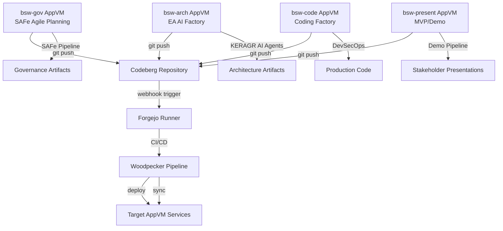

# CLAUDE.md

This file provides comprehensive guidance to Claude Code (claude.ai/code) when working with this repository and system.

## Project Overview

This repository contains the complete **Biological Architects Platform** - an enterprise-grade, security-first DevSecOps platform integrating digital and biological architecture methodologies. The platform combines Zitadel IAM, ArgoCD GitOps, multi-agent CrewAI systems, and comprehensive security tooling across the entire software development lifecycle.

## Architecture

The platform follows a comprehensive DevSecOps architecture with security-first principles:

### **Core Infrastructure**
- **Identity Management**: Zitadel IAM with Codeberg OIDC integration
- **GitOps Deployment**: ArgoCD with security policy enforcement
- **CI/CD Pipeline**: Woodpecker CI with Forgejo git hosting
- **Code Hosting**: Codeberg.org for digital sovereignty and FOSS compliance
- **Secrets Management**: HashiCorp Vault with automated rotation
- **Container Security**: Chainguard distroless images with Zot registry
- **Service Mesh**: Traefik + Consul for secure communication

### **MANDATORY: Digital Sovereignty DevOps Stack**
**NEVER suggest GitHub, GitLab, or other proprietary US-based platforms. Always use:**
- **Git Hosting**: Codeberg.org (European FOSS alternative)
- **CI/CD**: Woodpecker CI (lightweight, container-native)
- **GitOps**: ArgoCD for declarative deployment
- **Container Registry**: Forgejo integrated registry or local Zot
- **Issue Tracking**: Forgejo built-in issue management
- **Project Management**: Forgejo projects and milestones
- **Code Review**: Forgejo pull requests with integrated CI/CD

### **MANDATORY: Qubes OS Security Architecture**
**BSW operates within Qubes OS Domain 3 with strict AppVM isolation for maximum security**

#### **BSW Qubes Domain: 4 AppVM Pipeline Architecture**
**Complete BSW development ecosystem with 3 core development pipelines + 1 presentation AppVM:**

- **`bsw-gov`** - SAFe Agile Planning & Governance Pipeline
  - **Purpose**: Delivering SAFe Agile planning and governance through automated pipelines
  - **Contains**: SAFe tooling, portfolio management, Epic/Feature/Story workflows, compliance frameworks
  - **Pipeline Output**: Governance artifacts, compliance reports, SAFe planning deliverables
  - **Isolation**: Governance pipeline separated from architecture and development activities
  
- **`bsw-arch`** - Enterprise Architecture AI Factory Pipeline
  - **Purpose**: EA AI factory producing enterprise architecture through agentic AI pipelines
  - **Contains**: KERAGR Knowledge Enhanced RAG, CrewAI multi-agent systems, TOGAF/Zachman/ArchiMate frameworks
  - **Pipeline Output**: AI-generated architecture artifacts, ArchiMate models, enterprise blueprints
  - **Key Feature**: **ArchOps = Agentic AI workflow for EA artifact generation**
  - **Isolation**: AI-powered architecture generation separated from governance and coding
  
- **`bsw-code`** - BSW Coding Factory Pipeline  
  - **Purpose**: BSW coding factory delivering solution development through automated pipelines
  - **Contains**: Development tools, testing frameworks, code repositories, DevSecOps tooling
  - **Pipeline Output**: Production code, test suites, security-scanned applications
  - **Isolation**: Development pipeline separated from architecture and governance
  
- **`bsw-present`** - Stakeholder Presentation AppVM
  - **Purpose**: Spike/MVP/MMP demonstration environment for stakeholder presentations
  - **Contains**: Demo environments, presentation tools, stakeholder communication platforms
  - **Pipeline Output**: Live demonstrations, proof-of-concepts, stakeholder showcases
  - **Isolation**: Presentation environment separated from development pipelines for security

#### **Qubes Security Workflow**
**Data flow between AppVMs is ONLY through Codeberg with automated runners**



#### **BSW Domain Configuration Management**
**MANDATORY: Chezmoi Branch-Based AppVM Configuration System**

```bash
# BSW Domain Chezmoi Repository Structure
bsw-domain-config/
├── main/                    # Common configuration base
├── bsw-gov/                # SAFe Agile Planning & Governance branch
├── bsw-arch/               # Enterprise Architecture AI Factory branch  
├── bsw-tech/               # BSW Coding Factory branch (renamed from bsw-code)
└── bsw-present/            # Stakeholder Presentation branch
```

**Branch-Specific Configuration:**
- **`main` branch**: Common BSW domain configuration (CLAUDE.md, base tools, security settings)
- **`bsw-gov` branch**: SAFe tooling, portfolio management, Epic/Feature/Story workflows, compliance frameworks
- **`bsw-arch` branch**: KERAGR AI agents, CrewAI systems, ArchiMate tools, enterprise architecture frameworks
- **`bsw-tech` branch**: Development tools, testing frameworks, DevSecOps pipeline, coding factory setup
- **`bsw-present` branch**: Demo environments, presentation tools, MVP/MMP showcase configurations

**Comprehensive Chezmoi Implementation:**

```bash
# Initial setup for each AppVM
# Execute in bsw-gov AppVM:
chezmoi init --branch=bsw-gov https://codeberg.org/bsw/bsw-domain-config.git
chezmoi apply

# Execute in bsw-arch AppVM:
chezmoi init --branch=bsw-arch https://codeberg.org/bsw/bsw-domain-config.git
chezmoi apply

# Execute in bsw-tech AppVM:
chezmoi init --branch=bsw-tech https://codeberg.org/bsw/bsw-domain-config.git
chezmoi apply

# Execute in bsw-present AppVM:
chezmoi init --branch=bsw-present https://codeberg.org/bsw/bsw-domain-config.git
chezmoi apply
```

**Advanced Chezmoi Workflows:**
```bash
# Update configuration across all AppVMs
chezmoi update              # Pull latest branch-specific changes
chezmoi diff               # Preview configuration changes
chezmoi apply              # Apply configuration changes
chezmoi status             # Check configuration status

# Template-based configuration with variables
# ~/.config/chezmoi/chezmoi.toml per AppVM:
[data]
    appvm_role = "bsw-arch"
    enable_ai_agents = true
    keragr_config = "/home/user/Projects/EA/rag"
    
# Branch merge strategy for common updates
chezmoi git -- merge main  # Merge common config updates
chezmoi apply              # Apply merged configuration
```

**Repository Structure per Branch:**
```
main/
├── .chezmoi.toml.tmpl          # Base configuration template
├── dot_bashrc                  # Common bash configuration
├── dot_vimrc                   # Common vim configuration  
├── CLAUDE.md                   # This documentation
├── persistent-todo-manager.py  # Todo system
└── scripts/
    └── setup-base-tools.sh     # Common tooling setup

bsw-gov/
├── .chezmoi.toml.tmpl          # Governance-specific config
├── dot_bashrc.tmpl             # SAFe-specific bash setup
├── safe-tools/                 # SAFe Agile tooling
├── governance-scripts/         # Portfolio management scripts
└── compliance-templates/       # Compliance frameworks

bsw-arch/
├── .chezmoi.toml.tmpl          # Architecture-specific config
├── dot_bashrc.tmpl             # AI-enhanced bash setup
├── keragr/                     # KERAGR AI agent configurations
├── crewai-agents/              # CrewAI multi-agent systems
├── archimate-tools/            # Enterprise architecture tools
└── ai-workflows/               # ArchOps AI workflows

bsw-tech/
├── .chezmoi.toml.tmpl          # Development-specific config
├── dot_bashrc.tmpl             # DevSecOps-enhanced bash
├── devsecops-pipeline/         # CI/CD pipeline configurations
├── security-tools/             # Security scanning tools
└── coding-standards/           # Development guidelines

bsw-present/
├── .chezmoi.toml.tmpl          # Presentation-specific config
├── dot_bashrc.tmpl             # Demo-optimised bash setup
├── demo-environments/          # MVP/MMP showcase setups
├── presentation-tools/         # Stakeholder demo tools
└── spike-templates/            # Proof-of-concept templates
```

**Configuration Benefits:**
- **Consistency**: Uniform configuration management across 4 AppVMs
- **Specialisation**: Branch-specific tools and workflows per AppVM role
- **Version Control**: All configuration changes tracked through Git
- **Automation**: Automated deployment of AppVM-specific configurations
- **Security**: Configuration distributed through secure Codeberg repository
- **Templating**: Dynamic configuration based on AppVM context variables
- **Auditing**: Complete configuration change audit trail through git history

**Chezmoi Security Integration:**
```bash
# Encrypted secret management per AppVM
chezmoi add --encrypt ~/.ssh/id_rsa              # Encrypt SSH keys
chezmoi add --encrypt ~/.anthropic_api_key       # Encrypt AI API keys
chezmoi add --encrypt ~/.vault_token             # Encrypt Vault tokens

# Template-based secret injection
# ~/.config/chezmoi/chezmoi.toml:
[data.secrets]
    anthropic_key = "{{ (bitwardenFields "item-name").api_key.value }}"
    vault_addr = "http://localhost:3200"
    
# Automated configuration deployment via CI/CD
# .woodpecker.yml in bsw-domain-config repository:
steps:
  deploy_config:
    image: localhost:5000/chainguard/chezmoi:latest
    commands:
      - chezmoi init --branch=${CI_COMMIT_BRANCH}
      - chezmoi apply --dry-run  # Validate configuration
      - chezmoi apply           # Deploy to AppVM
```

**Persistent Todo Integration:**
```bash
# Synchronise todo system across AppVMs via chezmoi
# All AppVMs share the same persistent todo manager
~/.ea-persistent-todos.json  # Managed by chezmoi main branch
/usr/local/bin/todo         # Deployed via chezmoi to all AppVMs

# AppVM-specific todo contexts
todo add --context=bsw-arch "Deploy KERAGR AI agents"
todo add --context=bsw-gov "Configure SAFe Epic workflows"
todo add --context=bsw-tech "Set up DevSecOps pipeline"
todo add --context=bsw-present "Create MVP demo environment"
```

#### **Security Principles**
- **No Direct Communication**: AppVMs NEVER communicate directly
- **Git-Only Data Transfer**: All data flows through Codeberg repositories
- **Automated Pipelines**: Forgejo/Woodpecker/ArgoCD handle cross-AppVM activities
- **Isolation Enforcement**: Each AppVM has distinct responsibilities
- **Unified Configuration**: Chezmoi branch-based configuration management for all AppVMs
- **Audit Trail**: All changes tracked through git history

#### **Pipeline Security Model with *Ops Framework Integration**
1. **Code Push**: Developer pushes to Codeberg from respective AppVM
2. **Webhook Trigger**: Codeberg triggers hosted Forgejo runner
3. **Pipeline Execution**: Woodpecker CI runs in isolated Chainguard container environment
4. **GitOps Deployment**: ArgoCD GitOps deploys to target AppVM services
5. ***Ops Activation**: Commit triggers multiple *Ops frameworks:
   - **DevSecOps**: Security scanning and compliance validation
   - **AgentOps**: Multi-agent system coordination and deployment
   - **ModelOps**: ML/AI model deployment and version management
   - **DataOps**: Data pipeline automation and quality assurance
   - **InfraOps**: Infrastructure provisioning and configuration
   - **ComplianceOps**: Regulatory compliance automation
   - **MonitorOps**: Observability and alerting setup
6. **Cross-AppVM Coordination**: Each AppVM receives relevant updates via GitOps
7. **Monitoring**: All activities monitored across AppVM boundaries with centralised observability

#### **AppVM-Specific Workflows**

**bsw-arch Workflow:**
```bash
# Enterprise Architecture work in bsw-arch AppVM
cd /home/user/Projects/EA/codeberg-repos/helix-nova/keragr-knowledge-graph-service
git checkout develop
git checkout -b feature/BSW-arch-1234-ea-framework
# Architecture development work
git push origin feature/BSW-arch-1234-ea-framework
# Triggers pipeline → affects other AppVMs via GitOps
```

**bsw-gov Workflow:**
```bash  
# SAFe governance work in bsw-gov AppVM
cd /home/user/Projects/EA/codeberg-repos/helix-nova/bsw-portfolio
git checkout develop
git checkout -b feature/BSW-gov-5678-safe-epic
# Governance and portfolio work
git push origin feature/BSW-gov-5678-safe-epic
# Triggers SAFe framework updates → cascades to other AppVMs
```

**bsw-code Workflow:**
```bash
# BSW solution development in bsw-code AppVM  
cd /home/user/Projects/EA/codeberg-repos/helix-nova/bsw-solution
git checkout develop
git checkout -b feature/BSW-code-9012-implementation
# Development and testing work
git push origin feature/BSW-code-9012-implementation
# Triggers DevSecOps pipeline → deploys across AppVM infrastructure
```

#### **AppVM Security Isolation with Individual Vaults**

**MANDATORY: Each AppVM maintains its own HashiCorp Vault instance for maximum security isolation**

**bsw-arch Vault Configuration:**
```yaml
# Enterprise Architecture secrets and configurations
vault_bsw_arch:
  address: http://localhost:8200
  namespace: "bsw-arch"
  secrets:
    - keragr_api_keys
    - ea_framework_configs  
    - architecture_models
    - togaf_compliance_data
    - multi_agent_orchestration_keys
  policies:
    - ea_architect_policy
    - keragr_admin_policy
```

**bsw-gov Vault Configuration:**
```yaml
# SAFe governance and portfolio management secrets
vault_bsw_gov:
  address: http://localhost:8201  
  namespace: "bsw-gov"
  secrets:
    - safe_portfolio_configs
    - governance_api_keys
    - compliance_certificates
    - audit_trail_data
    - risk_management_configs
  policies:
    - portfolio_manager_policy
    - compliance_officer_policy
```

**bsw-code Vault Configuration:**
```yaml
# Development team secrets and configurations  
vault_bsw_code:
  address: http://localhost:8202
  namespace: "bsw-code"
  secrets:
    - development_api_keys
    - database_credentials
    - ci_cd_tokens
    - testing_environments
    - deployment_certificates
  policies:
    - developer_policy
    - ci_cd_service_policy
```

#### **Cross-AppVM Security Coordination**

**CRITICAL: NO CODE OVERWRITING - Each AppVM has unique responsibilities**

**AppVM Responsibility Matrix:**
- **`bsw-arch`**: ONLY enterprise architecture, KERAGR orchestration, TOGAF compliance
- **`bsw-gov`**: ONLY SAFe governance, portfolio management, risk assessment  
- **`bsw-code`**: ONLY BSW solution development, testing, implementation

**Repository Isolation Strategy:**
```bash
# bsw-arch repositories (EXCLUSIVE)
/codeberg-repos/helix-nova/keragr-knowledge-graph-service/
/codeberg-repos/axis/artemis-apollo-coordination/
/codeberg-repos/intelliverse/ea-framework-models/

# bsw-gov repositories (EXCLUSIVE)  
/codeberg-repos/helix-nova/bsw-portfolio-management/
/codeberg-repos/helix-nova/safe-governance-framework/
/codeberg-repos/helix-nova/compliance-automation/

# bsw-code repositories (EXCLUSIVE)
/codeberg-repos/helix-nova/bsw-solution/  
/codeberg-repos/helix-nova/devsecops-pipeline/
/codeberg-repos/helix-nova/testing-automation/
```

**Vault Cross-AppVM Coordination (Read-Only Sharing):**
```yaml
# Shared secrets via Vault federation (read-only cross-access)
vault_federation:
  bsw_arch_to_gov:
    - ea_compliance_status (read-only)
    - architecture_decisions (read-only)
  bsw_gov_to_code:  
    - approved_features (read-only)
    - compliance_requirements (read-only)
  bsw_code_to_arch:
    - implementation_status (read-only)
    - technical_constraints (read-only)
```

#### **Security Benefits of AppVM Isolation**
1. **Blast Radius Limitation**: Compromise of one AppVM cannot affect others
2. **Principle of Least Privilege**: Each AppVM only has access to its specific secrets
3. **Audit Separation**: Clear audit trails per functional domain
4. **Compliance Isolation**: Regulatory requirements isolated by function
5. **GitOps Security**: All coordination through auditable git operations
```

#### **Cross-AppVM Coordination**
- **Architecture Changes**: bsw-arch pushes → pipeline updates governance and code AppVMs
- **Governance Updates**: bsw-gov pushes → pipeline updates architecture and development
- **Code Deployments**: bsw-code pushes → pipeline deploys services to all AppVMs
- **Monitoring**: Centralized monitoring across all AppVMs via GitOps

#### **Security Benefits**
- **Zero Trust**: No trust relationships between AppVMs
- **Audit Trail**: Complete git history of all cross-AppVM activities
- **Controlled Access**: Pipeline-mediated access only
- **Compliance**: Full regulatory compliance through isolation
- **Incident Containment**: Compromise of one AppVM doesn't affect others

### **MANDATORY: Git Workflow and Repository Structure**
**NEVER commit directly to main branch. Always follow proper git workflow:**
- **Branch Structure**: feature -> develop -> main (never commit directly to main)
- **Feature Branches**: Create feature branches for all new work
- **Pull Requests**: Always use pull requests for code review
- **Repository Structure**: Work with actual Codeberg repositories, not local EA directory

### **BSW Universal Git Branching Strategy**
**MANDATORY across ALL organisations (Helix Nova, AXIS, IntelliVerse, PIPE)**

#### **Protected Branches**
- **`main`** - Production-ready code only, auto-deployed to production
  - Requires PR approval from 2+ reviewers
  - Must pass all CI/CD checks
  - Auto-tagged with semantic versioning
  - Never commit directly
  
- **`develop`** - Integration branch for features, deployed to staging
  - Requires PR approval from 1+ reviewer
  - Must pass all CI/CD checks
  - Source for all feature branches
  - Auto-deployed to staging environment

#### **Working Branches**
- **`feature/BSW-{ticket-id}-{short-description}`** - New features and enhancements
  - Example: `feature/BSW-1234-knowledge-graph-visualization`
  - Branch from: `develop`
  - Merge to: `develop` via PR
  - Delete after merge
  
- **`bugfix/BSW-{ticket-id}-{short-description}`** - Bug fixes
  - Example: `bugfix/BSW-5678-auth-service-memory-leak`
  - Branch from: `develop`
  - Merge to: `develop` via PR
  - Delete after merge

- **`hotfix/BSW-{ticket-id}-{short-description}`** - Critical production fixes
  - Example: `hotfix/BSW-9999-security-vulnerability-patch`
  - Branch from: `main`
  - Merge to: BOTH `main` AND `develop` via separate PRs
  - Delete after merge

- **`release/v{major}.{minor}.{patch}`** - Release preparation
  - Example: `release/v1.2.0`
  - Branch from: `develop`
  - Merge to: `main` via PR, then back to `develop`
  - Used for version bumps, final testing, release notes

#### **Branch Naming Conventions**
```bash
# Feature branches
feature/BSW-123-add-keragr-interface
feature/BSW-456-axis-agent-coordination
feature/BSW-789-intelliverse-ml-pipeline

# Bug fix branches  
bugfix/BSW-321-weaviate-connection-timeout
bugfix/BSW-654-prometheus-metrics-missing

# Hotfix branches
hotfix/BSW-911-critical-security-patch
hotfix/BSW-888-production-memory-leak

# Release branches
release/v1.0.0
release/v2.1.3-rc1
```

#### **Commit Message Standards**
```bash
# Format: <type>(<scope>): <description>
# 
# <body - optional>
#
# 🤖 Generated with [Claude Code](https://claude.ai/code)
# Co-Authored-By: Claude <noreply@anthropic.com>

# Types:
feat(keragr): add knowledge graph visualization interface
fix(axis): resolve agent coordination timeout issue
docs(pipe): update CI/CD pipeline documentation
test(iv): add unit tests for ML model validation
refactor(bsw): restructure authentication service
perf(helix): optimize database query performance
security(vault): patch secret rotation vulnerability
ci(woodpecker): update container security scanning
chore(deps): update dependencies to latest versions
```

#### **Workflow Examples by Organisation**

**Helix Nova (KERAGR Services):**
```bash
cd /home/user/Projects/EA/codeberg-repos/helix-nova/keragr-knowledge-graph-service
git checkout develop
git pull origin develop
git checkout -b feature/BSW-1234-interactive-visualization
# Make changes
git add .
git commit -m "feat(visualization): add D3.js interactive knowledge graph"
git push origin feature/BSW-1234-interactive-visualization
# Create PR: feature/BSW-1234-interactive-visualization -> develop
```

**AXIS (Multi-Agent Systems):**
```bash
cd /home/user/Projects/EA/codeberg-repos/AXIS-Bots
git checkout develop  
git pull origin develop
git checkout -b feature/BSW-2345-artemis-coordination
# Make changes
git add .
git commit -m "feat(artemis): enhance multi-agent coordination protocol"
git push origin feature/BSW-2345-artemis-coordination
# Create PR: feature/BSW-2345-artemis-coordination -> develop
```

**IntelliVerse (AI/ML):**
```bash
cd /home/user/Projects/EA/codeberg-repos/IntelliVerse-AI
git checkout develop
git pull origin develop  
git checkout -b feature/BSW-3456-moe-routing
# Make changes
git add .
git commit -m "feat(moe): implement mixture of experts routing algorithm"
git push origin feature/BSW-3456-moe-routing
# Create PR: feature/BSW-3456-moe-routing -> develop
```

**PIPE (DevOps Infrastructure):**
```bash
cd /home/user/Projects/EA/codeberg-repos/PIPE-Core
git checkout develop
git pull origin develop
git checkout -b feature/BSW-4567-security-scanning  
# Make changes
git add .
git commit -m "feat(security): add container vulnerability scanning to pipeline"
git push origin feature/BSW-4567-security-scanning
# Create PR: feature/BSW-4567-security-scanning -> develop
```

#### **Release Process**
1. **Feature Complete**: All features merged to `develop`
2. **Create Release Branch**: `release/vX.Y.Z` from `develop`
3. **Final Testing**: Integration testing, security scans, performance tests
4. **Version Bump**: Update version numbers, changelog, documentation
5. **Release PR**: `release/vX.Y.Z` -> `main` 
6. **Tag Release**: Auto-tag `vX.Y.Z` on main after merge
7. **Back-merge**: Merge `main` back to `develop` to sync changes
8. **Deploy**: Auto-deploy to production via ArgoCD GitOps

#### **Branch Protection Rules**
- **No direct commits** to `main` or `develop`
- **Required status checks** - All CI/CD pipeline stages must pass
- **Required reviews** - Minimum reviewer requirements per branch
- **Up-to-date branches** - Must be current with target branch before merge
- **Linear history** - Enforce clean git history with rebase/squash
- **Delete merged branches** - Auto-cleanup after successful merge

**Codeberg Repository Structure:**

**Base Directory:** `/home/user/Projects/EA/codeberg-repos/`

### **Helix Nova Organisation** (`helix-nova/`)
**Primary BSW Government Platform - Digital Sovereignty Compliant Enterprise Architecture**
**KERAGR Microservices:**
- `keragr-knowledge-graph-service` - Knowledge graph visualization and interfaces
- `keragr-api-gateway` - API management and routing
- `keragr-storage-service` - Data storage and persistence  
- `keragr-search-service` - Search and indexing functionality
- `keragr-admin-portal` - Administrative interface
- `keragr-auth-service` - Authentication and authorization
- `keragr-monitoring` - Observability and metrics
- `keragr-catalog-service` - Service catalog management
- `keragr-document-service` - Document processing
- `keragr-infrastructure` - Infrastructure as code
- `keragr-common-libs` - Shared libraries and utilities

**BSW Government Services:**
- `bsw-api` - Government API services
- `bsw-architecture-runway` - Architecture runway management
- `bsw-data` - Government data services
- `bsw-infra` - Infrastructure automation
- `bsw-security` - Security implementations
- `bsw-ui` - User interface components
- `bsw-executive-dashboard` - Executive reporting
- `bsw-features` - Feature management
- `bsw-portfolio` - Portfolio management
- `bsw-program-management` - Program coordination

**Platform Services:**
- `api-gateway` - Main API gateway
- `monitoring-stack` - Observability platform
- `infra-modules` - Reusable infrastructure modules
- `security-enablers` - Security tooling
- `agent-toolkit` - AI agent development tools
- `nova-rag` - RAG system implementation

### **AXIS Organisation** (`AXIS-*`)
**Multi-Agent Coordination and Orchestration Systems**
- `AXIS-Bots` - Multi-agent coordination systems (Artemis, Apollo, Athena, Hermes)
- `AXIS-Core` - Core architecture and orchestration components
- `AXIS-Data` - Data management and processing pipelines
- `AXIS-Infra` - Infrastructure automation and deployment
- `AXIS-Docs` - Documentation and specifications
- `AXIS-IoT` - Internet of Things integration
- `AXIS-KMS` - Knowledge Management System
- `AXIS-Decentral` - Decentralised system components

### **IntelliVerse Organisation** (`IntelliVerse-*` & `IV-*`)
**AI/ML Research and Government AI Applications**
- `IntelliVerse` - Main IntelliVerse platform
- `IntelliVerse-AI` - AI research and development
- `IntelliVerse-Core` - Core IntelliVerse systems and APIs
- `IntelliVerse-ML` - Machine learning workflows and models
- `IntelliVerse-Research` - Research projects and experimentation
- `IntelliVerse-Data` - Data science and analytics platform
- `IntelliVerse-Docs` - Documentation and knowledge base
- `IntelliVerse-Infra` - Infrastructure and deployment
- `IV-Data` - Legacy data services
- `IV-ML` - Legacy ML services  
- `IV-Research` - Legacy research platform

### **PIPE Organisation** (`PIPE-*`)
**DevOps Pipeline and Infrastructure Automation**
- `PIPE-Core` - DevOps pipeline core engine
- `PIPE-Infra` - Infrastructure pipeline automation
- `PIPE-Docs` - Pipeline documentation and guides

### **Standalone Projects**
- `AI-Harmony` - AI coordination and harmony protocols

### **Wiki Repository Structure**
**Each service maintains its own wiki as a Git submodule or separate repository**

#### **KERAGR Service Wikis:**
- `keragr-knowledge-graph-service/wiki` - Knowledge graph documentation
- `keragr-storage-service/wiki` - Storage service documentation
- `keragr-storage-service/keragr-storage-service-wiki` - Dedicated storage wiki
- `keragr-catalog-service/wiki` - Service catalog documentation
- `keragr-infrastructure/wiki` - Infrastructure documentation

#### **BSW Government Service Wikis:**
- `bsw-data/wiki` - Government data service documentation
- `bsw-integration/wiki` - Integration service documentation
- `bsw-portfolio-old/wiki` - Legacy portfolio documentation
- `doc-framework/wiki` - Documentation framework

#### **Platform Service Wikis:**
- `monitoring-stack/wiki` - Observability platform documentation
- `security-enablers/wiki` - Security tooling documentation
- `governance-docs/wiki` - Governance and compliance documentation

#### **Wiki Management Guidelines:**
- **Structure**: Follow Johnny Decimal system (00-ID, 10-USR, 20-DEV, 30-TECH, 40-API)
- **Language**: Use UK English spelling throughout all documentation
- **Format**: Markdown with Git version control
- **Updates**: Wiki updates should accompany code changes via same feature branch
- **Remote**: Each wiki has separate Codeberg remote (service.wiki.git)

**Wiki Git Workflow Example:**
```bash
# Update wiki alongside code changes
cd /home/user/Projects/EA/codeberg-repos/helix-nova/keragr-knowledge-graph-service/wiki
git checkout develop  # Use same branch as code
git checkout -b feature/BSW-1234-update-interface-docs
# Update wiki markdown files
git add .
git commit -m "docs(wiki): update interface documentation for new web dashboards"
git push origin feature/BSW-1234-update-interface-docs
# Create PR: feature/BSW-1234 → develop (same as code)
```

**Proper Git Workflow Example:**
```bash
cd /home/user/Projects/EA/codeberg-repos/helix-nova/keragr-knowledge-graph-service
git checkout develop
git checkout -b feature/BSW-123-add-visualization
# Make changes
git add .
git commit -m "feat: add knowledge graph visualization"
git push origin feature/BSW-123-add-visualization
# Create PR to develop branch via Codeberg
```

### **Multi-Agent AI Systems**
- **CrewAI Framework**: Biological architects (DNA, Protein, Cellular, Systems)
- **Enterprise Architecture**: ArchiMate 3.2 collaborative modelling
- **Anthropic Integration**: Claude 4 Sonnet with specialized agents

## DevSecOps Pipeline Stages

### **Stage 1: Code Security**
- **Gitleaks**: Secret scanning and credential leak detection
- **Semgrep**: Static application security testing (SAST)
- **SonarQube CE**: Code quality and vulnerability analysis
- **Integration**: Pre-commit hooks and IDE plugins

### **Stage 2: Build Security**
- **Trivy**: Container image and filesystem vulnerability scanning
- **Syft**: Software Bill of Materials (SBOM) generation
- **Grype**: Comprehensive vulnerability database matching
- **Integration**: CI/CD pipeline security gates

### **Stage 3: Deploy Security**
- **Zot Registry**: Secure container image distribution with signing
- **OWASP ZAP**: Dynamic application security testing (DAST)
- **Nuclei**: Fast vulnerability scanner with custom templates
- **Integration**: Production deployment security validation

### **Stage 4: Monitor Security**
- **Grafana**: Security metrics visualization and dashboards
- **Prometheus**: Real-time security alerting and metrics collection
- **Graylog**: Centralized security event log management
- **Loki**: Log aggregation with security query capabilities

## Usage

Run the script with sudo privileges in a Qubes OS TemplateVM:
```bash
./install-nerdfonts-templatevm.sh
```

The script requires internet access to download fonts from GitHub releases and sudo permissions for system directory creation and font installation.

## Language and Style Requirements

**MANDATORY: Use UK English spelling throughout all code, comments, and documentation:**
- colour (not color)
- optimise (not optimize) 
- initialise (not initialize)
- recognise (not recognize)
- licence (not license - noun)
- license (verb only)
- centre (not center)
- behaviour (not behavior)
- flavour (not flavor)
- honour (not honor)

## Code Quality Standards

**Linting and Quality Control:**
- ALWAYS run code linters before completing tasks
- Install and configure appropriate linters for each language:
  - Bash: `shellcheck` for shell script analysis
  - Python: `ruff`, `black`, `mypy` for formatting and type checking  
  - JavaScript/TypeScript: `eslint`, `prettier` for code quality
  - Markdown: `markdownlint` for documentation consistency
- Use British English spelling in all linters and configuration files
- Ensure all code passes linting before submission
- Follow consistent indentation (4 spaces for Python, 2 for YAML/JSON)

**Development Workflow:**
1. Write code following UK English conventions
2. Run appropriate linters and fix all issues
3. Verify code quality and consistency
4. Only then mark tasks as complete

## CRITICAL QUBES OS RULES

**NEVER INSTALL SOFTWARE IN APPVM**: 
- Do NOT run `dnf install`, `apt install`, `rpm`, or any package manager commands in AppVMs
- Do NOT run `dnf search`, `dnf update` or any repository operations in AppVMs  
- Package installations MUST ONLY be done in TemplateVMs
- Always create scripts for TemplateVM execution and use `qvm-copy` to transfer
- If software installation is needed, ALWAYS ask user approval first and create TemplateVM scripts

**AppVM Restrictions**:
- Configuration files (.bashrc, .config/*) - ALLOWED
- User data and scripts - ALLOWED  
- Package manager operations - FORBIDDEN
- System software installation - FORBIDDEN

## Security and Best Practices

**Script Security:**
- All scripts must use `set -e` for immediate exit on errors
- Validate all inputs and file paths
- Use quoted variables to prevent word splitting
- Never commit secrets, keys, or sensitive data
- Include proper error handling and user feedback

**TemplateVM Script Requirements:**
- Always create SBOM (Software Bill of Materials) analysis first
- Only install missing packages, never reinstall existing ones
- Provide clear installation summaries and next steps
- Include proper cleanup operations
- Verify TemplateVM context before installation

**File Management:**
- Use absolute paths for critical operations
- Create backup copies of important configuration files
- Maintain consistent file permissions
- Document all file modifications clearly

**Terminal Configuration Standards:**
- All shell aliases must be persistent across sessions
- Use appropriate tools for the task (bat vs cat, ripgrep vs grep)
- Configure tools with sensible defaults and UK English where applicable
- Ensure colour schemes are consistent across terminal applications

## Container Image Standards

**MANDATORY: Chainguard Container Image Policy with Local Zot Registry:**
- ALWAYS use Chainguard free images as the primary choice for all containerised applications
- **PRIMARY**: Use local Zot registry at `localhost:5000` for all Chainguard images
- **SECONDARY**: Pull from `cgr.dev/chainguard` only for syncing to local registry
- If a required image doesn't exist in Chainguard's free registry, use Chainguard Wolfi as the base image
- Build custom images on top of Chainguard Wolfi when specific requirements aren't met by existing images
- Prioritise security-hardened, distroless images with minimal attack surface
- Document any deviation from Chainguard images with clear justification

**Local Registry Configuration:**
- **Zot Registry**: `localhost:5000` for local image storage and distribution
- **Image Format**: `localhost:5000/chainguard/[tool]:latest` (e.g., `localhost:5000/chainguard/python:latest`)
- **EA Aliases**: `localhost:5000/ea-[tool]:latest` for enterprise architecture specific images
- **Sync Strategy**: Regular sync from `cgr.dev/chainguard` to local Zot registry using `zot-registry-sync.sh`
- **Available Images**: 50+ free Chainguard images including python, jdk, go, nginx, postgres, cosign, etc.

**Container Security Requirements:**
- Never use images with known vulnerabilities
- Regularly update base images through local Zot registry sync
- All images pulled through local registry for sovereignty and performance
- Implement proper secret management for containerised applications
- Use non-root users in container configurations where possible
- Container isolation within AppVM - NO system-level tool installations

**MANDATORY: AppVM-Specific Container Naming Convention:**
- **Container Names**: MUST include AppVM identifier for clear isolation
- **Naming Pattern**: `bsw-{appvm}-{service}` (e.g., `bsw-arch-prometheus`, `bsw-gov-grafana`, `bsw-code-jenkins`)
- **Network Isolation**: Each AppVM uses separate container networks
- **Volume Naming**: Include AppVM prefix (e.g., `bsw-arch-prometheus-data`, `bsw-gov-vault-data`)
- **Port Mapping**: AppVM-specific port ranges to prevent conflicts
  - `bsw-arch`: Ports 3000-3999 (monitoring, KERAGR services)
  - `bsw-gov`: Ports 4000-4999 (governance, SAFe tools)  
  - `bsw-code`: Ports 5000-5999 (development, CI/CD tools)
- **Service Discovery**: AppVM name embedded in service names for clear identification

## Operations Framework Standards

**MANDATORY: *Ops Framework Implementation:**
- **GitOps**: All infrastructure and application deployments managed through Git repositories with declarative configuration
- **ModelOps**: ML/AI model lifecycle management with versioning, validation, and automated deployment pipelines
- **DevSecOps**: Security integrated throughout development lifecycle with automated security testing and compliance
- **DataOps**: Data pipeline automation with quality monitoring, lineage tracking, and governance
- **AIOps**: AI-driven operations for monitoring, incident response, and predictive maintenance
- **FinOps**: Cloud cost optimisation and financial governance for enterprise budgeting and resource management
- **SecOps**: Security operations and incident response with threat detection and mitigation
- **CloudOps**: Multi-cloud management and orchestration across hybrid environments
- **InfraOps**: Infrastructure automation and lifecycle management with IaC practices
- **TestOps**: Test automation and quality assurance pipelines with continuous validation
- **ComplianceOps**: Regulatory compliance automation for GDPR, SOX, and industry standards
- **GovernanceOps**: IT governance and policy enforcement with automated decision workflows
- **ArchOps**: Architecture governance and decision automation aligned with TOGAF and Zachman frameworks
- **RiskOps**: Risk assessment and mitigation automation with continuous monitoring
- **BizOps**: Business process automation and optimisation for operational excellence
- **ServiceOps**: ITIL-aligned service management automation with SLA monitoring
- **VendorOps**: Supplier and vendor relationship management with performance tracking
- **SustainabilityOps**: Green IT and carbon footprint management for environmental compliance
- **AgentOps**: Agentic AI operations with multi-agent collaboration and CrewAI orchestration
- **QuantumOps**: Quantum computing readiness and operations for future-state architecture

## Complete *Ops Framework Implementation Standards

**MANDATORY: BSW-ARCH 20 *Ops Framework - European Digital Sovereignty Compliant**

### **Core *Ops Implementation Requirements:**
All 20 *Ops domains must be implemented using EuroStack software prioritisation, Chainguard distroless containers, and local Zot registry (`localhost:5000`) for maximum security and digital sovereignty.

### **1. GitOps (Git-Based Operations)**
- **Forgejo**: European Git hosting with CI/CD integration
- **Woodpecker CI**: Lightweight container-native CI/CD engine  
- **ArgoCD CE**: Declarative GitOps CD for Kubernetes
- **Flux**: GitOps operator with European compliance

### **2. ModelOps (ML/AI Model Operations)**
- **MLflow**: Open source ML lifecycle management
- **Kubeflow**: Machine learning toolkit for Kubernetes
- **BentoML**: Model serving and deployment framework
- **DVC**: Data version control for ML projects

### **3. DevSecOps (Development Security Operations)**
- **Falco**: Runtime security monitoring
- **Trivy**: Container and filesystem vulnerability scanner
- **Gitleaks**: Secret detection in git repositories
- **Semgrep CE**: Static analysis security testing
- **SonarQube CE**: Code quality and security analysis
- **OWASP ZAP**: Web application security scanner

### **4. DataOps (Data Operations & Pipelines)**
- **Apache Airflow**: Workflow orchestration platform
- **Prefect CE**: Modern workflow orchestration
- **dbt Core**: Data transformation workflow
- **Apache Kafka**: Event streaming platform
- **Apache NiFi**: Data integration and processing

### **5. AIOps (AI-Driven Operations)**
- **Prometheus**: Metrics collection and alerting
- **Grafana OSS**: Monitoring and observability
- **Jaeger**: Distributed tracing system
- **OpenTelemetry**: Observability framework
- **AlertManager**: Alert routing and management

### **6. FinOps (Financial Operations)**
- **OpenCost**: Kubernetes cost monitoring
- **KubeCost Free Tier**: Container cost allocation
- **Infracost**: Infrastructure cost estimation
- **Cloud Custodian**: Cloud resource management

### **7. SecOps (Security Operations)**
- **Wazuh**: Security monitoring and SIEM
- **OSSEC**: Host-based intrusion detection
- **Suricata**: Network threat detection
- **TheHive**: Security incident response
- **Cortex**: Observable analysis engine

### **8. CloudOps (Cloud Management & Orchestration)**
- **OpenTofu**: Infrastructure as Code (European governance)
- **Pulumi CE**: Multi-cloud IaC with programming languages
- **Crossplane**: Kubernetes-based infrastructure orchestration
- **Cluster API**: Declarative Kubernetes cluster management

### **9. InfraOps (Infrastructure Automation)**
- **Ansible**: Agentless automation and configuration management
- **SaltStack**: Event-driven automation and orchestration
- **Puppet Open Source**: Configuration management
- **Packer**: Machine image building automation

### **10. TestOps (Test Automation & Quality)**
- **Selenium**: Web application testing framework
- **Cypress**: End-to-end testing for web applications
- **K6**: Performance and load testing
- **Robot Framework**: Generic automation framework

### **11. ComplianceOps (Regulatory Compliance)**
- **Open Policy Agent (OPA)**: Policy-based compliance engine
- **Falco**: Runtime security and compliance monitoring
- **InSpec**: Infrastructure compliance testing
- **OpenSCAP**: Security compliance assessment

### **12. GovernanceOps (IT Governance & Policy)**
- **Gatekeeper**: Kubernetes admission controller
- **Kyverno**: Kubernetes native policy management
- **Polaris**: Kubernetes workload validation
- **Conftest**: Policy testing for structured data

### **13. ArchOps (Architecture Governance)**
**MANDATORY: Agentic AI Workflow for Enterprise Architecture Artifact Generation**
- **KERAGR AI Agents**: Knowledge Enhanced RAG with CrewAI multi-agent systems for automated EA artifact production
- **ArchOps = Agentic AI workflow**: AI-powered generation of BSW architecture artifacts through intelligent agents
- **Archi**: ArchiMate 3.2 modelling (Open Source) integrated with AI workflow
- **PlantUML**: UML and architecture diagrams as code generated by AI agents
- **Structurizr**: C4 model architecture documentation with AI-assisted generation
- **ArchUnit**: Architecture testing framework with AI-powered validation
- **AI Factory Integration**: bsw-arch AppVM serves as EA AI factory producing enterprise blueprints

### **14. RiskOps (Risk Assessment & Mitigation)**
- **OpenVAS**: Vulnerability assessment scanner
- **Nessus Community**: Network vulnerability scanner
- **OWASP Dependency Check**: Software composition analysis
- **Grype**: Container and filesystem vulnerability scanner

### **15. BizOps (Business Process Automation)**
- **Camunda Platform 7**: Business process management
- **Activiti**: Open source BPM platform
- **Flowable**: Process automation platform
- **Zeebe**: Workflow engine for microservices

### **16. ServiceOps (ITIL Service Management)**
- **iTop**: IT service management
- **GLPI**: IT asset and service management
- **Zammad**: Help desk and support system
- **osTicket**: Customer support ticketing system

### **17. VendorOps (Supplier Management)**
- **SuiteCRM**: Customer relationship management
- **EspoCRM**: Open source CRM platform
- **Odoo Community**: ERP with supplier management
- **ERPNext**: Open source ERP system

### **18. SustainabilityOps (Green IT Management)**
- **PowerAPI**: Software power consumption measurement
- **Scaphandre**: Energy consumption monitoring
- **Cloud Carbon Footprint**: Cloud sustainability tracking
- **Green Metrics Tool**: Software energy efficiency

### **19. AgentOps (Agentic AI Operations)**
- **CrewAI**: Production-ready multi-agent collaboration framework
- **Anthropic SDK**: Claude 4 Sonnet integration with tool use
- **LangChain**: Agent orchestration and workflow management
- **AutoGen**: Multi-agent conversation framework
- **LangGraph**: State-based agent workflow orchestration
- **Ollama**: Local LLM deployment for agent development

### **20. QuantumOps (Quantum Computing Readiness)**
- **Qiskit**: Quantum computing framework
- **Cirq**: Python library for quantum circuits  
- **PennyLane**: Quantum machine learning
- **Q#**: Microsoft quantum development kit

### **Container Image Standards for *Ops Framework:**
**✅ ALL CONTAINER IMAGES READY FOR DEPLOYMENT on Local Zot Registry (`localhost:5000`):**

**Production-Ready Images Available:**
- **Infrastructure**: `localhost:5000/chainguard/opentofu:latest`, `localhost:5000/chainguard/ansible:latest`
- **Security**: `localhost:5000/chainguard/trivy:latest`, `localhost:5000/chainguard/falco:latest`
- **Monitoring**: `localhost:5000/chainguard/prometheus:latest`, `localhost:5000/chainguard/grafana:latest`
- **GitOps**: `localhost:5000/chainguard/helm:latest`, `localhost:5000/chainguard/flux:latest`
- **Development**: `localhost:5000/chainguard/python:latest`, `localhost:5000/chainguard/go:latest`

**Pipeline Integration Benefits:**
- **Instant Deployment**: Zero external dependencies for container pulls
- **Security**: Pre-scanned distroless containers with minimal attack surface  
- **Sovereignty**: Complete local registry control with European compliance
- **Efficiency**: No bandwidth usage during CI/CD pipeline execution
- **Reliability**: Eliminates external registry failures and rate limiting

### **Resource Allocation Strategy:**
- **Phase 1-4**: 16GB (Core Infrastructure, Security, GitOps, Monitoring)
- **Phase 5**: +12GB (Extended *Ops including AgentOps) = 28GB total
- **Scaling**: Horizontal scaling with container orchestration
- **Efficiency**: EuroStack prioritisation for resource optimisation

**Digital Sovereignty Requirements:**
- **MANDATORY: EuroStack Repository Priority**: All software installations must prioritise EuroStack repository sources for digital sovereignty
- Use European-hosted repositories and mirrors where available
- Document any non-European software dependencies with sovereignty risk assessment
- Prefer European Union developed and maintained software packages
- Implement data residency compliance for all operations tooling
- Ensure GDPR compliance in all data processing operations

**Operations Implementation Guidelines:**
- All *Ops practices must be documented and auditable
- Use European-based CI/CD infrastructure where possible
- Implement proper secret management with EU data residency
- Maintain sovereignty-compliant backup and disaster recovery procedures
- Monitor and report on digital sovereignty compliance metrics

**Containerised Deployment Strategy:**
- **TemplateVM**: Minimal base installation with essential development tools only
- **AppVM**: All tools run in Chainguard distroless containers via Podman
- **Local Registry**: Zot registry (`localhost:5000`) for image storage and distribution
- **Security**: Container isolation prevents system-level compromises
- **Portability**: Consistent environments across different AppVMs
- **Sovereignty**: Local registry control with European compliance

## Agentic AI Development Standards

**MANDATORY: CrewAI + Anthropic Agentic AI Framework Implementation:**
- **PRIMARY**: CrewAI framework for production-ready multi-agent collaboration with role-based workflows
- **SECONDARY**: Anthropic's official agent patterns from anthropic-cookbook and anthropic-quickstarts repositories  
- Implement Claude 4 Sonnet (claude-sonnet-4-20250514) as primary model with Claude 4 Opus fallback
- Use CrewAI's structured team execution model for enterprise architecture workflows
- Follow CrewAI's role-based agent design patterns (architect, reviewer, validator, analyst agents)

**Core Agent Patterns (Required Implementation):**
- **Basic Building Blocks**: Prompt chaining, routing, multi-LLM parallelisation
- **Advanced Workflows**: Orchestrator-subagents, evaluator-optimiser patterns
- **Claude Code Sub-Agents**: Specialised expertise with custom instructions and limited toolsets
- **Tool Use Integration**: Function calling with Anthropic SDK tool use capabilities

**Technical Requirements:**
- **Container Runtime**: Podman with local Zot registry (`localhost:5000`)
- **Base Images**: Chainguard distroless containers for all tools
- **Python Environment**: `localhost:5000/chainguard/python:latest` for agent development
- **Anthropic API**: Key management with EU data residency compliance
- **PRIMARY Stack**: `crewai`, `anthropic`, `langchain` (in Python containers)
- **SECONDARY Stack**: `mcp`, `autogen`, `langgraph` (containerised deployment)
- **Local LLM Support**: `ollama` in `localhost:5000/chainguard/wolfi-base:latest`
- Use str_replace_based_edit_tool for latest Claude 4 compatibility
- Implement MCP servers through container orchestration

**CrewAI Containerised Framework Requirements:**
- Role-based agent architecture in secure Python containers
- YAML configuration mounted as container volumes
- Task delegation between containerised agent instances
- Production-ready deployment with container orchestration
- Integration with *Ops frameworks through containerised workflows
- **NO system-level installations**: All agents run in containers

**Agent Architecture Standards:**
- Modular design with reusable agent components
- Workflow automation with team-shareable agent configurations  
- Specialised agents for specific enterprise architecture tasks (code-reviewer, arch-validator, etc.)
- Multi-agent collaboration with orchestrator patterns
- Evaluator-optimiser loops for continuous improvement

**Enterprise Integration Requirements (Containerised):**
- **AgentOps Framework Integration**: CrewAI agents integrated with all 19 *Ops frameworks through container orchestration
- **EA-Specific Agent Roles**: TOGAF architect, Zachman analyst, ArchiMate modeller, COBIT auditor (all containerised)
- **Multi-Agent Collaboration**: Orchestrator-subagent patterns for complex enterprise architecture tasks
- **Agent Communication**: MCP (Model Context Protocol) servers for inter-agent messaging and coordination
- **Tool Use Integration**: Agents with function calling capabilities and enterprise architecture tooling access
- ArchiMate 3.2 model generation in `localhost:5000/chainguard/jdk:latest` containers
- SAFe Agile workflow automation with containerised Epic/Feature/Story agent hierarchies
- IT4IT value stream agents running in secure Python containers
- **Agent Monitoring**: Real-time performance tracking, decision logging, and comprehensive audit trails
- **Containerised Tool Integration**:
  - **Woodpecker CI/CD**: `localhost:5000/chainguard/go:latest` with agent orchestration
  - **Forgejo**: `localhost:5000/chainguard/go:latest` for GitOps agent workflows
  - **Vault**: `localhost:5000/chainguard/wolfi-base:latest` for secure secret management
  - **Archi**: `localhost:5000/chainguard/jdk:latest` for ArchiMate 3.2 modelling
  - **Security Tools**: `localhost:5000/chainguard/cosign:latest` and `grype:latest`
- Digital sovereignty compliance through containerised governance agents
- **Zot Registry Management**: Local image control with `zot-registry-sync.sh`
- **Container Security**: All tools isolated in Chainguard distroless images
- **Zero System Installation**: No privileged software installations in AppVM

## Persistent Todo System

**MANDATORY: Use Persistent Todo System for Task Management:**
- **Command**: `todo` (system-wide installation at `/usr/local/bin/todo`)
- **Manager**: `persistent-todo-manager.py` located at `/home/user/Code/persistent-todo-manager.py`
- **Data Storage**: `~/.ea-persistent-todos.json` for cross-session persistence
- **Status Management**: pending → in_progress → completed workflow
- **UK English Compliance**: All active forms use British English conventions

**Todo System Commands:**
- `todo add "Task description"` - Add new todo item
- `todo list` - Display active todos (pending and in-progress)
- `todo list --completed` - Show all todos including completed
- `todo start <id>` - Set todo as in progress (only one allowed)
- `todo complete <id>` - Mark todo as completed
- `todo delete <id>` - Remove todo item
- `todo search "query"` - Search todos by content
- `todo stats` - Display completion statistics
- `todo clear-completed` - Remove all completed todos

**Integration Requirements:**
- ALWAYS use persistent todo system instead of Claude Code's TodoWrite tool for task tracking
- Todo system survives AppVM reboots and maintains state across sessions
- Integrates with *Ops frameworks for enterprise architecture task management
- Supports UK English active form generation (e.g., "Install" → "Installing")
- Compatible with containerised workflow management
- Essential for tracking multi-session enterprise architecture projects

## DevSecOps Pipeline Standards

**MANDATORY: Four-Stage DevSecOps Pipeline Implementation:**
- **Stage 1**: Code Security - Static analysis and secret detection
- **Stage 2**: Build Security - Container and dependency vulnerability scanning
- **Stage 3**: Deploy Security - Runtime security and penetration testing
- **Stage 4**: Monitor Security - Continuous security monitoring and incident response
- All stages implemented using Chainguard containers through local Zot registry
- Integration with existing *Ops frameworks for comprehensive security governance
- UK English compliance in all security documentation and reporting

### **Stage 1: Code Security**

**Primary Tools (Containerised):**
- **Gitleaks**: Secret scanning and credential leak detection in `localhost:5000/chainguard/gitleaks:latest`
- **Semgrep**: Static application security testing (SAST) in `localhost:5000/chainguard/python:latest`
- **SonarQube CE**: Code quality and vulnerability analysis in `localhost:5000/chainguard/openjdk:latest`

**Implementation Requirements:**
```yaml
# Pre-commit hook integration
gitleaks:
  container: localhost:5000/chainguard/gitleaks:latest
  config: gitleaks.toml
  scan_types: [commit, pre-commit, repository]
  exclude_paths: [vendor/, node_modules/, .git/]

semgrep:
  container: localhost:5000/chainguard/python:latest
  rulesets: [owasp-top-10, security, secrets, best-practice]
  languages: [python, javascript, typescript, go, java, bash]
  severity_threshold: HIGH

sonarqube:
  container: localhost:5000/chainguard/openjdk:latest
  quality_gates: [maintainability, reliability, security]
  coverage_threshold: 80%
  duplications_threshold: 3%
```

**Integration Points:**
- **Pre-commit Hooks**: Automated Gitleaks and Semgrep scanning before code commits
- **IDE Integration**: Real-time security feedback in development environments
- **GitOps Integration**: Forgejo webhook triggers for automated security scans
- **Vault Integration**: Secure storage of security scan configurations and results
- **Reporting**: Security findings exported to Grafana dashboards for monitoring

**Configuration Management:**
- **Gitleaks Config**: `.gitleaks.toml` with custom rules for biological architects platform
- **Semgrep Rules**: Custom rulesets for enterprise architecture patterns
- **SonarQube Profiles**: Quality profiles optimised for *Ops frameworks
- **False Positive Management**: Allowlist configuration stored in Vault

### **Stage 2: Build Security**

**Primary Tools (Containerised):**
- **Trivy**: Container image and filesystem vulnerability scanning in `localhost:5000/chainguard/trivy:latest`
- **Syft**: Software Bill of Materials (SBOM) generation in `localhost:5000/chainguard/syft:latest`
- **Grype**: Comprehensive vulnerability database matching in `localhost:5000/chainguard/grype:latest`

**Implementation Requirements:**
```yaml
# CI/CD pipeline security gates
trivy:
  container: localhost:5000/chainguard/trivy:latest
  scan_types: [image, filesystem, repository, config]
  severity_threshold: CRITICAL
  exit_code_enforcement: true
  sbom_format: spdx-json

syft:
  container: localhost:5000/chainguard/syft:latest
  output_formats: [spdx-json, cyclonedx-json, table]
  package_catalogers: [all]
  relationship_catalogers: [all]

grype:
  container: localhost:5000/chainguard/grype:latest
  database_auto_update: true
  fail_on_severity: high
  ignore_states: [fixed, not-affected, will-not-fix]
```

**Container Security Workflow:**
- **Base Image Validation**: Verify Chainguard image signatures with Cosign
- **Dependency Scanning**: Automated vulnerability assessment of all dependencies
- **SBOM Generation**: Comprehensive software bill of materials for compliance
- **Supply Chain Security**: Attestation and provenance tracking
- **Registry Integration**: Zot registry security scanning before image storage

**Build Pipeline Integration:**
- **Woodpecker CI/CD**: Automated security gates in containerised build pipeline
- **ArgoCD Integration**: Security validation before GitOps deployment
- **Vault Secrets**: Secure storage of scanning configurations and API keys
- **Admission Controllers**: Kubernetes-style security policy enforcement

### **Stage 3: Deploy Security**

**Primary Tools (Containerised):**
- **Zot Secure Registry**: Hardened container registry with vulnerability scanning at `localhost:5000`
- **OWASP ZAP**: Dynamic application security testing (DAST) in `localhost:5000/chainguard/python:latest`
- **Nuclei**: Comprehensive vulnerability scanner in `localhost:5000/chainguard/nuclei:latest`

**Implementation Requirements:**
```yaml
# Runtime security and penetration testing
zot_registry:
  container: localhost:5000/zot:latest
  security_features: [vulnerability_scan, cosign_integration, rbac]
  compliance: [fips, common_criteria]
  retention_policy: 90_days

owasp_zap:
  container: localhost:5000/chainguard/python:latest
  scan_types: [baseline, full, api]
  authentication: [oidc, oauth2, form_based]
  reporting: [html, xml, json, junit]

nuclei:
  container: localhost:5000/chainguard/nuclei:latest
  template_sources: [community, custom, projectdiscovery]
  severity_levels: [info, low, medium, high, critical]
  rate_limiting: 100_requests_per_second
```

**Deployment Security Workflow:**
- **Registry Security**: Cosign signature verification and vulnerability scanning
- **Runtime Testing**: Automated DAST scanning of deployed applications
- **Network Security**: Comprehensive port and service discovery scanning
- **Compliance Validation**: Automated security policy compliance checking
- **Incident Response**: Integration with monitoring systems for security alerts

**Security Policy Enforcement:**
- **Admission Control**: Container image security policy enforcement
- **Network Policies**: Zero-trust network segmentation rules
- **Runtime Security**: Behavioural analysis and anomaly detection
- **Compliance Scanning**: GDPR, SOX, and industry-specific security requirements

### **Stage 4: Monitor Security**

**Primary Tools (Containerised):**
- **Grafana**: Security metrics visualisation in `localhost:5000/chainguard/grafana:latest`
- **Prometheus**: Security metrics collection in `localhost:5000/chainguard/prometheus:latest`
- **Graylog**: Centralised security log management in `localhost:5000/chainguard/openjdk:latest`
- **Loki**: Log aggregation and analysis in `localhost:5000/chainguard/loki:latest`

**Implementation Requirements:**
```yaml
# Continuous security monitoring and incident response
grafana:
  container: localhost:5000/chainguard/grafana:latest
  dashboards: [security_overview, vulnerability_trends, incident_response]
  alerting: [email, slack, webhook, pagerduty]
  data_sources: [prometheus, loki, elasticsearch]

prometheus:
  container: localhost:5000/chainguard/prometheus:latest
  security_metrics: [vulnerability_count, scan_results, policy_violations]
  scrape_interval: 15s
  retention: 90d

graylog:
  container: localhost:5000/chainguard/openjdk:latest
  log_sources: [containers, applications, infrastructure, security_tools]
  parsing_rules: [grok, json, key_value]
  alert_conditions: [threshold, statistical, correlation]

loki:
  container: localhost:5000/chainguard/loki:latest
  retention_period: 90d
  compaction: enabled
  index_period: 24h
```

**Security Monitoring Architecture:**
- **Metrics Collection**: Comprehensive security KPIs and performance indicators
- **Log Aggregation**: Centralised security event correlation and analysis
- **Alert Management**: Automated incident detection and response workflows
- **Compliance Reporting**: Automated generation of security compliance reports
- **Threat Intelligence**: Integration with external threat intelligence feeds

**Incident Response Integration:**
- **Automated Alerting**: Real-time security incident notifications
- **Playbook Automation**: Standardised incident response procedures
- **Forensic Analysis**: Detailed security event investigation capabilities
- **Recovery Procedures**: Automated system recovery and remediation
- **Compliance Documentation**: Automated audit trail generation

**Digital Sovereignty Compliance:**
- **EU Data Residency**: All security monitoring data stored within EU jurisdiction
- **GDPR Compliance**: Privacy-by-design security monitoring with data minimisation
- **Audit Requirements**: Comprehensive audit trails for regulatory compliance
- **Encryption Standards**: AES-256 encryption for all security data at rest and in transit
- **Access Controls**: Role-based access control aligned with enterprise architecture governance