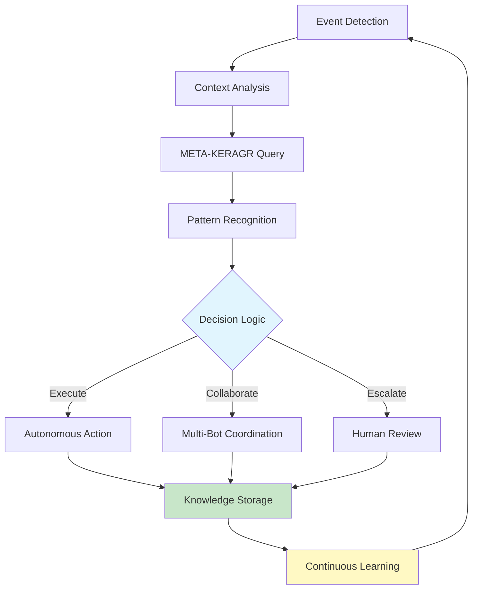
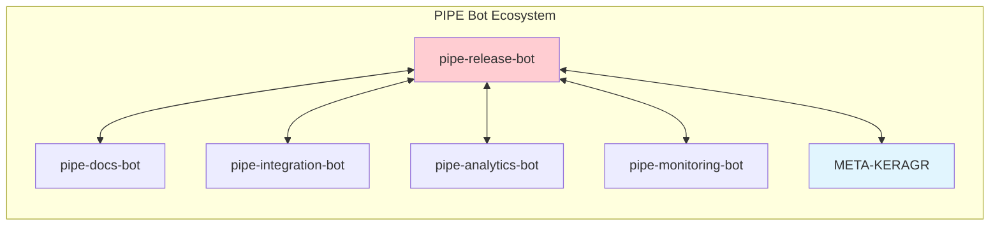

# PIPE RELEASE MANAGEMENT BOT Wiki

Welcome to the Release Management Bot wiki - your comprehensive guide to autonomous platform intelligence.

## 🧠 Overview

The **pipe-release-bot** is an autonomous Augmentic AI agent that manages release coordination, version management, and changelog generation. This wiki provides complete documentation for installation, configuration, usage, and integration.

## 📚 Quick Links

- **[Getting Started](Getting-Started)** - Installation and first steps
- **[Architecture](Architecture)** - System architecture and design
- **[API Reference](API-Reference)** - Complete API documentation
- **[Examples](Examples)** - Real-world usage examples
- **[Integration Guide](Integration-Guide)** - Multi-bot integration
- **[Troubleshooting](Troubleshooting)** - Common issues and solutions

## 🎯 Key Features

- Autonomous Operation
- Multi-Bot Collaboration
- Knowledge Learning

## 🔄 Autonomous Operation Workflow

## 🤖 Multi-Bot Integration

## 🔐 Security & Compliance

- **TOGAF 9.2**: Full architecture framework compliance
- **UK English**: British spelling and terminology throughout
- **Encryption**: TLS 1.3 for all communications
- **Access Control**: Role-based access control (RBAC)
- **Audit Logging**: Complete operation trace
- **GDPR Compliance**: Privacy-by-design principles

## 📊 Performance Metrics

| Metric | Target | Description |
|--------|--------|-------------|
| **Response Time** | < 100ms | Average API response time |
| **Availability** | > 99.9% | System uptime percentage |
| **Accuracy** | > 95% | Decision accuracy rate |
| **Collaboration** | > 90% | Multi-bot integration success |

## 🆘 Support

- **Issues**: [Report Issues](https://codeberg.org/PIPE-Bots/pipe-release-bot/issues)
- **Discussions**: [Community Forum](https://codeberg.org/PIPE-Bots/pipe-release-bot/discussions)
- **PIPE Ecosystem**: [PIPE Overview](https://codeberg.org/PIPE-Bots)

## 📄 Licence

MIT Licence - See [LICENCE](https://codeberg.org/PIPE-Bots/pipe-release-bot/src/branch/main/LICENCE)

---

🤖 **pipe-release-bot** - Autonomous Platform Intelligence through Augmentic AI

*Last updated: 2025-10-05*
